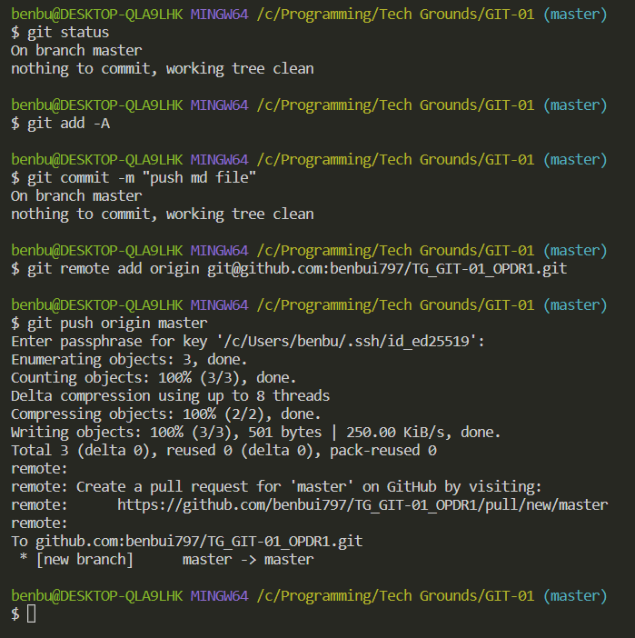

# Git and GitHub
Git is a version control system. It is used to keep track of code, making it possible to revert back changes in case of an error. Also it enables collaborating with co-workers. There is the possibility to create new branches (like a tree) to work on new features without actually changing the current 'main' branch. When the new feature is fully functional, you can merge it with the main.

GitHub is like social media for programmers. It enables us to share code and collaborate. You can connect a local Git repository with GitHub as a 'remote' and push/pull updates from it.

## Key terminology
Git  
GitHub  
Git commands:
- add (-A for all or ./)
- commit (-m "message")
- remote (origin git-ssh-link)
- push (origin /branch/)
- pull (fetch/merge)
- branch 
- checkout (to change branch)

## Exercise
### Sources
https://www.w3schools.com/git/default.asp

### Overcome challanges
I've used Git/GitHub before, so I was already familiar with the basics.
Previously I have followed the tutorial on W3schools and watched a couple of YouTube videos.

### Results
I pushed this file to my repo and cloned the repo of my teammate Quincy. Also I cloned the 'classroom' repo so I could push this document there.

