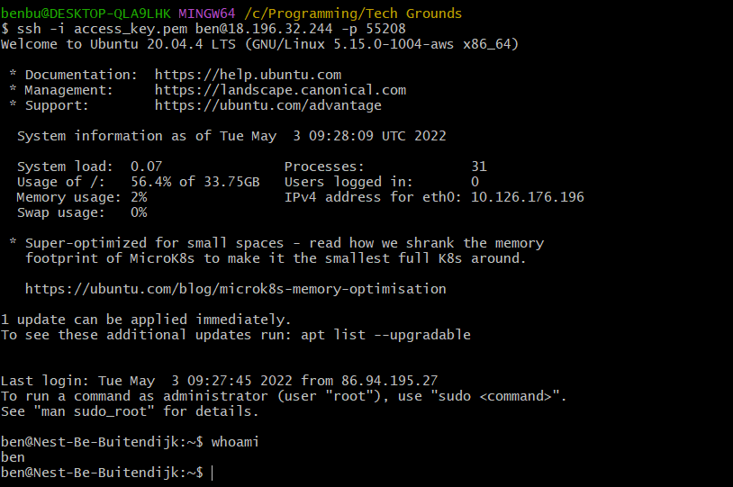

# LNX-01 Setting Up
Setting up SSH on my laptop to be able to make a secure connection to the VM.

## Key terminology
- Virtual Machine (VM)
- Hypervisor (studied during assesment week)
- SSH (Secure Shell Protocol) -> for verification of identity
- SSH == Asymmetric Encryption (Public Key / Private Key pair)

## Exercise
### Sources
https://docs.microsoft.com/en-us/windows-server/administration/openssh/openssh_install_firstuse
https://en.wikipedia.org/wiki/Secure_Shell
https://docs.microsoft.com/en-us/windows-server/administration/openssh/openssh_keymanagement
https://macsecurity.org/how-to-use-private-key-to-login-ssh/
https://stackoverflow.com/questions/34045375/connect-over-ssh-using-a-pem-file

### Overcome challanges
- On first attempt, I didn't use the public key, so permission was denied. I had to look up how to use the public key file attached to the email.
- Use BASH instead of Powershell...

- VM was setup with a different port address ^^ -> Ask Casper for help :)

### Results
I was able to log onto the VM:

