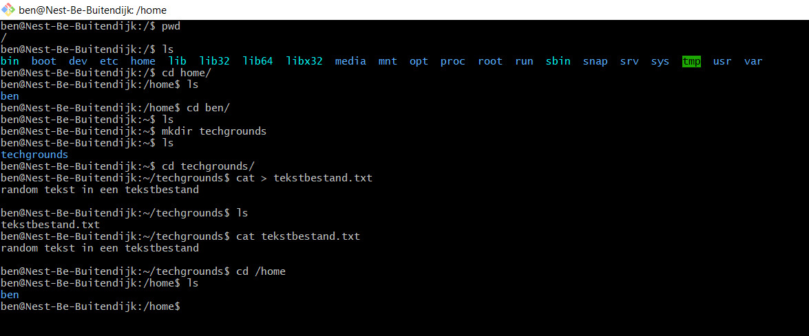

# LNX-02 Files and directories
Getting familiar with Linux structure of files and directories.

## Key terminology
- pwd (print working directory)
- ls (list)
- cd (change directory)
- mkdir (make directory)
- touch (make file)
- cat (concatenate)
- Absolute path is the complete path starting from the root (/)
- Relative path is the path starting from the current working directory

## Exercise
### Sources
https://linuxhandbook.com/linux-directory-structure/
https://www.w3cschoool.com/linux-tutorial

### Overcome challanges
- I had some previous experience with bash commands.
- I cannot find a desktop/public/picture directory inside my home folder. I believe the installed container is a lightweight version that doesnt have these folders installed by default.

### Results
I have used the commands and inserted a screenshot below:

