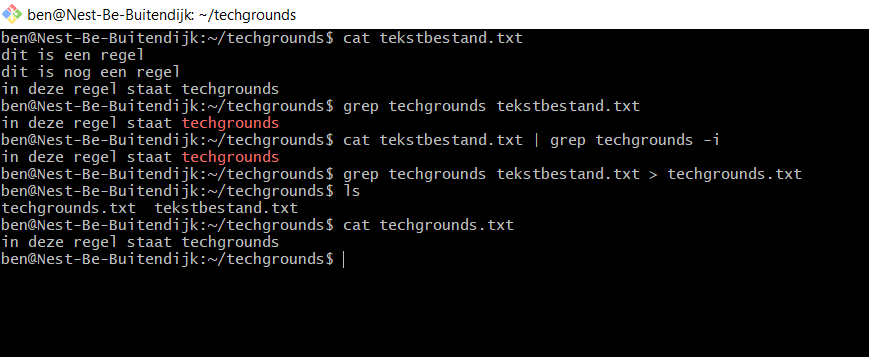

# LNX-03 Working with text (CLI)
Learning to do common text operations using Linux CLI.

## Key terminology
- echo (print to terminal)
- echo text > filename (print to file)
- echo text >> filename (append newline to file)
- cat textfile (prints contents of textfile to terminal)
- grep -> "global regular expression print" (use this to filter partial text)
- regular expressions (code to describe language patterns)

### grep additional arguments:
- -i (make regex case insensitive)
- grep -A (command is used to display the line after the result.)
- grep -B (command is used to display the line before the result.)
- grep -C (command is used to display the line after and line before the result.)

## Exercise
### Sources
- https://www.w3cschoool.com/linux-grep  
- I was already familiar with some of the commands

### Overcome challenges
- N/A

### Results

