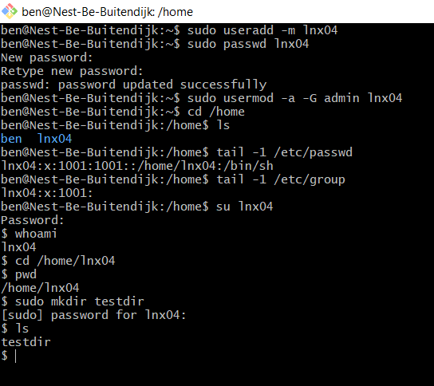

# LNX-04 Users and groups
Introduction to creating new users on a Linux system, giving them permissions and assigning them to groups.

## Key terminology
- sudo (super user do = similar to admin functionality in Windows)
- super user == user with root privileges
- useradd USERNAME (command to add new user)
- optional flags:  
    -m (add home directory)  
    -d (specify different home directory)  
    -e (add expiry date to user YYYY-MM-DD)  
    -L (lock user account)  
    -U (unlock user account)  
- passwd USERNAME (command to add password to user)
- usermod (modify user)
- groupadd GROUPNAME (add new group)
- primary / secondary group (primary group defines the permissions)
- usermod -a -G GROUP USER (add user to group (-G), -a (without -a user will be removed from any other group))
- gpasswd -d USER GROUP (remove user from group)
- userdel USERNAME (command to delete user)

- structure of passwd file in /etc/passwd:  
    User name  
    Encrypted password (x represents password is stored)  
    User ID number (UID)  
    User’s group ID number (GID)  
    Full name  
    User’s home directory  
    User’s login shell (default is bash shell)  

- UID >= 1000 == real user
- UID < 1000 == system user

- etc/shadow contains the actual passwords, but only in encrypted format

## Exercise
### Sources
https://www.w3cschoool.com/linux-create-user  
https://www.w3cschoool.com/linux-user-management  
https://www.w3cschoool.com/user-password  
https://www.w3cschoool.com/local-groups
https://linuxhandbook.com/linux-list-users/  

### Overcome challanges
I had to look up some additional commands, but the sites linked above were very useful and provided all information I needed (and more).

### Results
Screenshot below shows:
- new user made
- added password
- added user to admin group
- new home directory for new user created when new user was added
- show new user in /etc/passwd
- show new user in /etc/group
- log into new user and show current user
- move into home directory and create new dir using sudo command (to check if user has sudo permissions)

