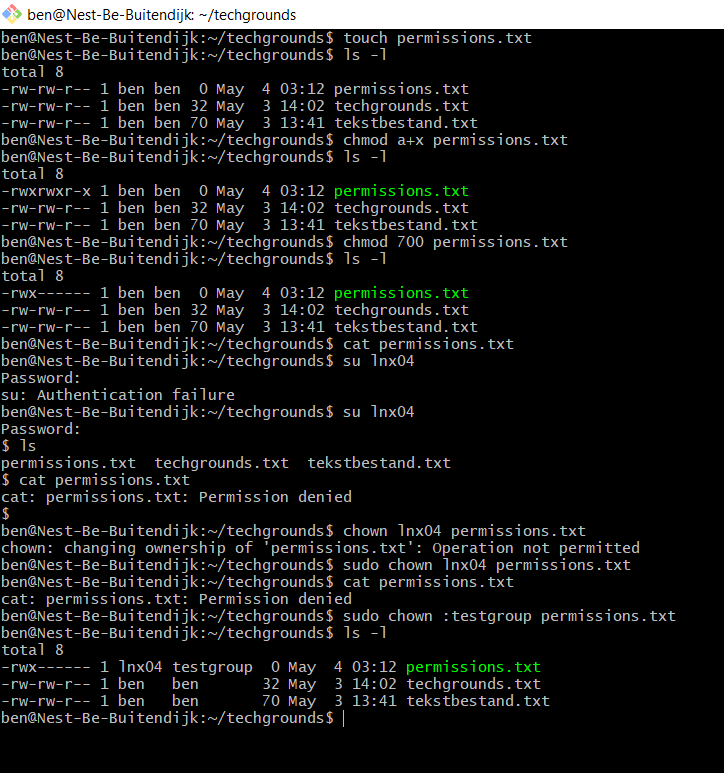

# LNX-05 File permissions
Linux allows us to set permissions for different operations for every file.  
These operations are: reading, writing and executing.
The permissions can be set for the fileowner, a group and every other user. The root does not need permission.  

## Key terminology
- ls -l (ls for list, -l for long option (-a for all option to include hidden files))
- chgrp / chown (changing the ownership of a file's group/user)

- the first letter/character in front of a file in a long list describes the filetype:   

|Abbreviation | Filetype|
|--- | ---  
|\- | normal file|  
|d | directory|
|l | symbolic link|
|p | named pipe|
|b | blocked device|
|c | character device|
|s | socket |

The second till 10th character represent the permissions:

|position | characters | ownership|
|---|---|---|
|1 | - | denotes file type|
|2-4 | rw- | permission for user|
|5-7 | rw- | permission for group|
|8-10 | r-- | permission for other|

`chmod <groupname>+<permission> <filename>` == `chmod u+x test.txt` == add execute permission to userowner.
Change + to - to remove permission

|character|user|
|---|---|
|u|user (owner of file|
|g|groupmember|
|o|other users|
|a|all|

Octal Table:

|binary|octal|permissions|
|---|---|---|
|000|0|---|
|001|1|--x|
|010|2|-w-|
|011|3|-wx|
|100|4|r--|
|101|5|r-x|
|110|6|rw-|
|111|7|rwx|

Symbolic shorthand:
|Number|Permission|
|---|---|
|0|No permission|
|1|Execute|
|2|Write|
|3|Execute and Write|
|4|Read|
|5|Read and Execute|
|6|Read and Write|
|7|Read, Write and Execute|

`chmod 700 file.txt` == all permissions for owner (7), no permissions for groups and other users

- chown (change ownership of file)   
`chown USER FILE`  
`chown :GROUP FILE` (add colon in front of groupname)  
`chown USER:GROUP FILE` (change both user and group)  

## Exercise
### Sources
https://www.w3cschoool.com/linux-file-ownership  
https://www.w3cschoool.com/linux-file-permission  
https://www.w3cschoool.com/linux-chmod-command  
https://www.w3cschoool.com/linux-chown-command
https://www.section.io/engineering-education/user-groups-and-permissions-linux/  

### Overcome challenges
I learned some new commands and new options. For example, I didn't know the exact meaning of the numbers and how to read/use them in chmod command.

### Results

