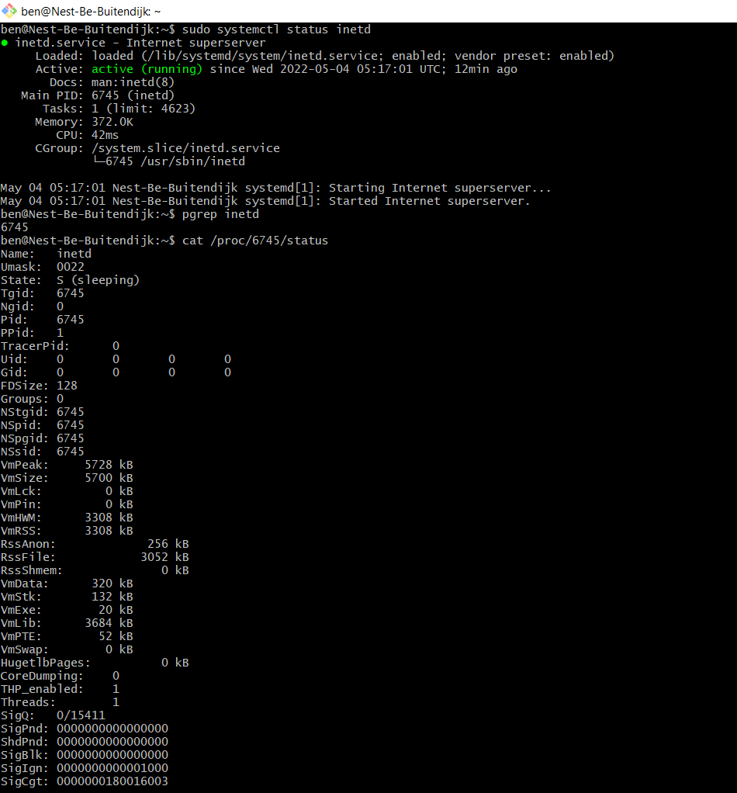
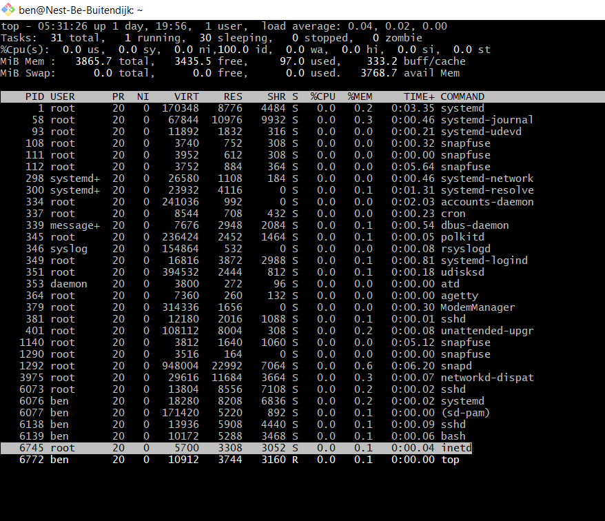
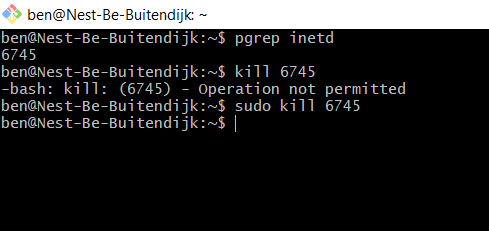

# LNX-06 Processes
A process is an instance of a piece of code. 
Processes on Linux can be divided into 3 categories: Daemons, Services and Programs.
- Daemons run in the background and are not interactive.
- Services respond to requests from programs and may be interactive.
- Programs are run and used by users.

Daemons run in the background, but can not be called/accessed by users. However they can be called by services to perform a certain task.
Services come from the Client Server Model, for example an Apache HTTP server application is a service being run on a server.

Before SSH, there was telnet. An outdated, unsecure method of connecting to a server. It should not be used, but we will for this exercise in order not to mess with the current SSH connection.

## Key terminology
- processes: Daemon, Services and Programs (description above)
- telnet
- systemctl (tool to manage services in Linux)
- PID == process ID
- Processes are stored in systemd, when the system is aware of them, they are called `units`
- `units` can have different suffixes based on their functionality (.service, .socket, .timer etc)
- `pgrep PROCESSNAME` == command to retrieve PID based on process name
- `ps aux | grep -i PARTIALNAME` == combine ps aux and grep if you don't know the full name (ps == Process status)
- `free` (command for overview of used and available RAM and disk memory)
- `top` (command to check memory usage for all processes in Linux)
- Information about memory usage is stored in `/proc/meminfo`. This is not a real file, but a virtual file that provides realtime information.
- `/proc/$pid/status` gives info about a specific pid

- `killall PROCESSNAME` (kills process with this name)
- `kill -SIGNAL $pid` (add signal for different kind of operations)
- `pkill PROCESSNAME` (it will kill any process containing this name)
- SIGTERM / SIGKILL (terminate is stop the process gracefully, kill is stop the process forcefully)

|Signal Name|Signal Number|Signal Use|
|---|---|---|
|SIGNULL|0|NULL, check access to PID|
|SIGHUP|1|Hangup|
|SIGINT|2|Interrupt|
|SIGQUIT|3|Quit|
|SIGKILL|9|Kill|
|SIGTERM|15|Terminate|
|SIGSTOP|24|Stop|
|SIGTSTP|25|Stop/pause the process|
|SIGCONT|26|Continue a stopped process|

## Exercise
### Sources
https://stackoverflow.com/questions/28139377/daemon-and-service-difference
https://www.howtoforge.com/how-to-install-and-use-telnet-on-ubuntu/
https://linuxhint.com/systemctl-utility-linux/
https://www.configserverfirewall.com/linux-tutorials/how-to-get-pid-of-a-process/
https://www.linux.com/training-tutorials/5-commands-checking-memory-usage-linux/
https://stackoverflow.com/questions/22261452/finding-memory-usage-of-a-process-in-linux
https://www.geeksforgeeks.org/ps-command-in-linux-with-examples/
https://www.w3cschoool.com/kill-process-linux
https://www.geeksforgeeks.org/kill-command-in-linux-with-examples/?ref=lbp

### Overcome challenges
- I did not know telnet so had to look up how to install and run it. The first link was a comprehensive guide and also introduced the systemctl command, which basically answered the questions of the exercise.
- I looked up multiple ways to retrieve (memory) information about processes. top is very clear.

### Results
Starting telnet, getting status via systemctl. Additionally getting the pid via pgrep:
  
Using `top` to get info about processes including telnet:  
  
Killing telnet:  
  

