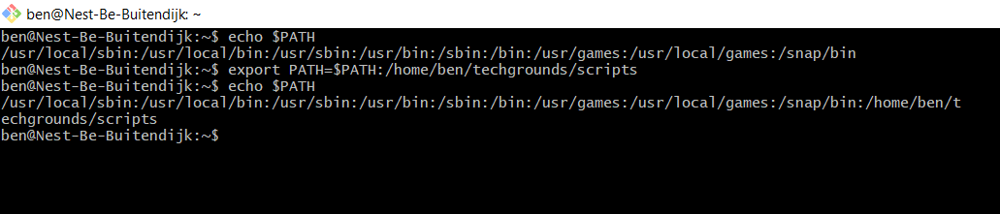
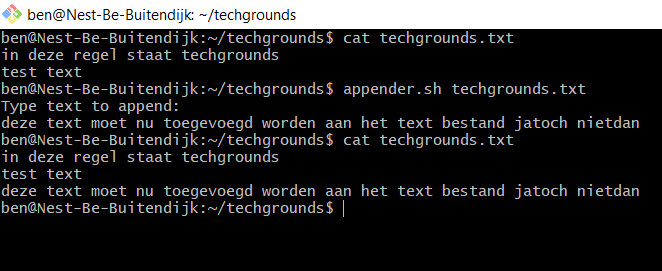
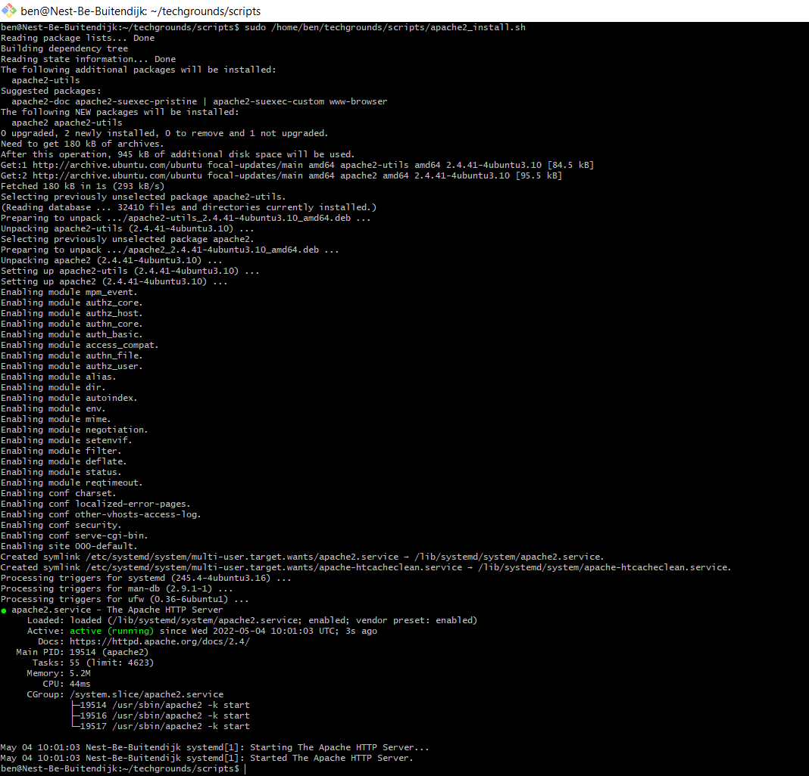
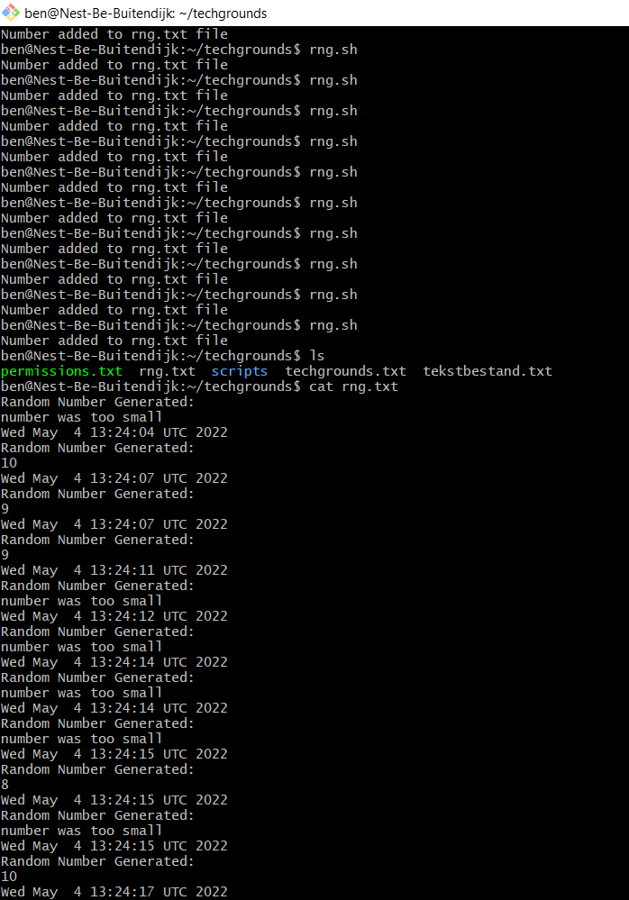

# LNX-07 Bash scripting
Introduction into Bash scripting. Bash is the default CLI in Linux.
Bash alias **B**ourne-**A**gain **SH**ell.
A shell is an interface that connects to the OS.
A Bash script is a series of commands compiled together in a text file.
Instead of running every command seperately, you can run the script and all commands will automatically run.
It's also possible to add additional logic such as loops, conditionals and variables.

## Key terminology
- `env`: display all environment variables
- `export NAME=VALUE`: add new variable to environment
- `NAME=VALUE`: also works
- `echo $NAME`: print variable to terminal
- `unset NAME`: delete variable from env
- `PATH`: defines in which folders the shell will look for executables
- `export PATH=/home/ben/techgrounds/scripts:$PATH`: insert new path in front of PATH var
- `export PATH=$PATH:/home/ben/techgrounds/scripts`: insert new path behind PATH var
- make changes in PATH permanent by editting .bashrc file
- DONT INSERT A NEW PATH WITH A LEADING COLON! == SECURITY RISK because it searches cwd first
- [Special Linux variables](https://www.tutorialspoint.com/unix/unix-special-variables.htm) (CL arguments for example)

## Exercise
### Sources
https://www.w3cschoool.com/set-environment-variable  
https://www.howtogeek.com/658904/how-to-add-a-directory-to-your-path-in-linux/  
https://linuxconfig.org/bash-scripting-tutorial
https://www.tutorialspoint.com/unix/unix-what-is-shell.htm  
https://phoenixnap.com/kb/how-to-vim-save-quit-exit  
https://httpd.apache.org/  
https://httpd.apache.org/docs/2.4/install.html  
https://linuxconfig.org/generating-random-numbers-in-bash-with-examples  
https://www.tutorialspoint.com/unix/unix-basic-operators.htm  
https://www.tutorialspoint.com/unix/unix-decision-making.htm  
https://www.tutorialspoint.com/unix/if-fi-statement.htm  

### Overcome challanges
- I am familiar with basic coding principles in Python and C, but not in Bash. So I checked out some tutorials to understand the syntax of creating Bash scripts.
- I forgot a couple of vim commands, so I had to look those up.
- httpd is a service from Apache, so I checked Apache documentation for a guide on installing it.
- Apache script required Sudo permissions -> run script with absolute path (it's possible to add path to sudo_path, but it's not secure)
- I had to figure out how to automatically confirm the prompt whilst installing apache. The answer is to use the -y flag.

### Results
Adding script directory to PATH var:  
  
  
Created appender script, which takes the target .txt file as argument and asks the user for the text to append:
  

Created a script that downloads, installs, launches and prints status of Apache server:
  
  
Random Number generating script (I did exercise 2 and 3 in one):  

