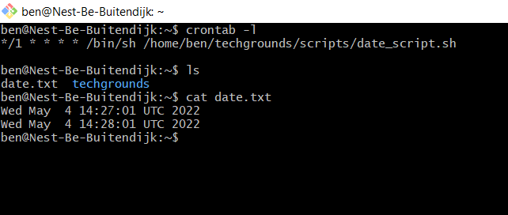
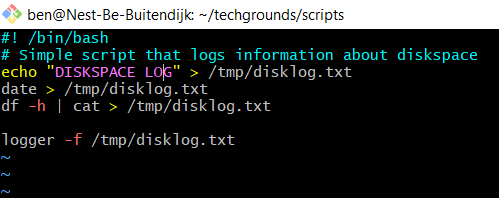
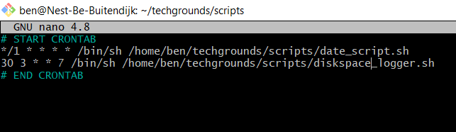
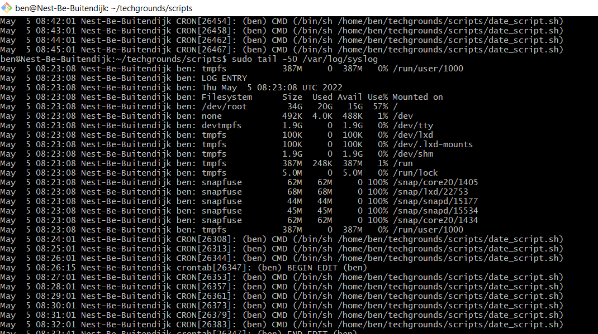

# LNX-08
Cron jobs are scripts which re-occur based on time (chronological I guess).

Programs can send events to the systemlogger. There is 4 important terms for log events:

- Facility: The identifier used to describe the application or process that submitted the log message. For example, mail, kernel, and ftp.
- Priority: An indicator of the importance of the message. Levels are defined within syslog as guidelines, from debugging information to critical events.
- Selector: A combination of one or more facilities and levels. When an incoming event matches a selector, an action is performed.
- Action: What happens to an incoming message that matches a selector — Actions can write the message to a log file, echo the message to a console or other device, write the message to a logged in user, or send the message along to another syslog server.

## Key terminology
- crontab (Cron Tables)
- `/etc/cron.allow` add users to allow them to schedule tasks
- `/etc/cron.d/cron.deny` block users from scheduling tasks
- `crontab -e` edits crontab entries to add, delete, or edit cron jobs
- `crontab -l` list all the cron jobs for the current user
- `crontab -u username -l` list another user's crons
- `crontab -u username -e` edit another user's crons.

- cronjob looks like: ` <min> 
 <day><mnth><wkdy> /bin/sh /path/to/script`  
 
| |VALUE|DESCRIPTION|
|---|---|---|
|Minutes|0-59|Command would be executed at the specific minute.|
|Hours|0-23|Command would be executed at the specific hour.|
|Days|1-31|Commands would be executed in these days of the months.|
|Months|1-12|The month in which tasks need to be executed.|
|Weekdays|0-6|Days of the week where commands would run. Here, 0 is Sunday.|

Additional options are range, list, step values, but go to [crontab.guru](https://crontab.guru/) to make it simple.

- `df` disk filesystems (aka disk free) -> information about the complete system, check --help for flags (human readability etc)
- `du` disk usage -> information how directories & files are using diskspace

- `/var/log` all logs are stored here

- `logger [-i] [-f file] [-p priority] [-t tag] [message]` command for logging

- Log Rotation: logs can grow very quickly. Tools such as `logrotate` help sysadmins to rotate/compress/mail/delete logfiles

## Exercise
### Sources
- https://www.freecodecamp.org/news/cron-jobs-in-linux/
- https://crontab.guru/
- https://phoenixnap.com/kb/how-to-view-read-linux-log-files
- https://phoenixnap.com/kb/linux-check-disk-space
- https://linuxhint.com/use-logger-command-linux/
- https://www.tutorialspoint.com/unix/unix-system-logging.htm

### Overcome challenges
- Cronjobs/crontab is new to me, but my first hit on google was a very clear tutorial.
- I knew what logfiles were, but finding how to generate them was a bit trickier.
- learning about systemlogging, did a lot of reading on the subject.
- Crontab needs a first and last line that is not a cronjob -> insert comments before and after

### Results
Created a script that writes the current datetime to a text file in my home dir.  
Scheduled it to run every minute in crontab:  
  

Script for logging disk info:  
  

Both scripts in crontab:  
  

Tail of syslog to show both scrips operational:

