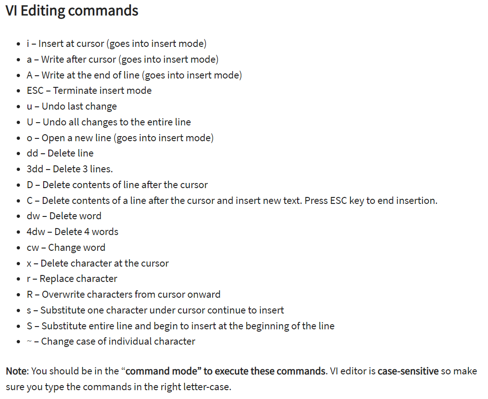
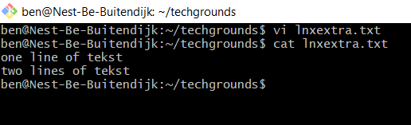

# LNX-Extra01 Vi
Vi is a texteditor in Linux. 
There are 2 modes; command and insert.
command is used to 'control' the program, for example: saving, quitting etc
Insert is used to edit the text.
Vi purists use HJLK keys to move around, but if you are not being watched, you are allowed to use arrow keys. The mouse doesn't work.

## Key terminology
- Vi: text editor
- Vim: V Im(proved)
- insert mode: `i`
- command mode: `esc`
- `:wq` (command mode) = w (write/save), q(quit). Can also run 1 of them.
- shift+ZZ (shortcut for save&quit)
- the `~` symbols mean empty line

## Exercise
### Sources
- https://www.guru99.com/the-vi-editor.html
- https://linuxhandbook.com/basic-vim-commands/

### Overcome challenges
I used Vi for the scripting exercises, so I already had learned the basics.

### Results

