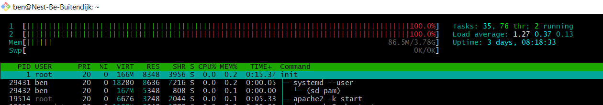
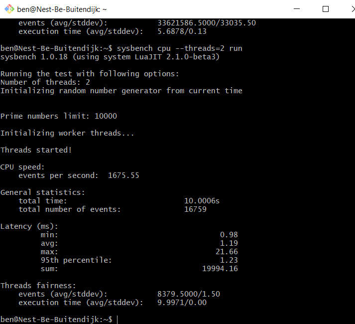
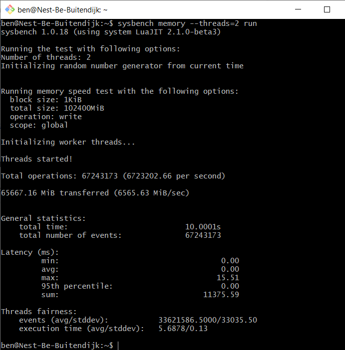
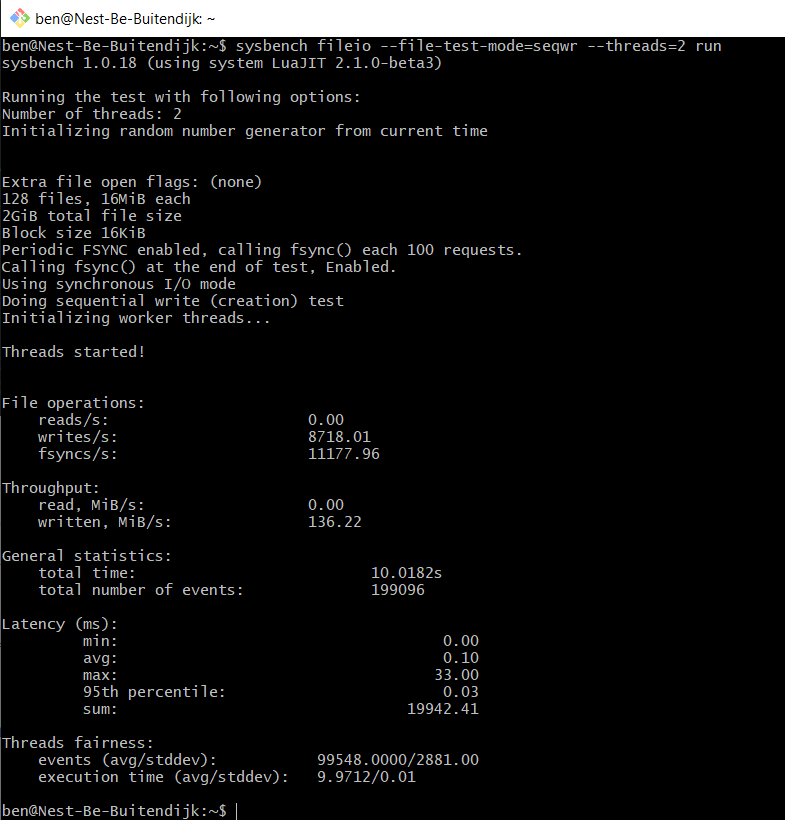

# LNX-Extra02 System Monitoring
Linux has a lot of tools available to check on your system's health.
You can check the performance of CPU, RAM Memory, diskspace, etc

top and htop are tools examples of such tools.

Stress is a tool to induce load on the system, after which you can observe it in htop. stress-ng is another option.

There are commands to retrieve the VM's specs, such as `getconf`.

## Key terminology
- `getconf _NPROCESSORS_ONLN`: get amount of CPU cores
- `/dev/null`: it's a Linux blackhole, if you want stuff to dissapear (for example, filter out error messages by redirecting the stdout here)
- `/dev/urandom`: Consistent output of random bytes
- `/dev/zero`: Consistent output of NULL
- `sysbench --test=cpu run`: change cpu to other tests. change run to help for info.

## Exercise
### Sources
- https://linuxhint.com/install-htop-ubuntu/
- https://manpages.ubuntu.com/manpages/focal/man1/stress.1.html
- https://manpages.ubuntu.com/manpages/focal/man1/stress-ng.1.html
- https://linuxconfig.org/how-to-stress-test-your-cpu-on-linux
- https://linuxhint.com/what_is_dev_null/
- https://linuxconfig.org/how-to-benchmark-your-linux-system

### Overcome challenges
- htop was pretty self-explanatory, but stress-ng was not. The documentation was too expanded for a beginner, so I looked for more specific tutorials.
- I learned more about /dev/ folder and a couple of uses.
- There were a lot of `apache2 -k start` processes (and threads). This confused me, but after looking online, this is to have the server ready for any client requests coming in and is expected behaviour.

### Results
I did run `stress --cpu 2`, but then I wasn't able to enter htop... The screenshot below is from a trick I found online using yes and redirecting it to /dev/null.  
  
  
After some more googling, I found another tool; `sysbench` which is a program to benchmark the system. It runs a test and displays a diagnostics report.  
  
CPU benchmark:   
  
  
Memory benchmark:  
  

I/O benchmark (sequential file writing):  
  

