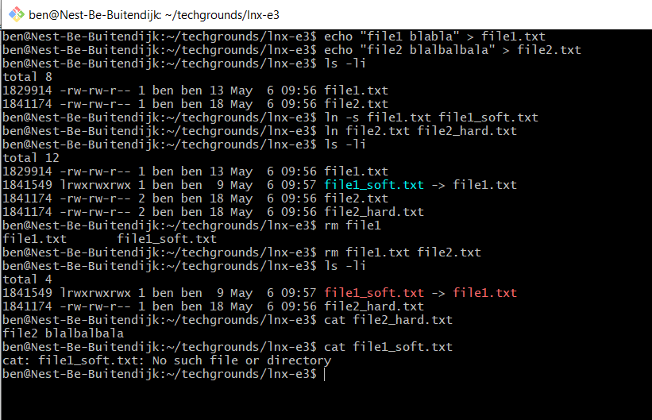

# LNX-Extra03 Inodes and Links
Files in Linux are stored in a file system. Every file or directory (directories are treated as files in Linux) has an inode associated with it, which contains data about data (metadata).  

Links function similarly to shortcuts in Windows and Aliases in MacOS. There are two types of links in Linux: symbolic or soft links, and hard links.  
A symbolic link creates a new inode, which points to the name of the original file instead of to the data on disk.
A hard link creates a new pointer to the original inode.  

## Key terminology
- Inode: information about data (metadata) 
- inode table: all inodes on a partition are stored here. Usually at the beginning, for quick acces.

Metadata that is stored in an Inode:
- Size
- Permission
- Owner/Group
- Location of the hard drive
- Date/time
- Other information

 

- `ls -i` use -i flag to display inode information
- `df -hi` say hello to my inodes
- by default an inode is created for every 2K bytes of space on a partition.
- if you have a lot of files smaller than 2KB, it's possible to run out of inodes -> your disk is full (an mailserver could run into this problem)
- directories are treated as files. directories contain information about which inodes are stored in that directory.
- hardlink: add the same inode in another directory's data. (create a link/pointer to the original inode)
- if a file has a hardlink, deleting the original won't delete the data! You only 'unlink' the original inode (that's why inode table stores link_count!)
- `ln <source> <target>`: create a hardlink
- softlink/symbolic link: create a new inode, pointing to the content of the source inode. This is comparable to a shortcut in windows. Changing the data the softlink will change the original data! Changing metadata (permissions, owner etc) will change the original inode!
- they are commonly used as a shortcut for long and confusing paths
- `ln -s <source> <target>`: create a softlink
- the filetype of a softlink is `l` (when you list). You do not know if it links to a dir or file, until you follow the link.

## Exercise
### Sources
- https://linuxhandbook.com/inode-linux/
- https://linuxhandbook.com/symbolic-link-linux/
- https://linuxhandbook.com/hard-link/
- https://linuxhandbook.com/symbolic-link-linux/

### Overcome challenges
- I had never heard of Inodes, so I googled: "Linux Inodes Explained"
- Understanding the difference between hard- and softlinks. The previous article linked to an article explaining this.
- Understanding hardlinks, the article explaining the difference linked to this.
- Understanding softlinks, the article explaining the difference linked to this.

### Results
The exercise was not very hard, but getting my head around the soft/hard link concepts took a bit of time. This exercise is an example of their difference in practise. A soft/symbolic link points to the exact same data, thus after deleting the original file, the softlink fails.  

Summary: A softlink is more like 'forwarding' the request to the original file. A hardlink is creating a new link that points to the same destination. 

