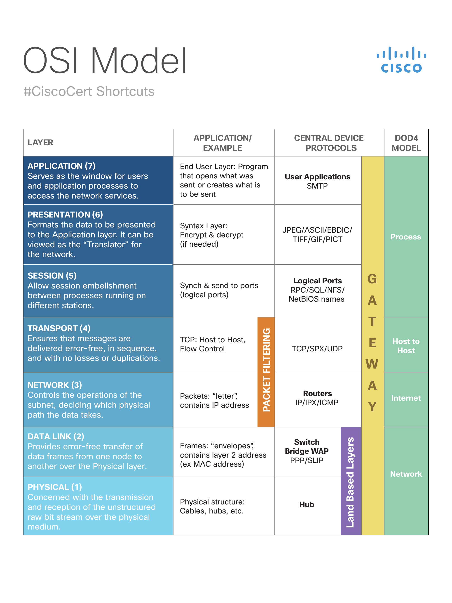
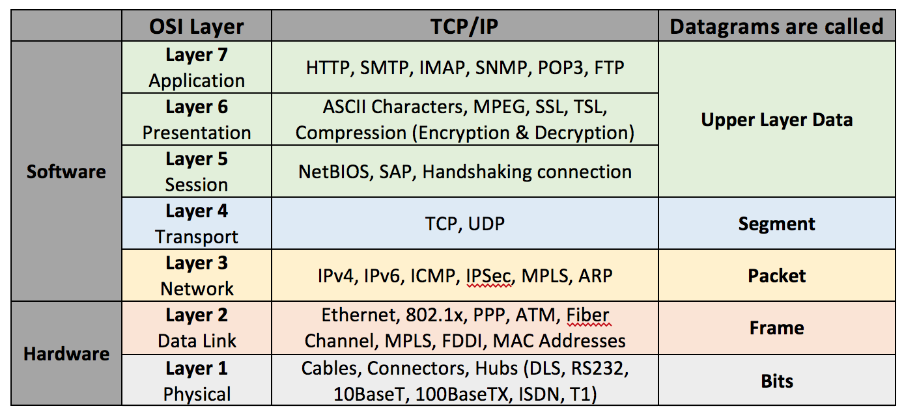

# NTW-01 OSI Stack
The **OSI model** is a conceptual model that describes the different layers of a telecommunication or computing system, without any regard for the specific underlying technology or protocols.  
The different layers can be visualised as a flowchart, where every layer has class of functionality to the layer above it, whilst it is being served by the layer below. Different functionalities of a layer are provided by entities. The entities only interact and communicate with the layers directly below and provide facilities for the layer above.  

The OSI consists of 7 different layers which can be described as follows:  
  

**Layer 1: The Physical Layer**  
Layer 1 is the lowest level. It is responsible for the transmission and reception of raw bits over a physical medium, such as cables and a computer's network card. This layer describes how bits are transferred (the encoding of 1's and 0's to an electrical current or light pulse). Common problems on this layer are EMI/other noise or incorrectly configured NIC's (network interface controller) or HUB's.

**Layer 2: Data Link**  
The Data Link layer is the protocol layer that transmits data between nodes on a network across the physical layer. This layer provides functional and procedural means to transfer data between network entities and may also provide the means to correct errors (such as [flow control](https://en.wikipedia.org/wiki/Flow_control_(data)) or frame collisions (the same entity receiving multiple frames at the same time)). Data link frames (the PDU of this layer) do not cross the boundary of the local network. This layer can be divided into two sublayers: MAC and LLC. Examples of this layer are: Ethernet, Point-to-Point Protocol (PPP), HDLC, ADCCP. 

**Layer 3: Network Layer**
The network layer provides the functionality to communicate between different networks. It can have many nodes connected to it by an address (IP) and allows different nodes to sent a message to other nodes by encapsulating a message with an address and let the network find it's way to the destination. If the message is too big for the data link layer on one of the nodes, it may split it into multiple fragments. These fragments will be reassembled at the target node once all fragments have been received. It may also report on delivery errors on these transfers. Functions of this layer include: routing protocols, multicast group management, network-layer information and error, and network-layer address assignment. It is the function of the payload that makes these belong to the network layer, not the protocol that carries them.  

**Layer 4: Transport Layer**  
The transport layer provides the functional and procedural means of transferring variable-length data sequences from a source host to a destination host from one application to another across a network. Transport protocols may be connection-oriented or connectionless. [TCP](https://en.wikipedia.org/wiki/Transmission_Control_Protocol) is an example protocol (although not officially referenced in the OSI model).

**Layer 5: Session layer**  
The Session Layer creates the setup, controls the connections, and ends the teardown, between two or more computers, which is called a "session". Since DNS and other Name Resolution Protocols operate in this part of the layer, common functions of the Session Layer include user logon (establishment), name lookup (management), and user logoff (termination) functions. The Session Layer also provides for full-duplex, half-duplex, or simplex operation, and establishes procedures for checkpointing, suspending, restarting, and terminating a session between two related streams of data, such as an audio and a video steam in a web-conferencing application.

**Layer 6: Presentation layer**  
The Presentation Layer establishes data formatting and data translation into a format specified by the application layer during the encapsulation of outgoing messages while being passed down the protocol stack. The Presentation Layer handles protocol conversion, data encryption, data decryption, data compression, data decompression, incompatibility of data representation between OSs, and graphic commands. The presentation layer transforms data through the into the form that the application layer accepts, to be sent across a network. Since the presentation layer converts data and graphics into a display format for the Application Layer, the Presentation Layer is sometimes called the syntax layer. This layer can handle changing the encoding of different files to the correct format (text into ASCII or data into XML).

**Layer 7: Application layer**  
The application layer is the one closest to the end user. Not all applications fall into this category, because not all applications provide a means of communication between a client and a server. Apps such as internet browsers and email programs do fall into this category.  
Application-layer functions typically include file sharing, message handling, and database access, through the most common protocols at the application layer, known as HTTP, FTP, SMB/CIFS, TFTP, and SMTP. The most important distinction in the application layer is the distinction between the application-entity and the application.  
An application can have multiple application-entities.

  

### TCP/IP
  
An alternative model is **Internet Protocol Suite**, commonly known as the TCP/IP model. The design protocols of the TCP/IP model does not care as much about strict hierarchical encapsulation and layering. The model consist of the **Internet Protocol** as the connectionless layer and the **Transmission Control Protocol** as a reliable connection-oriented service.  
In the TCP/IP model, there are four abstract layers of functionality:  

**Link/Network Acces Layer**  
The protocols of the link layer operate within the scope of the local network. The link layer is used to move data between two hosts on the same link. This is related to the physical transmission of data.

**Internet Layer**  
Internet layer requires sending data from source network to a destination network. This process is called routing and IP-addresses are a protocol to support this functionality.

**Transport / Host-to-Host Layer**  
The transport layer establishes basic data channels that applications use for task-specific data exchange. The layer establishes host-to-host connectivity in the form of end-to-end message transfer services that are independent of the underlying network and independent of the structure of user data and the logistics of exchanging information. Connectivity at the transport layer can be categorized as either connection-oriented, implemented in TCP, or connectionless, implemented in UDP. The protocols in this layer may provide error control, segmentation, flow control, congestion control, and application addressing (port numbers). For the purpose of providing process-specific transmission channels for applications, the layer establishes the concept of the network port.  
[QUIC](https://en.wikipedia.org/wiki/QUIC) is a more recent transfer protocol.

**Application Layer**  
Quite similar to the OSI model. Protocols such as HTTP, SMTP, FTP belong here. At the application layer, the TCP/IP model distinguishes between user protocols and support protocols. Support protocols provide services to a system of network infrastructure. User protocols are used for actual user applications. For example, FTP is a user protocol and DNS is a support protocol.

### Difference between OSI and TCP/IP

- The Internet application layer maps to the OSI application layer, presentation layer, and most of the session layer.
- The TCP/IP transport layer maps to the graceful close function of the OSI session layer as well as the OSI transport layer.
- The internet layer performs functions as those in a subset of the OSI network layer.
- The link layer corresponds to the OSI data link layer and may include similar functions as the physical layer, as well as some protocols of the OSI's network layer.

## Key terminology
- OSI Model: Open Systems Interconnection model 
- TCP/IP Model: Internet Protocol Suite
- SDU: Service Data Unit - Data sent by a user that is sent to a peer user unchanged.
- PDU: Protocol Data Unit - Encapsulating the SDU with a certain protocol (for example, adding the header (address, request type, statuscode etc) to a html request)
- MAC: Medium Acces Control - responsible for controlling how devices in a network gain access to a medium and permission to transmit data.
- LLC: Logical Link Control - responsible for identifying and encapsulating network layer protocols, and controls error checking and frame synchronization.
- MTU: Maximum Transmission Unit
- TCP: Transmission Control Protocol - 
- UDP: User Datagram Protocol - Less reliable transmission protocol (but useful for video streaming for example, where you'd rather miss a byte than reload all the time)
- Duplex/Half-Duplex/Simplex - Duplex: two-way simultaneous communication. Half-Duplex: two-way, but not simultaneous communication. Simpex: One-way communcation.
- QUIC: Quick UDP Internet Connections

### Sources
- https://en.wikipedia.org/wiki/OSI_model
- https://en.wikipedia.org/wiki/Service_data_unit
- https://en.wikipedia.org/wiki/Protocol_data_unit
- https://en.wikipedia.org/wiki/Data_link_layer
- https://en.wikipedia.org/wiki/Transmission_Control_Protocol
- https://en.wikipedia.org/wiki/User_Datagram_Protocol
- https://en.wikipedia.org/wiki/Internet_protocol_suite
- https://www.geeksforgeeks.org/tcp-ip-model/
