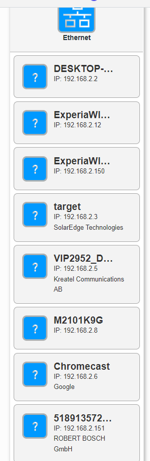
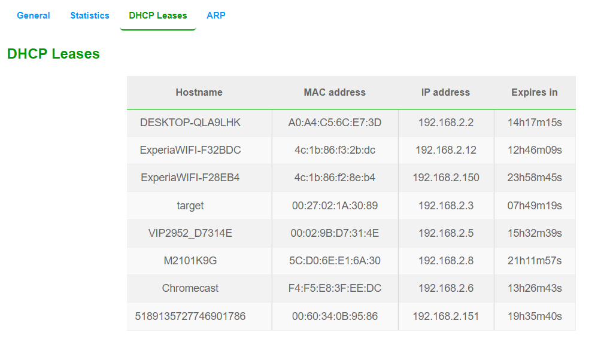
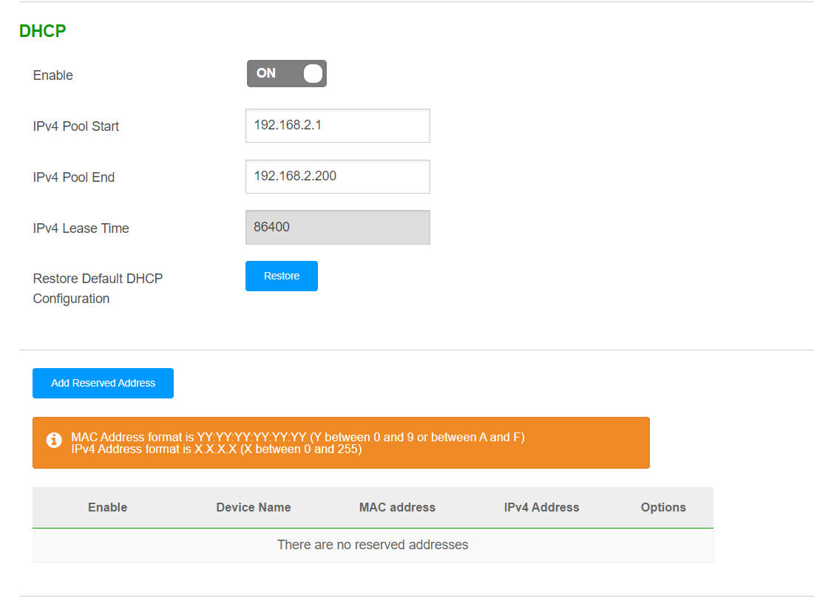

# NTW-02 Network devices
Without devices, you can't connect a network.

## Key terminology
- Repeater: `physical` 2 port device to increase signal strength (and increase the distance it's able to cover without signal loss or corruption)
- Hub: `physical` More or less the same as a repeater, but with more ports. Hubs do not filter data, so packets are send to all connected devices.
- Bridge: `data link` A bridge is a repeater with the added functionality of filtering data based on the MAC addresses of source and destination. It has 2 ports.
- Switch: `data link` A switch is a multi-port bridge with a buffer. The Switch can perform error checking before forwarding data. Only forwarding correct data to the corresponding port makes it very efficient.
- Router: `network layer` A router is a device like a switch that forwards data packets based on their IP addresses. A Router connects LAN with WAN and has a dynamically updating routing table (best route to take to get from point A to point B).
- Gateway: Also called a protocol converter and can operate on any OSI layer to connect multiple networks through multiple protocols.
- Brouter: `data link / network layer` Also known as a Bridging Router that combines features from both devices. It can route packets across a network or work as a bridge, it's capable of filtering local network traffic.
- NIC: `physical / network layer` Network Interface Card, the card in your device that enables a connection to a network (either via cable or WiFi).
- Access point: `data link` Connects to a Ethernet cable and generates a WiFi signal (Wireless)
- DHCP: Dynamic Host Configuration Protocol - Dynamically allocated IP addresses for different devices (or assign static ones if you want). It's commonly used by ISP's to be as efficient as possible with IP addresses (even though most devices are permanently connected nowadays as opposed to ISDN/ADSL back in the day)
- DHCP Mac Binding `data link`: Assigns a MAC (unique ID for a device in a network) to an IP (static). The IP assignment will not expire. (for example printers in a company's network)
- Static / Dynamic IP address: Static = IP address wont change. Dynamic = ISP may assign different address once current lease expires.

## Exercise
### Sources
- https://www.geeksforgeeks.org/network-devices-hub-repeater-bridge-switch-router-gateways/
- https://en.wikipedia.org/wiki/Gateway_(telecommunications)  
- https://nl.wikipedia.org/wiki/Dynamic_Host_Configuration_Protocol
- https://www.techbout.com/check-ip-static-dynamic-4135/

### Overcome challenges
N/A

### Results
**Benoem en beschrijf de functies van veel voorkomend netwerkapparatuur**  
Check above under key terms.

**De meeste routers hebben een overzicht van alle verbonden apparaten, vind deze lijst. Welke andere informatie heeft de router over aangesloten apparatuur?** 

  
The whole IoT is connected :) Some obvious ones such as laptops, mobile phone and  WiFi signal amplifiers, but I did not know the solar panels were also constantly connected to the internet.  
Other information in my router: Connection about the WIFI, phone (landline) connection, DHCP, DNS assigments, (service) Logs of the router.
  
**Waar staat je DHCP server op jouw netwerk? Wat zijn de configuraties hiervan?**   
In powershell: `ipconfig /all` -> shows the whole IP config. If it says DHCP enabled, your IP address is dynamic. My current IP address will expire tomorrow.  
The screenshot below is from my local DHCP, which assigns a unique IP to all connected devices. In the settings, I can set the range of addresses (it currently allows for 200 instead of 255 for some reason). Also I could add reserved (permanent) addresses on this page. 
    

