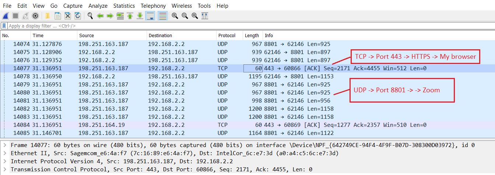
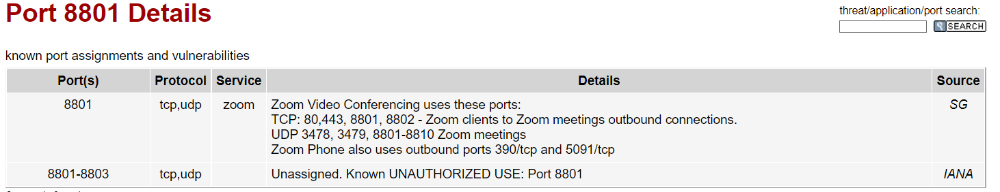

# NTW-03 Protocols
Every layer of the OSI stack has different protocols. Two examples of Layer 4 protocols are TCP and UDP.
UDP utilises a 'fire-and-forget' strategy, TCP on the other hand, a 'three-way handshake'. TCP is therefor more reliable (TCP ensures every package is correctly received), but UDP is significantly faster.
UDP is used in, for example, video streaming. 

The most commonly used protocols have their default ports (port 80 for http, port 443 for https etc etc)  
[Commonly used ports](https://nl.wikipedia.org/wiki/TCP-_en_UDP-poorten)

## Key terminology
- TCP: Three-way handshake model - communication back&forth between client and server to ensure correct delivery.
- WireShark: A tool to monitor network traffic (you can see information about every frame transferred; port, which protocol, src and dest IP addresses)

## Exercise
### Sources
- https://www.tutorialspoint.com/tcp-3-way-handshake-process
- https://nl.wikipedia.org/wiki/TCP-_en_UDP-poorten
- https://en.wikipedia.org/wiki/International_Organization_for_Standardization
- https://en.wikipedia.org/wiki/Internet_Engineering_Task_Force
- https://en.wikipedia.org/wiki/Request_for_Comments
- https://www.wireshark.org/
- https://nl.wikipedia.org/wiki/Packet_sniffer
- https://www.wireshark.org/docs/man-pages/tshark.html
- https://www.youtube.com/watch?v=OU-A2EmVrKQ
- https://www.speedguide.net/port.php?port=8801

OSI layers protocols:
- https://en.wikipedia.org/wiki/Physical_layer
- https://en.wikipedia.org/wiki/Data_link_layer
- https://en.wikipedia.org/wiki/Network_layer
- https://en.wikipedia.org/wiki/Transport_layer
- https://en.wikipedia.org/wiki/Session_layer
- https://en.wikipedia.org/wiki/Presentation_layer
- https://en.wikipedia.org/wiki/Application_layer

### Overcome challenges
- Learning about Wireshark
- Installed Wireshark on VM, but since the VM doesnt have a monitor, it doesn't work. -> Install WireShark on local machine.

### Results
**Identify several other protocols and their associated OSI layer. Name at least one for each layer.**
Layer 1 (Physical): Bluetooth, USB, Ethernet
Layer 2 (Data Link):  802.3 Ethernet, 802.11 Wi-Fi, MAC
Layer 3 (Network):  IPv4, IPv6
Layer 4 (Transport): TCP, UDP, QUIC, DCCP, 
Layer 5 (Session): DNS (Domain Name Service) `or its layer 7`, RTP, SOCKS (lots of layer 5 protocols are obsolete) 
Layer 6 (Presentation): NCP, NDR
Layer 7 (Application): HTTP, HTTPS, DHCP, FTP, SMTP, POP, PTP, IRC

**Figure out who determines what protocols we use and what is needed to introduce your own protocol.**  
Internet Engineering Task Force is an open standards organisation, which develops and promotes voluntary internet standards. In partical technical standards that comprise the Internet Protocol Suite. There are no formal members, all participants are volunteers (although a lot of them are sponsored). You can join the mailinglist for a membership fee and vote in propositions.

RFC (Request for Comments) are a series of publications regarding the standard-setting bodies for the Internet. Many RFC's are experimental in nature, however, quite a few of them have been adopted by the IETF as internet standards. You can submit a paper to the RFC for peer-review.

**Look into wireshark and install this program. Try and capture a bit of your own network data. Search for a protocol you know and try to understand how it functions.**
Wireshark is a 'packet sniffer' and can intercept and analyse network data. Normally, the NIC ignores packets not addressed to the MAC, but a Packet Sniffer such as Wireshark changes this behaviour.

  

Zoom uses port 8801:
  
