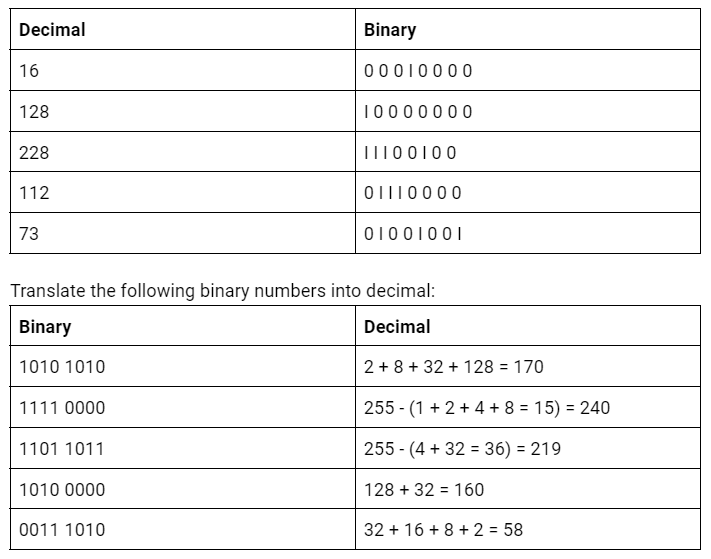
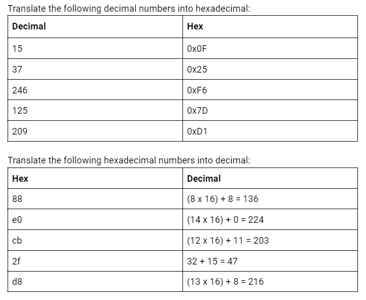

# NTW-04 Counting in Binary and Hexadecimal
Computers store information in bits. bits can have a electrical current (1) or not (0). Because computers can store only 2 'values' in a bit, the binary system is used. A sequence of 8 bits is a byte.  
Starting from the right, the numerical value of that bit is 2^0 = 1. The bit to the left of it 2^1 = 2, then 2^2 = 4, 2^3 = 8 etc etc.
This way you can combine a certain sequence of bits to make longer numbers.  

Hexadecimal is counting up to 16 (0-15) by using ABCDEF after the numbers. This is easier to read for humans.  

To distinquish hexadecimal from decimal, a 0x is usually added in front.  
Hexadecimal notation is recognisable from for example, HTML color selection. (#FFFFFF for white)

## Key terminology
- n/a

## Exercise
### Sources
- I learned about this in CS50 course.

### Overcome challenges
- I learned about this in CS50 course.

### Results
  
  
