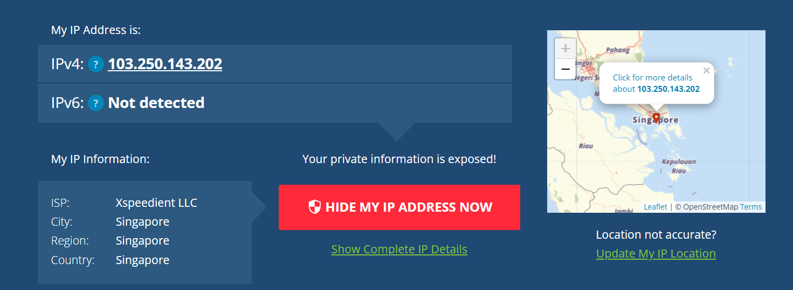
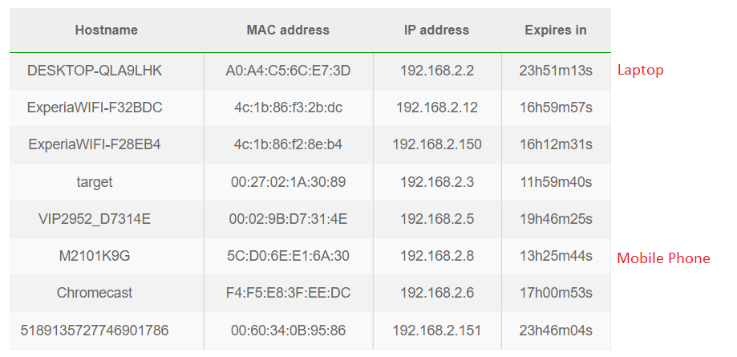
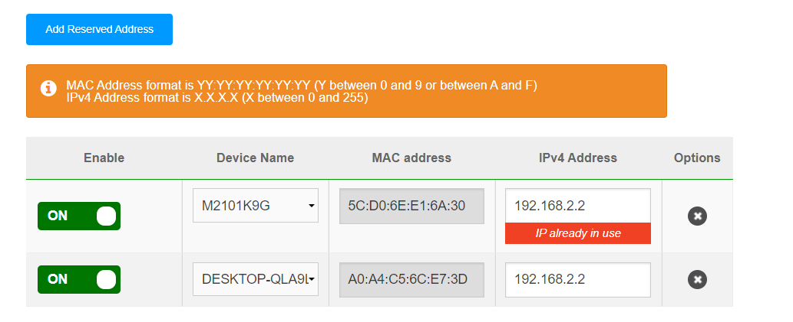
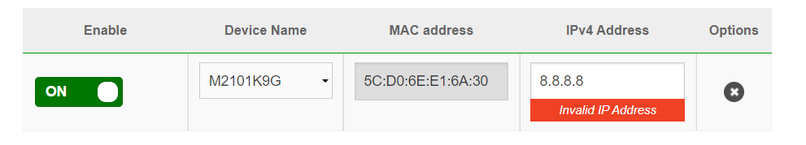
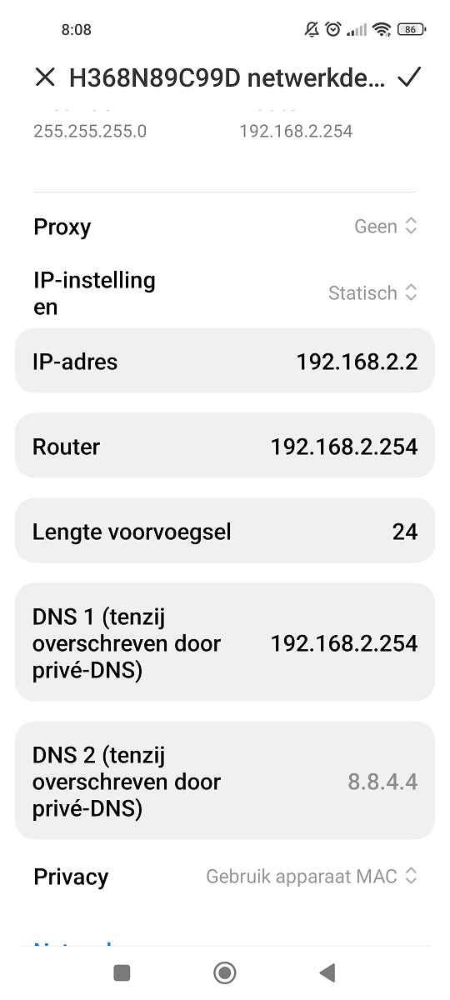
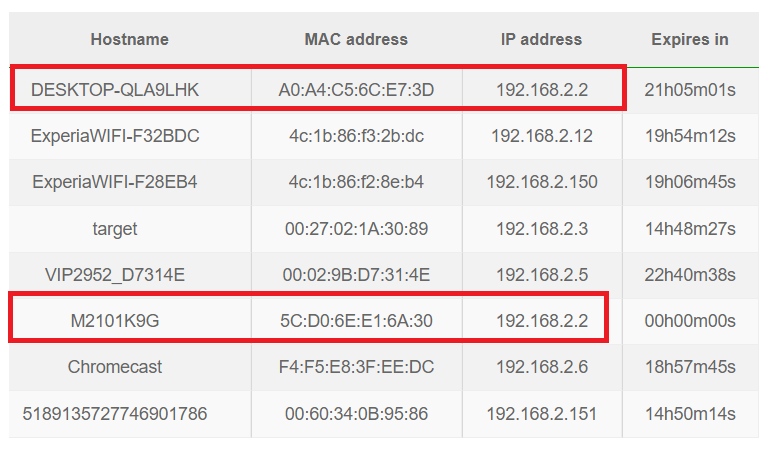

# NTW-05 IP addresses
The summary in the assignment is very clear.

## Key terminology
- IP address: Your address on the internet
- IPv4 = 32 bits == 4 bytes (4,3 E^9 possible combinations)
- IPv6 = 128 bits == 16 bytes (1,7 E^38 possible combinations) **that is 38 zero's!**
- Public vs Private IP: We ran out of IPv4 addresses, therefore we have only 1 public IP (our address to communicate with the world). In our local network, every device also has its own IP address (not accessable to the outside world, therefore it's called a private IP). Your public IP address is provided by your ISP.
- IP address looking like 192.128.x.x / 172.16.x.x / 10.x.x.x are almost always private IP addresses (local)
- NAT table: Network Address Translation - Your local network has only 1 public IP, but multiple devices can access the internet. This is done via NAT, which usually resides in the router or firewall. It converts a public IP to a private IP address and vice versa. It also masks the port number (so in the case of 2 requests on the same port (2 devices watching YouTube at the same time), it knows which reply is addressed to which host).
- Static NAT: directly (and statically) links a private IP to a public IP (very costly!! usually only used for web hosting (maybe google's 8.8.8.8?)) 
- Dynamic NAT: dynamically links a private IP address to a public IP, from a pool of available addresses. If there is no address available, the package is dropped. This is also very costly!
- PAT: aka NAT overload. Many private IP's can be translated to a single public IP. This is the most frequently used type, because it is very cost efficient. You can connect thousands of private addresses online through a single public IP address.
- Static / Dynamic: Because there are a finite number of addresses, they are usually not given out permanently, but on a lease basis. These addresses can therefore change (aka dynamic). It's possible to have static addresses too (useful for printers in a local network for example)

## Exercise
### Sources
- https://www.geeksforgeeks.org/network-address-translation-nat/
- I learned about bits bytes and IP addresses at CS50 course.

### Overcome challenges
- Playing around with your VPN gives issues when logging into your modem -> restart laptop

### Results
**Ontdek wat je publieke IP adres is van je laptop en mobiel op wifi. Zijn de adressen hetzelfde of niet? Leg uit waarom.**  
They are the same, because this is the address that is connected to the outside world.  

Go to this site from both devices and you get the same IP: https://whatismyipaddress.com/  
My IP address is owned by KPN and the server appearantly is located in Zoetermeer.  
 

If I enable my VPN, it masks my actual IP address, so for a website such as that checker, it looks like I am from Singapore ^^ 

**Ontdek wat je privé IP adres is van je laptop en mobiel op wifi. Zijn de adressen hetzelfde of niet? Leg uit waarom.**  
Same as NTW-03... Go into your router and check DHCP routing.  They are not the same, because otherwise you get a conflict and only one of them would have access to the internet (probably the device that has been assigned as last? Let's find out in the next question...)  

  

**Verander het privé IP adres van je mobiel naar dat van je laptop. Wat gebeurt er dan?**   
My modem doesn't allow a duplicate private IP's, even when assigning both statically...

Hypothetically if this was allowed by my router; there would be data collisions and a loss of data would occur.

[I did some online reading to understand the possible consequences of an occurence such as this](https://arstechnica.com/civis/viewtopic.php?t=1368751)  
  
  

**Probeer het privé IP adres van je mobiel te veranderen naar een adres buiten je netwerk. Wat gebeurt er dan?**   
My modem does not allow to change the IP of my phone to a non-private reserved address (I can change it to 192.168.2.xxx and fill in some random number for xxx)  
Hypothetically; my phone would lose connection because the traffic addressed to that address would be redirected out of the network.  
  
  

**Second attempt: changing the IP of my phone in my phone**  
I did not get the expected result... Both devices kept internet connection and I started a YouTube clip on both, but they both displayed the videos without any problems... There might be some other stuff going on to prevent this problem?  
      
  

  

