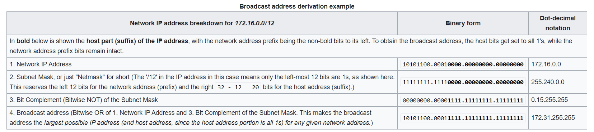
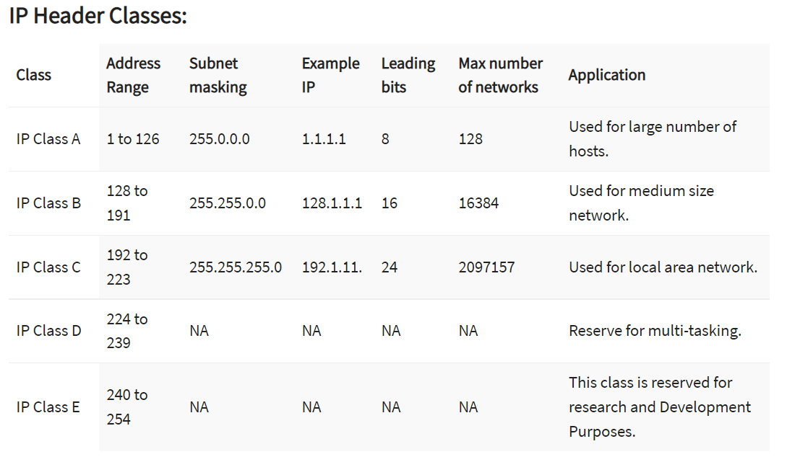
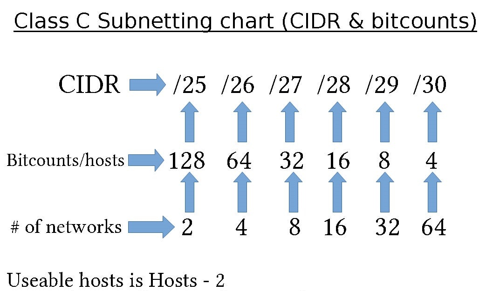
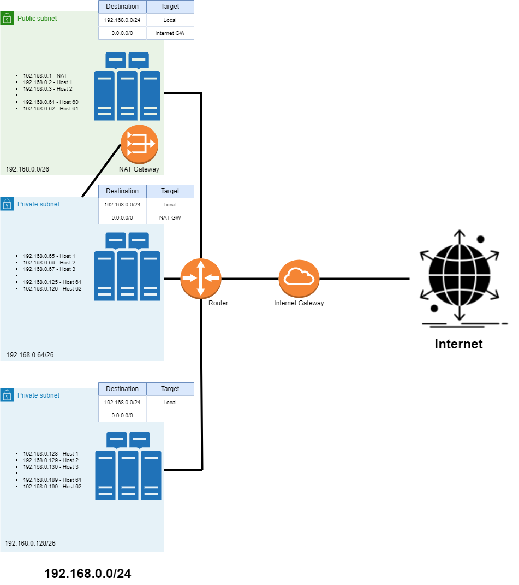

# NTW-06 Subnetting
An IP address consists of a network- and a host (device) portion. Without Submasking, we would not be able to distinquish between the two.  

Every bit that is a 1 in a subnet mask, belongs to the network. So for 255.255.255.0, that means all bits in the first 3 bytes belong to the network. You can layer this with the bits in the IP address and perform bitwise AND and know the values of the network.  

When you perform the bitwise AND, only the bits which are 1 in both sequences will be a 1 in the resulting sequence.  
  
Using this, any IP packet that is outside of the scope of a given subnet mask, are sent to the network gateway. So if a private network has a IPv4 address of 192.168.1.1 and a submask of 255.255.255.0, any packets with an address not within 192.168.1 has to the network gateway.
  

**Why is an address split up in two parts?**
When one hosts wants to communicate with another, it sends out a Broadcast to identify the receiver. The receiving host will reply with it's details. But every other host in the network will also receive the broadcast. A lot of hosts sending out broadcasts at the same time will clutter the network. Therefore the network is split up into smaller pieces. A Router is a physical border between networks and broadcasts do not cross a router, instead the router intelligently routes the request.  
  
You can see a submask as applying a filter over your network traffic; therefor you can improve efficiency (speed & stability) and security.  

**Submasking**  
Submasking is done by changing the default subnet mask by borrowing some bits from the host portion of the address.  
  
Some basic bitwise operation understanding is required. If you move all bits left, you double the value (provided you are not at the end of your byte...). Moving all bits 1 step right, you divide it by 2.  
  
By borrowing a bit from the host portion, you double the amount of networks and divide the amount of hosts by 2. If you borrow another bit, it's again network*2 and hosts/2. 2 hosts/addresses per network are reserved for the gateway and the broadcast.
  
   
  

Default submasks are divided into classes, because you are limited how many subnet you can make based on masking.  

Class A: starts with 1-126.x.x.x - default mask = 255.0.0.0 = +- 16 million host addresses (an ISP might use this)  
Class B: starts with 128-191.x.x.x - default mask = 255.255.0.0 = +- 65K host addresses (a big company might use this)  
Class C: starts with 192-223.x.x.x - default mask = 255.255.255.0 = 256 host addresses (normal connections)  
  
Reserved addresses:  
- 192.168.1.0 network address (only 0's in host part))
- 192.168.1.255 (broadcast address (only 1's in host part))
- 192.168.1.1 (usually the gateway)

    
    
  
CIDR notation of subnets (default for Class C is /24 aka 255.255.255.0 (3 x 8 bits = 24 bits belong to the network)):  
The slash notation (/24) is called a prefix, which should be read as: the submask length is 24 bits.
    
  
## Key terminology
- CIDR: Classless Inter-Domain Routing (slash notation). The number after the slash describes the length of the network mask in bits. /24 == 24 bits == 3 bytes == 255.255.255.0
- Broadcast: Form of communication, sending a signal to all connected hosts.
- Multicasting: Multicasting is a form of (group) communication. It can be one-to-many or many-to-many. 
- Broadcast address: The address on which the broadcast signal is transmitted (and connects the local network to the outside)
- Multicast address: A multicast address is a logical identifier for a group of hosts in a computer network.
- Public subnet: Communication is allowed between the subnet and the internet in both directions.
- Private subnet: Not connected to the internet (but can be connected via a NAT gateway)
- NAT Gateway: allows instances in a private network to connect ot the internet, but no unsolicited inbound traffic. A NAT Gateway must be located in a public subnet, otherwise it would not have access to a public IP.
- Gateway IP: best practise == first or last usable address = x.x.x.1 or x.x.x.254 (and use the same logic (first or last bit) on every subnet)
- ACL: Access Control List - predetermined list of 'rules' that can access area's of the network (a bit like file permissions on Linux). Usually applied on routers and switches within networks. Can aid security, but not as secure as a firewall.

## Exercise
### Sources
- https://www.ipxo.com/tutorial/what-is-subnet-mask/
- https://www.youtube.com/watch?v=s_Ntt6eTn94
- https://www.ipxo.com/subnet-cheat-sheet/
- https://en.wikipedia.org/wiki/Broadcast_address
- https://en.wikipedia.org/wiki/Default_gateway
- https://cloud.in28minutes.com/aws-certification-public-subnet-vs-private-subnet
- https://docs.aws.amazon.com/vpc/latest/userguide/vpc-nat-gateway.html
- https://www.youtube.com/watch?v=SBYNeGIng6I
- https://www.guru99.com/ip-address-classes.html
- https://www.geeksforgeeks.org/difference-between-vlan-and-subnet/
- https://portforward.com/networking/subnetting/
- https://www.geeksforgeeks.org/routing-tables-in-computer-network/
- https://www.ionos.com/digitalguide/server/know-how/cidr-classless-inter-domain-routing/
- https://serverfault.com/questions/854475/aws-nat-gateway-in-public-subnet-why
- https://docs.aws.amazon.com/vpc/latest/userguide/VPC_Scenario2.html
- https://www.youtube.com/watch?v=ntCiWVVgDI0

### Overcome challenges
- Understanding Subnetting
- Understanding Subnet masks
- Difference between private and public subnets
- NAT vs ACL
- Subnet vs VLAN
- Understanding the application and position of routing tables (thnx Casper!)
- Understanding the position of an Internet Gateway in relation to the network
- Understanding the position of a NAT in relation to the network (and private/public!!)

### Results

Design a networkarchitecture that meets the following demands:
- 1 private subnet with atleast 15 hosts. Only accessable within the LAN. (could be database servers)
- 1 private subnet with atleast 30 hosts. This network should have internet access through a NAT Gateway. (could be PC's)
- 1 public subnet with a internet gateway. This subnet needs to be able to place atleast 5 hosts (excluding the internet gateway) (could be netservers)

I would normally ask what kind of growth is expected. For now I have chosen to work with a network IP of 192.168.0.0/24, but 10.0.0.0/16 would make the routing configurations very easy (first host of every network would always be .1)  

We need atleast 3 seperate networks, so that means we need to borrow 2 bits -> 192.168.0.0/26  
  
/26 allows for 62 hosts (64 minus 2) on 4 seperate networks, which meets the demands (and room for another network in case of growth).  

