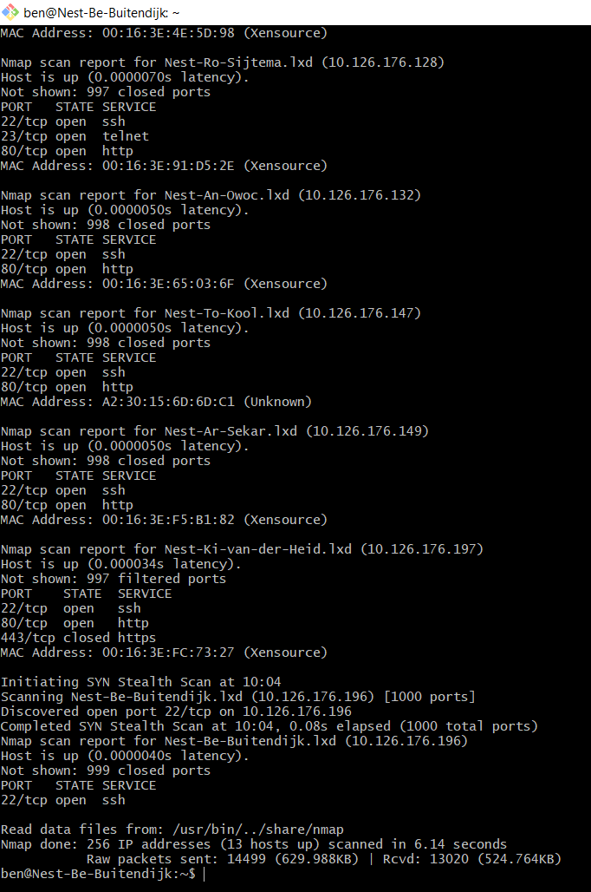

# SEC-01 Network Detection
In an effort to prevent or stop attacks on your network, you must be able to analyse your network traffic. There are many tools available, but two of the most popular ones are Wireshark and nmap.   
  
Nmap (Network mapper) is a tool that scans a network to find informati on about it, for example which hosts are connected and which ports are opened.  
  
Wireshark is a protocol analyser. It looks at (all) network traffic and can extract protocol/header information, such as source/destination addresses. 

## Key terminology
- `ip r`: get default gateway address
- for nmap addresses: you can use ranges `x.x.x.1-255` or wildcard `x.x.x.*`
- `sudo nmap -sP <address>`: scan network for all connected hosts.
- `sudo nmap -v <address>`: scan network for open ports
- `sudo nmap --iflist`: route and host interface information (our class VPC gateway is located at 10.126.176.1)
- `sudo nmap -p <port> <address>`: scan for port
- `hostname`: name of host
- `hostname -I`: address of host
- `<command> | awk '{print $<x>}'`: pipe into AWK and print x-th identifier of every line.

## Exercise
### Sources
- https://linuxhint.com/use-nmap-command-ubuntu/
- https://www.howtogeek.com/562941/how-to-use-the-awk-command-on-linux/

### Overcome challenges
- I had to type the IP address a couple of times and got annoyed -> found hostname command and learned more about awk + syntax

### Results
Scanning the network of my VM:  

I analysed the packets that you can view with Wireshark in [NTW-03](../03_Networking_1/NTW-03_Protocols.md). Click the link to view the screenshots there. Wireshark enables you to literally see every packet that is being transmitted on your network, so every millisecond you have a new entry.
