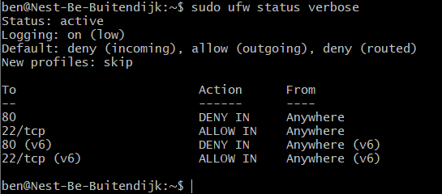

# SEC-02 Firewalls
A firewall is a security device that monitors network traffic and secures the network by applying a filter on incoming and outgoing traffic. Filters that can be applied are: protocol, port number, source and destination of a packet. More advanced firewalls can even filter based on the content.

Data is send across the network in the form of packets. A firewall analyses these packets by inspecting the header (protocol information) and payload (actual data). The header contains information such an IP address. Specific IP addresses can be blocked or all adresses can be blocked and only specific addresses are allowed to pass. 
  
  
**Software Firewalls**  
A software firewall is installed on the host device (therefore also known as a host firewall). As it is host specific, it will use some resources from the host to operate (CPU and RAM). Also it needs to be installed on every device and if different devices have different systems, you might need to configure them independently.  
An advantage of software firewalls is that they can distinquish between different programs while filtering traffic, thus they can allow one program and deny another.  
  

**Hardware Firewalls**  
Hardware firewalls (Appliance Firewalls) represent a seperate piece of hardware that is placed in between the local and external network (internet). These firewalls have their own resources and therefore do not consume any resources from hosts. Medium to large organisations might employ these, as it is more practical to install a single hardware firewall than install and configure a firewall for each host device. Setting up and configuring them is hard and takes skill.  
  

**Packet-Filtering Firewalls**  
When it comes to types of firewalls based on their method of operation, the most basic type is the packet-filtering firewall. It serves as an inline security checkpoint attached to a router or switch. As the name suggests, it monitors network traffic by filtering incoming packets according to the information they carry. This type of firewall decides whether a packet is allowed or denied access based on the header information. To do so, it inspects the protocol, source IP address, destination IP, source port, and destination port. Depending on how the numbers match the access control list (rules defining wanted/unwanted traffic), the packets are passed on or dropped. It can also be used to isolate internal network traffic.  
This method is fast and doesn't require a lot of resources, however, it is not the most secure, because it only checks the header. Malware can be embedded into the packet payload, which will be able to make it past this type of firewall. It is also vurnerable to IP Spoofing. 
  
  
**Circuit-Level Gateways**  
Circuit-level gateways operate at the session layer of the OSI model, observing the TCP connections and sessions. Usually these are build into types of software or other firewalls. These firewalls only instead the header and not the payload. These can check TCP handshakes.   
  

**Stateful Inspection Firewalls**  
A stateful inspection firewall keeps track of the state of a connection by monitoring the TCP 3-way handshake. This allows it to keep track of the entire connection – from start to end – permitting only expected return traffic inbound.  
When starting a connection and requesting data, the stateful inspection builds a database (state table) and stores the connection information. In the state table, it notes the source IP, source port, destination IP, and destination port for each connection. Using the stateful inspection method, it dynamically creates firewall rules to allow anticipated traffic.  
If a active connection is trusted, then not all packets in this session will be scanned. A TCP session is defined by the information in the handshake.  
UDP is a connectionless protocol (it does not have unique connection identifiers), therefore it will be removed from the trusted table after the configured timeout. A technique that uses this 'entry' is called [UDP hole punching](https://en.wikipedia.org/wiki/UDP_hole_punching), where empty packets are send to keep the connection established.  
This type of firewall is used as additional security. It enforces more checks and is safer compared to stateless filters. However, unlike stateless/packet filtering, stateful firewalls inspect the actual data transmitted across multiple packets instead of just the headers. Because of this, they also require more system resources.  
  
  
**Proxy Firewalls**  
Proxy: "An agent or substitute authorized to act for another person.". This is exactly what a Proxy firewall does, it serves as an intermediary device and forwards requests from the original client and masks it as its own. A server will only communicate with the proxy and the proxy communicates with the client. This hides the client's identification and geolocation from the server. Proxy servers will need additional configuration to encrypt the data (which is a potentional risk). Also it is not compatible with all network protocols.  
  

**Next-Generation Firewalls**  
The next-generation firewall is a security device that combines a number of functions of other firewalls. It incorporates packet, stateful, and deep packet inspection. Simply put, NGFW checks the actual payload of the packet instead of focusing solely on header information. An NGFW provides protection from malware attacks, external threats, and intrusion, however they can be very costly. As they operate on nearly every layer of the OSI model, they can be difficult to incorporate into existing security systems.   
  

**Cloud Firewalls**  
A Cloud Firewall (or Firewall-as-a-service) is a cloud solution for network protection. They are run and maintained by the cloud providers. Their main advantage is scalability and independence of system resources.  
  

**Application Firewall**
These firewalls operate on layer 7 and are designed for specific applications. It will inspect the packets on an application level. For example a firewall that is designed to protect a webserver, would be able to recognise and protect against SQL injections, Cross-site scripting for example.  
  
  
Different OS have different default firewalls. CentOS and REHL use firewalld. Ubuntu uses ufw. An older firewall that is still common today is iptables.

## Key terminology
- Firewall: a firewall is a security device that monitors network traffic and secures the network by applying a filter on incoming and outgoing traffic.
- IP Spoofing: packets which have a modified source IP address, to either hide the original or impersonate another source.
- Proxy vs VPN: a VPN additionally encrypts all data transmitted, aswell as re-route the trajectory through proxy's. A proxy server does not have encryption capabilities.

## Exercise
### Sources
- https://en.wikipedia.org/wiki/Stateful_firewall
- https://phoenixnap.com/blog/types-of-firewalls
- https://www.cloudflare.com/learning/ddos/glossary/ip-spoofing/
- https://www.cloudwards.net/vpn-vs-proxy-vs-tor/
- https://help.ubuntu.com/community/UFW

### Overcome challenges
- I felt I did not fully comprehend the explanation of stateful firewalls from the assignment, so I looked it up for more detailed info.
- Learning about UFW, commands, flags and syntax.

### Results
Apache 2 page hosted on my VM, but opened on my local machine:  
  
  
UFW settings:  

  
Apache page after UFW port 80 blocked:  

  

