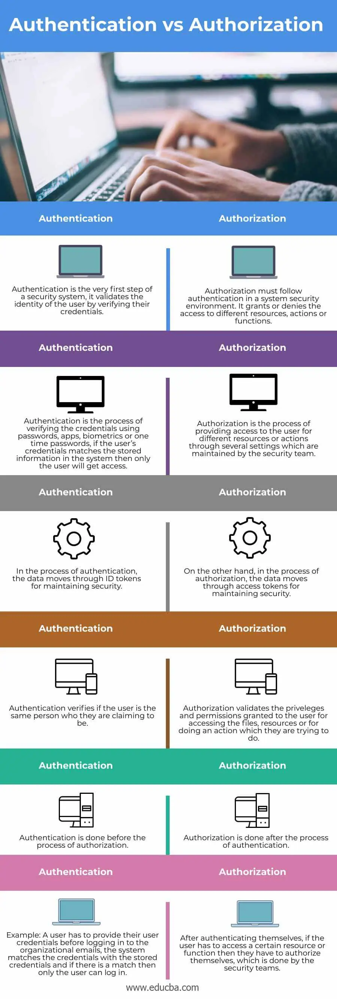
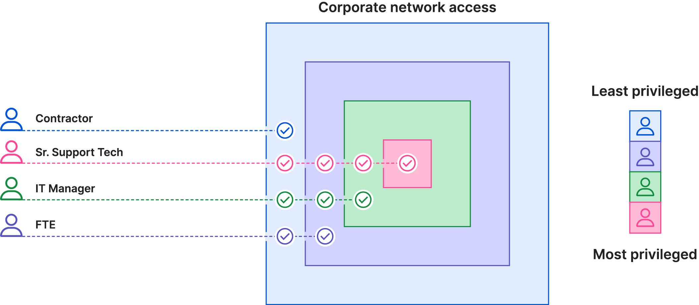

# SEC-03 Identity and Access management
IAM (Identity and Access Management) is a framework of business processes, policies and technologies that facilitate the management of digital or electronic identities.  
Security can be divided into two distinctions: authentication  and authorization. Both are different actions that happen when you log in.  
Systems used for IAM include single sign-on, two-factor authentication (2FA), multi-factor authentication (MFA) and privileged access management. 2FA is basically a subset of MFA.  

**Fundamental IAM components:**
- How individuals are identified in a system (difference between identity maangement and authentication)
- How roles are identified in a system and how they are assigned to individuals
- Adding, removing and updating individuals and their roles in a system
- Assigning levels of access to individuals or user groups
- Protecting sensitive data within the system and securing the system itself

**Authentication**
Authentication means verifying that a user is who he says he is. Think of your passport in the real world, if you want to travel, you need to bring your passport so the border control can verify your identity.  
In computer systems, there are multiple ways that authetication can take place. Examples are: passwords, pre-shared keys, behavioral authentication and biometrics. For each of these, there are multiple implementations, some examples can be found in the keyword list below.  
  
The factors of authentication:  
- Knowledge (password, PIN)
- Posession (badge, phone, smart-card)
- Inheritance (biometrics and behavioral analysis)
     
     
**Authorization**
Authorization happens after authentication. Provided the user is who he/she says he/she is, then what is the user allowed to do? Based on the role of a user in a organisation, what does the user have access to? Authorisation is storing this information and checking this when a user does an action. For example: one employee can add invoices to the system, but is not allowed to see all administrative details. Popular techniques are: RBAC, JWT, SAML (SSO), OpenID, OAuth.  
     

     
     
**Least Privilege Principle**
A commonly used authorisation concept is called the "Least priviledge principle". It is one of the core concepts of the zero-trust model. Basically, you consider everyone a treat, both inside and outside the network. Therefor, you very strictly control who has access to what. An user who requires more access rights to do their work, is therefor a bigger threat (which you could secure with more authorisation). In general, users only have access to the parts of the network that is required for them to do their work (comparable to a need-to-know distribution of information in an army. A general will know everything, but a foot-soldier will only receive orders from those higher in command.)
   
     

   
     
To conclude: a safe system has to apply both of them in a good combination. Authentication and authorisation are not the same, but complement each other and infact, require each other to be effective.  
You can layer multiple authentication methods on top of eachother to improve security. A password can be hacked, but (using 2FA with someone's phone) it's less likely that both their password is hacked AND their phone is stolen (and also hacked).  
Now imagine you also add a biometric layer, it is even less likely that someone will get unauthorised access.  
Combining this with a proper authentication system
  

  
## Key terminology
- Pre-shared keys: a key that is shared between users (for example, a wifi password)
- Behavioral authenticion: Using AI's, it's is possible to verify a users identity based on their common behavior, such as keystroke dynamics and mouse-use characteristics. If this falls outside the norm of a user, the AI can then shut the system down. 
- Biometrics: Authentication based on a users bio-data. For example: fingerprints, iris-scans, faces, voice recognition and even DNA sampling.
- One-time Passwords: Passwords that are communicated to the user by a previously authorised channel. They are only valid for a single transaction or session. (Google Authenticator on your phone).
- Authentication apps: A system could generate a security code that can be accessed through a third party app. (DigiD and your bank app)
- Access: The ability for a user to view, create or modify a file.
- RBAC: Role-based access management. 
- JWT: JSON Web token: This is used for the secure transmission of data. The parties have been authorised using a private key pair.
- SAML: Security Assertion Markup Language (aka Single Sign On (SSO)): Data is transferred through XML documents which have been signed digitally. 
- OpenID authorization: This authorization technique verifies the user on the basis of the authorization server’s authentication.
- OAuth: This authorization technique enables an API for authenticating and providing access to the user for the requested resource or action.

## Exercise
### Sources
- https://www.techtarget.com/searchsecurity/definition/identity-access-management-IAM-system
- https://www.educba.com/authentication-vs-authorization/
- https://www.onelogin.com/learn/what-is-mfa
- https://www.cloudflare.com/learning/access-management/principle-of-least-privilege/
- https://www.cloudflare.com/learning/security/glossary/what-is-zero-trust/

### Overcome challenges
Just a doing some reading. Was familiar with most things because we use them every day, but now I can put them in perspective.

### Results
N/A 
