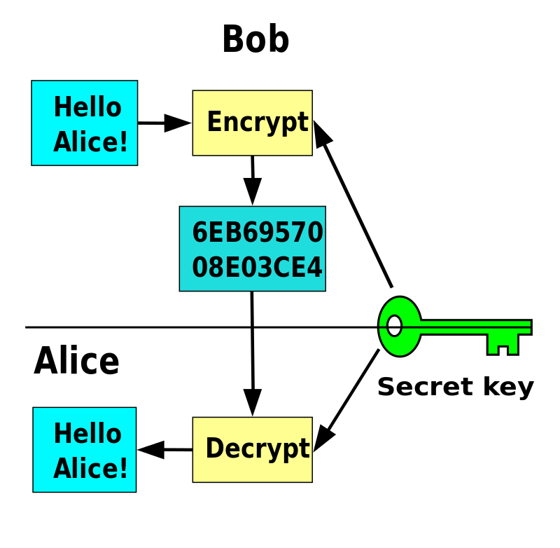
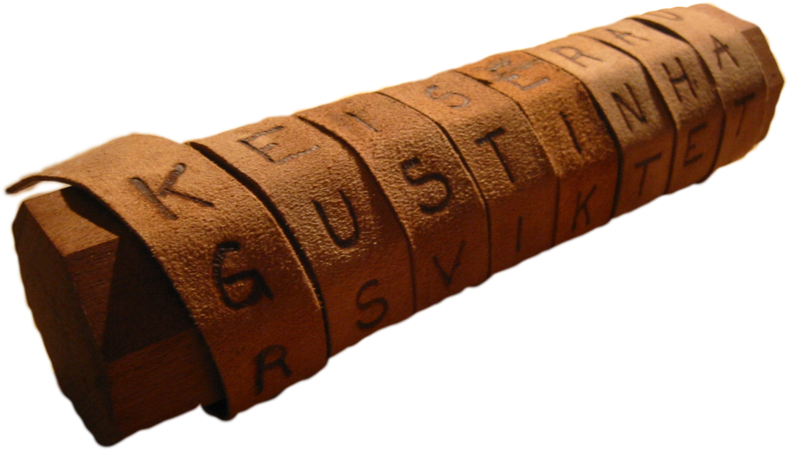
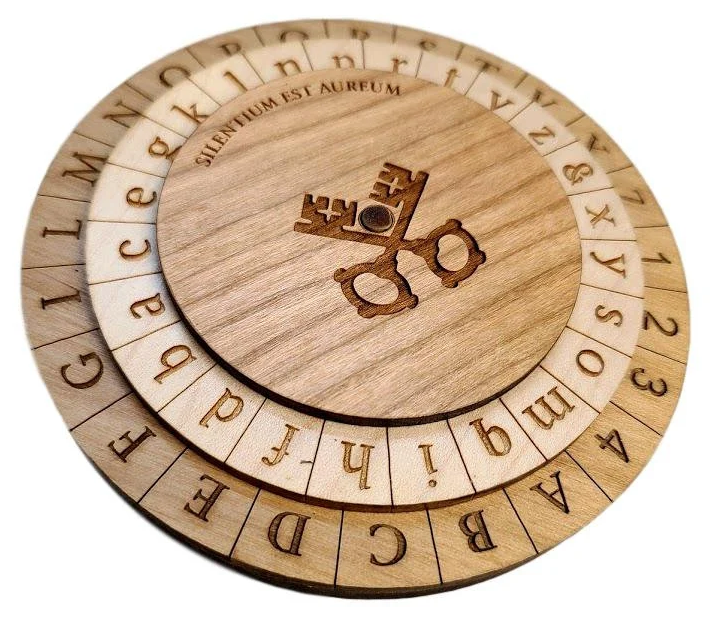

# SEC-04 Symmetric Encryption
Symmetric Encryption: Encryption using a single key that has to be shared between the encrypter (sender) and decrypter (receiver). The algorithm that is used to encrypt and decrypt should be publicly known (because then it has been well tested). The key is the only thing that is kept secret.  

  
  
There are systems that use a key only once (email will generate a new key for every email you sent) and systems that use a key multiple times (file encryption).  

Caesar cipher: shifting the letters of the alfabet by x amount. All letters are shifted by the same amount (it's therefor technically not a cipher).  
Substitution cipher: for every letter in the alfabet, there is a key-map where the replacement value for every input value is noted.  

**How to crack weak ciphers?**  
We can analyse a cipher text and compare the content to the most common letters (in English "e": 12.7%, "t": 9.1%. "a": 8.1% ). Which letter is the most frequent in the cipher text? That one has a very high probability of being "e" and we can continue to do this for the next letters too.  
Furthermore, we can search the ciphertext for digrams (common combination of two letters; "he", "an", "in", "th)  and trigrams.  
In computers, we can convert alfabetical letters to numerical values by using the ASCII encoding (how letters are stored in a byte) to perform these operations easier.  
  

Modern encryption using computers works a little bit different; the computer performs an XOR operation on the bits to encrypt or decrypt the message. A cipher has perfect secrecy (the ciphertext doesn't reveal anything about the plaintext) if for any given cipher text, there exists only 1 key. The "One Time Pad" is such a method, but the downside of OTP is that the key needs to be atleast as long as the text, therefor it's not efficient.  
  

In simple terms, good cryptography is not about being perfectly secure, but to make it as hard as possible to crack, whilst still being efficient to encrypt/decrypt. There are a couple of mathemetical problems, that take an incredible amount of processing power, such as prime factorisation and discrete logarithms problems. By using a key with a long enough length, it's not impossible to crack a key, but with today's processing powers, it would take 1000's of years to do so (and therefor it is considered safe).

## Key terminology
- Plaintext: original/input text
- Ciphertext: encrypted text
- Encrypt: Convert plaintext into ciphertext
- Decrypt: Convert ciphertext into plaintext
- key: the input variable into a function that encrypts/decrypts data.
- keyspace: all possible valid and distict variations in a specific cryptosystem. This is also the amount of attempts required by a brute-force attack to crack a cipher.
- Caesar cipher: shifting all letters in the alfabet by the same amount.
- Vigenère cipher: Repeating a key for the for the length of the full message to match both lengths. Then you add both letters together (mod 26) to get the ciphertext. This was used in the 16th century.
- Rotor Machines: machines that use a rotating disc that turns for every character typed. Therefor the keymap is shuffled and contains less patterns. Hebern machine (single rotor) and the Enigma machine (3-5 rotors) are examples. These were used from 1870 - 1943.
- DES: Data Encryption Standard (1974). After the enigma machina, digital encryption came into play. DES was a standard requirement (kind of like a protocol). AES (2001) and Salsa20(2008) are other examples.
- Stream cipher: Enciphers input by individual character.
- Block cipher: Enciphers input in blocks of plaintext.
- Frequency analysis: The analysis of how frequent a letter or group (n-grams) of letters is in a ciphertext. This is then compared to the statistics of a certain language and can predict a key based on the probability.

## Exercise
### Sources
- https://www.coursera.org/learn/cryptography#about (too mathemathical lol, I started some maths course to improve that first)
- CS50
- Computerphile Youtube Channel
- https://en.wikipedia.org/wiki/Cryptography
- https://www.asciichart.com/
- https://en.wikipedia.org/wiki/Frequency_analysis
- https://en.wikipedia.org/wiki/Block_cipher
- https://www.tutorialspoint.com/cryptography/block_cipher.htm
- https://en.wikipedia.org/wiki/Stream_cipher

### Overcome challenges
- I am interested in cryptography, so I had already looked most of it up. I thought it was a good idea to dive deeper this time and start a cryptography course, but it was pretty much only mathemetical formula's and got me confused about a lot of simple concepts... I think that was an example of diving too deep.

### Results
**Two examples of historic ciphers**
     
Scytale:  
The scytale was using in ancient Greek, in particular the Spartans. A strip of leather is wound around a rod. The recipient must use a rod of the same diameter, otherwise the letters are completely scrambled.  

     
     
Alberti Cipher:  
The Italian architect, Leon Battista Alberti, was the first to use a rotating mechanism, back in 1467. This was by far supreme than any previous cipher, because frequency analysis was impossible (the disk keeps rotating for every character, therefor character occurance has a different key).
  

  
   

**Two examples of digital ciphers that are being used today**  
AES (Advanced Encryption Standard): also known as Rijndael. Was invented by two Belgian cryptographers and selected by the NIST as a standard. It is a block cipher that works with blocks of 128 bits and has three different key lengths (128, 192 and 256 bits).
  
SHA (Secure Hash Algorithm): SHA has been developed by the NSA. There have been multple versions, SHA-0 was flawed and quickly retracted. The most recent version is SHA-3 This is an example of a cryptographic hash function. The difference between this and stream- or block ciphers, is that hash algoritms are uninvertable. That means once data is hashed, it's not possible to retrieve the original data. These kinds of functions are used to verify the authenticity of data/documents. 
     
   

**Sending a encrypted message to a teammate using a public key cipher**
Encrypting a message is not hard using a website such as: https://cryptii.com/  
The hard part was coming up with a key that I could share in a public room, without other people being able to know it.  
For this exercise, I teamed up with Killian and in NTW-03, I spotted his gaming username when he was trying to see if he could recognize Discord with WireShark. I used this as a key, since the probability of anyone else in the group knowing this information is small, therefor I could publicly tell him the reference to that. I could have chosen his sport, or which team he has played for, but he has mentioned this information in his introductions, so the chance is pretty high that there is someone else that also remembers this.  
His screen was only shared within our team and I believe my teammates were working on another assignment, so that lowers the chance that they were looking at the screenshare.  Also, spotting his username was pretty random, so even if they were watching, the probability that they spotted it as well, is even lower.  
  
The challening part with symmetric encryption is sharing the key. If anyone else knows his username (or are able to find out), they can then also decrypt the message. That is also a vurnerability here, it's not impossible for someone else to find out his username. 
  
Interestingly, the key I chose, is based on the probability that anyone else also knows it. So that logic is the same as the encryption basics: a lower probability is related to a higher security.

**update**
I have removed my previous message, because Casper said I have to share the actual key in the group channel. He gave a hint that we could do exercise SEC-05 first, which I am going to do now. After that, we will use asymmetric encryption to share the key of our symmetric encrypted message, so the public key itself is actually encrypted.

Instead of a Vigenère, I used a block cipher to encrypt the message. For complete implementation, check [SEC-05](./SEC-05_Asymmetric_Encryption.md)
