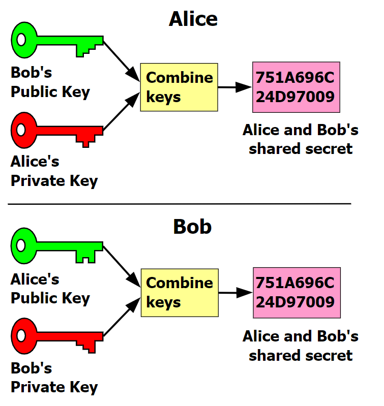
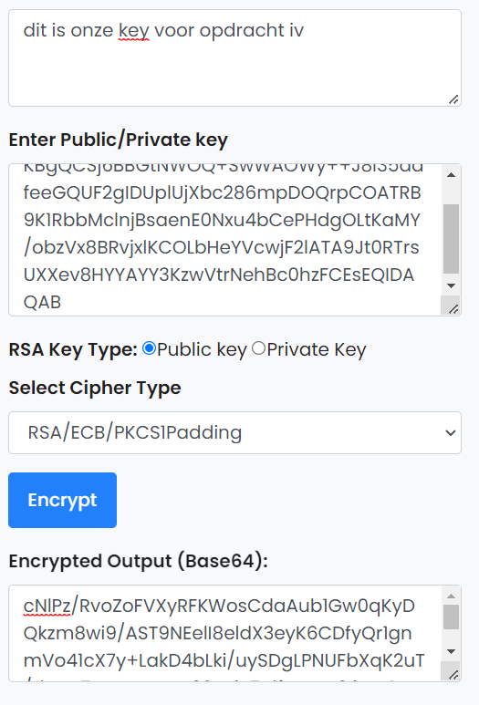
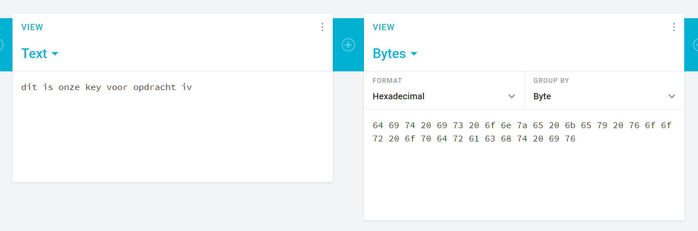
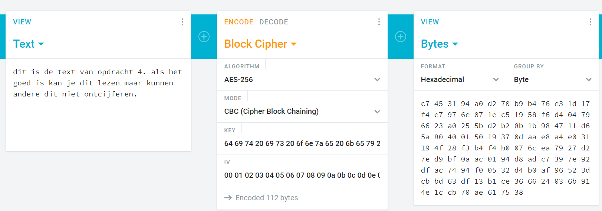
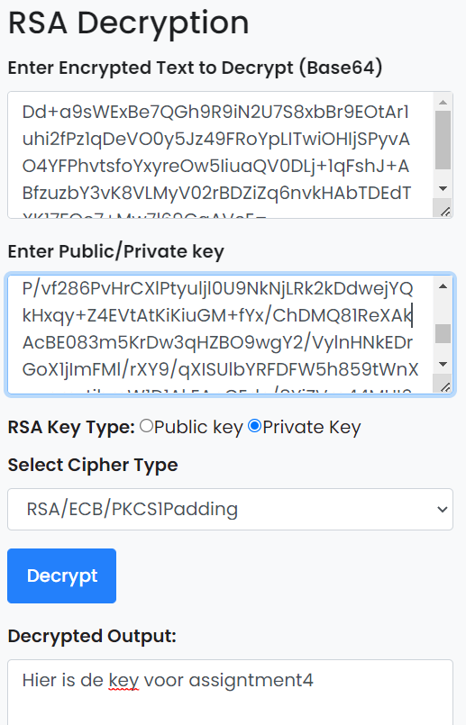
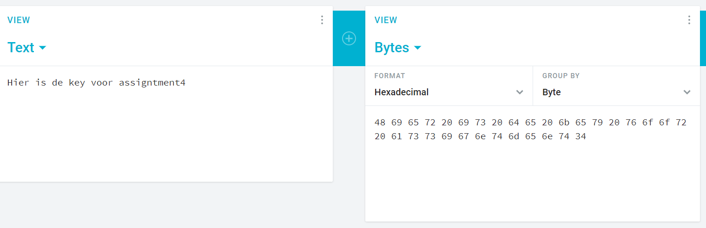
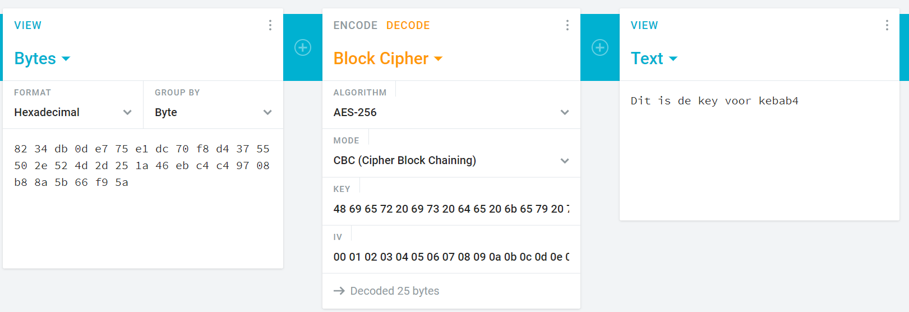

# SEC-05 Asymmetric Encryption
The main difference between symmetric and asymmetric encryption is that asymmetric encryption consists of 2 keys; a public and a private key. A significant disadvantage of symmetric encryption is key management. Every 2 users need a shared key and they might even have a different key for every message, therefor the amount of required keys can increase very quickly.  

Asymmetric encryption is based on a mathematical relation between two primes (public and private key). If you encrypt your message based on your private key and the receivers public key, they are able to encrypt the message with their private key and your public key. Anyone else who doesn't know the private keys can not decrypt it (the mathematical equation is considered a very hard computational problem).
  
The idea for this was published in 1976 by Diffie and Hellmann. A commonly used algorithm today is RSA.  
The SSH key we used to log into our VM is also an example of asymmetric encryption (SSH).

## Key terminology
n/a

## Exercise
### Sources
- https://en.wikipedia.org/wiki/Cryptography#Symmetric-key_cryptography
- https://en.wikipedia.org/wiki/Diffie%E2%80%93Hellman_key_exchange
- https://travistidwell.com/jsencrypt/demo/
- https://www.devglan.com/online-tools/rsa-encryption-decryption

### Overcome challenges
- n/a

### Results
I used the website to generate an RSA key. Then I shared my public key with my teammate Killian in our public channel. Then I encrypted a message (our shared key for SEC-04) using his public key and shared this again in the public channel.

The website in the exercise did not allow to edit the public key, so we could not sent encrypted messages. For that we used another site (linked above).  

  
  
  

  
  
**Decrypting Killian's message**  

  
  
  
  
  

I believe what we have done now, is called Bootstrapping and is how TLS/SSL communications work. First a secure channel is opened using an Asymmetrical key, after which the actual communication is done with symmetric encryption (because it is much faster).
