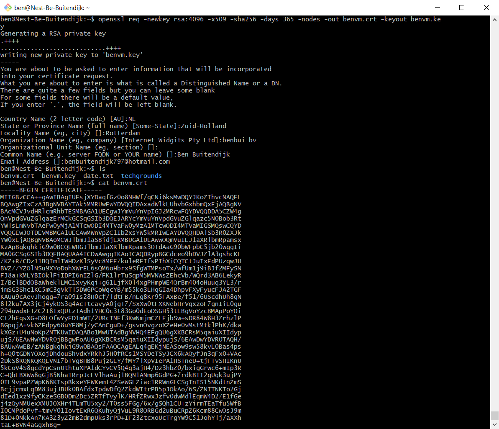
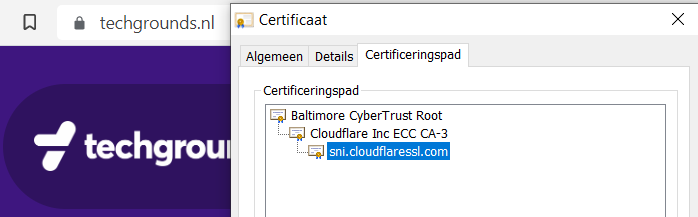
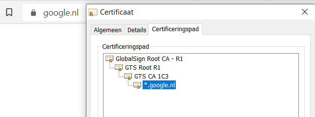
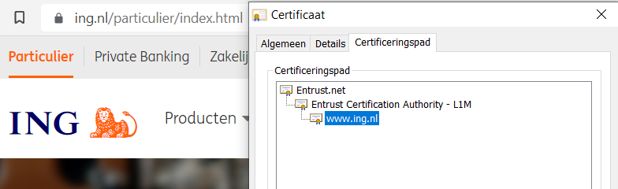
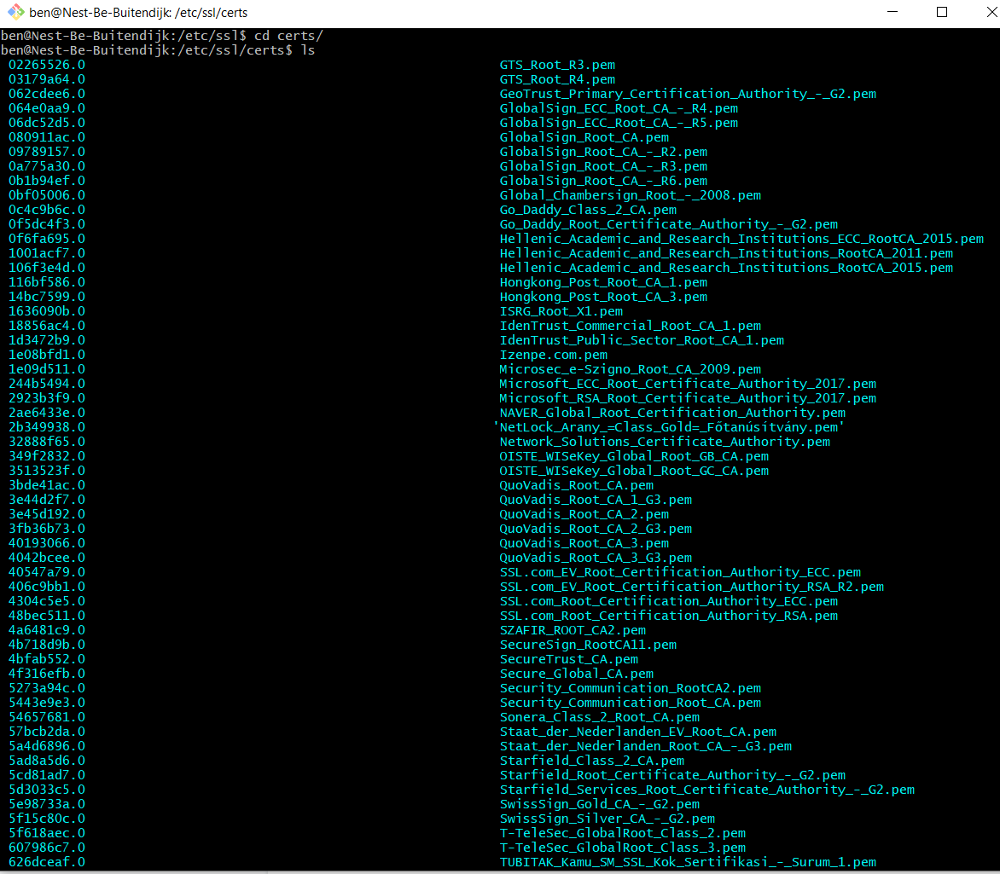

# SEC-06 Public Key Infrastructure
A public key infrastructure (PKI) is a system for the creation, storage, and distribution of digital certificates which are used to verify that a particular public key belongs to a certain entity. The PKI creates digital certificates which map public keys to entities, securely stores these certificates in a central repository and revokes them if needed.  

PKI consists of three entities also known as CIA:
- **Confidentiality:** Assurance that no entity can maliciously or unwittingly view a payload in clear text. If they do it appears as gibberish (ciphertext). TLS (Transport Layer Security) is a protocol used to achieve this goal.
- **Integrity:** Assurance that if the data transmitted has been tampered with, it would be obvious as it's integrity would have been compromised. Usually it's not of utmost importance to be prevent data from being compromised (tamper-proof), but it is of utmost importance that if integrity has been compromised, there is clear evidence of it (tamper evident).
- **Authenticity:** Assurance that you have certainty of what you are connecting to, or evidencing your legitimacy when connecting to a protected service. The former is termed server-side authentication (authenticating to a web server using a password). The latter is termed client-side authentication.
  
X.509 is the standard which defines the process in which a PKI should function. There are many ways of implementing a PKI, not all of them comply with the X.509 standard.  

An X.509 certificate binds an identity to a public key using a digital signature. A certificate contains an identity (a hostname, or an organization, or an individual) and a public key (RSA, DSA, ECDSA, ed25519, etc.), and is either signed by a certificate authority or is self-signed. When a certificate is signed by a trusted certificate authority, or validated by other means, someone holding that certificate can use the public key it contains to establish secure communications with another party, or validate documents digitally signed by the corresponding private key.  

In the X.509 system, there are two types of certificates. The first is a CA certificate. The second is an end-entity certificate. A CA certificate can issue other certificates. The top level, self-signed CA certificate is sometimes called the Root CA certificate. Other CA certificates are called intermediate CA or subordinate CA certificates. An end-entity certificate identifies the user, like a person, organization or business. An end-entity certificate cannot issue other certificates. An end-entity certificate is sometimes called a leaf certificate since no other certificates can be issued below it.  
  
An organization that wants a signed certificate requests one from a CA using a protocol like Certificate Signing Request (CSR), Simple Certificate Enrollment Protocol (SCEP) or Certificate Management Protocol (CMP). The organization first generates a key pair, keeping the private key secret and using it to sign the CSR. The CSR contains information identifying the applicant and the applicant's public key that is used to verify the signature of the CSR - and the Distinguished Name (DN) that is unique for the person, organization or business. The CSR may be accompanied by other credentials or proofs of identity required by the certificate authority.  
  
Browsers such as Internet Explorer, Firefox, Opera, Safari and Chrome come with a predetermined set of root certificates pre-installed, so SSL certificates from major certificate authorities will work instantly; in effect the browsers' developers determine which CAs are trusted third parties for the browsers' users. For example, Firefox provides a CSV and/or HTML file containing a list of Included CAs.

## Key terminology
- CA: Certificate Authority - Stores, issues and signs the digital certificates. A CA can issue other certificates. 
- TTP: Trusted third party (another name for CA's)
- RA: Registration Authority - Verifies the identity of entities requesting their digital certificates to be stored at the CA
- CSR:  Certificate Signing Request - in PKI's a CSR is a message from an applicant to a registration authority to apply for a digital identity certificate.
- OCSP: Online Certificate Status Protocol - A protocol used to obtaining the revocation status of a X509 certificate. It is an alternative to CRL (Certificate Revocation List).
- Self-Signed Certificate - Here we act as our own CA, signing our own CSR. Because we are not recognized as an official CA, this would give security warnings in browsers (as browsers have a list of official CA's).
- Root Certificate - a Self-signed certificate signed by a CA (there is not authority higher in the hierarchy, so they have to self-sign it). It is used to sign other certificates.
- Intermediate Certificate - This certificate is used to sign other certificates, but it is not self-signed. IC's are signed by a Root Certificate.
- End-Entity / Leaf Certificate - The final user's certificate. It is usually signed by a Intermediate Certificate (and therefore recognised as those have been signed by a Root). These certificates can not sign any other certificates (hence the leaf name, they cannot grow any branches).

## Exercise
### Sources
- https://en.wikipedia.org/wiki/Public_key_infrastructure
- https://en.wikipedia.org/wiki/X.509
- https://en.wikipedia.org/wiki/Certificate_signing_request
- https://en.wikipedia.org/wiki/Online_Certificate_Status_Protocol
- https://www.kinamo.nl/nl/support/faq/wat-zijn-root-en-intermediate-ssl-certificaten
- https://en.wikipedia.org/wiki/Public_key_certificate#Intermediate_certificate
- https://www.ibm.com/support/pages/openssl-commands-check-and-verify-your-ssl-certificate-key-and-csr (lots of extra commands)
- https://devopscube.com/create-self-signed-certificates-openssl/
- https://websiteforstudents.com/how-to-create-self-signed-certificates-on-ubuntu-linux/

### Overcome challenges
Understanding and learning a lot about PKI and X509.  
I did not understand why we would want to make a self-signed certificate, because they seem unsafe and not very user friendly (they are not installed in browsers by default so every user would have to do that manually)... The second to last link in my sources explained this part (although the actual tutorial on creating a self-signed certificate was confusing, so I used the last link... Thnx Killian).

Benefits:  
- You don’t need to rely on a third party to sign your certificate.
- You can create and use your own certificate authority.
- You don’t have to pay for a certificate from a CA.
- You have more control over your certificates.

Drawbacks:  
- Your users will need to install the certificate in their browsers or applications.
- Your users will need to trust your certificate authority manually.
- They unsafe for public facing applications.
- None of the browsers or operating systems trust the self-signed certificates unless the user installs them.
- Prone to man-in-the-middle attacks.

In general, self-signed certificates are a good option for applications in which you need to prove your own identity. They’re also a good option for development and testing environments. However, they shouldn’t be used for production applications.

### Results
**Create a self-signed certificate on your VM**  
For this we can use the openSSL program that is installed on our VM by default. It can be used for many different cryptographic applications, but in this case, we'll use it to generate an RSA key and a X509 CSR.

  

**Analyse some certification paths of well known websites (techgrounds, google, ing)**  
You can see the paths how these certificates have been signed. TG has been signed by CloudFlare with 2 intermediaries. ING by entrust.net  
Also many other details can be found in the certificate details.  
  
  
  
     
  
**Find the list of trusted certificate roots on your system (bonus points if you also find it in your VM)**  

