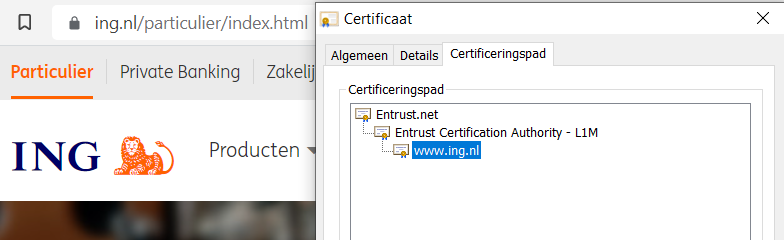

# SEC-07 Passwords
In terms of factors of authentication, passwords fall into the ‘something you know’ category.
On the front-end, passwords can be guessed. This can be made harder with the following strategies:
- Not using common passwords
- Using longer passwords
- Using special characters like @,*,%, etc.
- Using a mixture of CAPITAL and small letters
- Not using easily deducible passwords like birthdates or pet names
- Using a different password for every login
- Using a sentence

Of course, these strategies make it harder to remember your own passwords. Password managers were created to solve this problem.
On the back-end, passwords need to be stored securely. If your database (or /etc/shadow file in Linux) gets leaked or stolen, you don’t want anyone to just be able to read passwords in plaintext. This is why most stored passwords are hashed. Hackers will try to use a Rainbow Table to crack hashed passwords.

## Key terminology
- Hashing: A formula performed to reduce data of any size to a fixed size. Hashing functions are used to be able to store (and especially retrieving!) data in RAM more efficiently (Accessing data when you know the exact index is O(1)!). However these are not secure. Minimising collisions is important, but the speed of the function is more important.  
- Cryptographic Hashing Function: A mathematical function to map a message to a bit array of fixed size. It is a one-way function, the plaintext can not be inferred from the ciphertext. Collisions (two inputs sharing the same output) are not allowed (they are considered insecure). MD5 is considered broken because there have been collisions (and other vulnerabilities) found.
- Checksum function: Checksums are related to hashing functions. A checksum is a small sized block of data derived of another block of data. It is used for the purpose of checking data integrity. It can also be used to quickly check if a creditcard number is valid (Luhn's algorithm). 
- Salt: A random value added to a password before hashing it. Salting a password before hashing means the resulting hash is different (therefor it's hard to compare it to the most frequently used passwords). Using Salts, it's not required to store the actual password of a user, only the salt and the resulting hash. If an attacker knows the hash, it's very hard to calculate the password (unless an easy/common password is used)
- Rainbow Table: a rainbow table is a precomputed table for caching the output of cryptographic hashing functions. They are commonly used for cracking passwords where common ([NordPass survey](https://nordpass.com/most-common-passwords-list/)) and already cracked passwords have been ran through the hashing algorithm. The resulting hash is stored in the rainbow table. An attacker can simply look up a hash and see if it is found (which is very likely if you used "12345" as a password.). Brute-force is a method to crack a hash, but this is very computationally expensive and become infeasable if the password is long enough. Rainbow tables are an alternative to that method.

## Exercise
### Sources
- CS50
- https://en.wikipedia.org/wiki/Cryptographic_hash_function
- https://en.wikipedia.org/wiki/Hash_function
- https://en.wikipedia.org/wiki/Checksum
- https://en.wikipedia.org/wiki/Luhn_algorithm
- https://en.wikipedia.org/wiki/Rainbow_table
- https://nordpass.com/most-common-passwords-list/
- https://haveibeenpwned.com/
- https://crackstation.net/

### Overcome challenges
I learned about hashing during CS50 and I made use of Salting when following a webapp tutorial, but I did not know the exact function. Now I know. 

### Results
Descriptions of Hashing and how a Rainbow Table works are above under the key terminology.
  
  
 
     
Creating a new user on my VM with password 12345:

  
  
As you can see, the hash is not found in the rainbow table. The reason for this is that the password is being salted. The explanation of salting can be found above in the key terminology.  
I'm supposed to compare my hash with that of a teammate, but I can predict the result: because of salting (adding a random value before hashing), his hash will be different than mine. 
