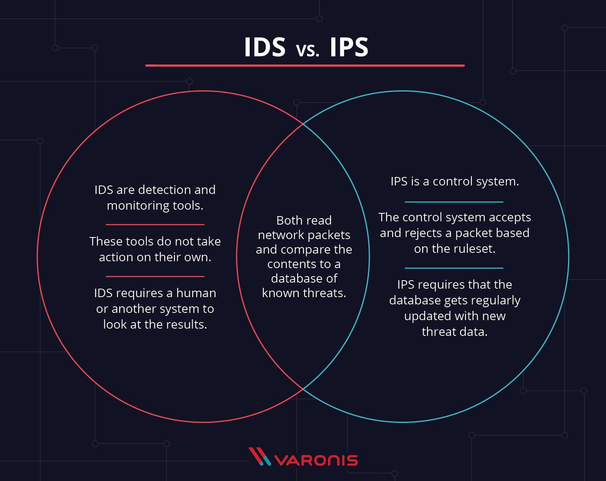

# SEC-08 Detection Response Analysis
So far, we’ve mostly looked at the prevention of attacks. While you want to prevent as many attacks as possible, some attacks will slip through your prevention systems. The most common method of getting malicious software (malware) into a network is through social engineering.

When getting hit with an attack, there are usually three steps to follow: Detection, response, and analysis.

Detecting an (attempted) attack is the first step to stopping it and to preventing future attempts. Tools like Wireshark can help analyse a network to detect anomalies. Intrusion detection systems (IDS) and intrusion prevention systems (IPS) are also used for this purpose.  
  
**Intrusion Detection System**  
These systems analyse and monitor the traffic on a network for signs that indicate attackers are using a known cyberthreat to infiltrate or steal data from your network. IDS systems compare the current network activity to a known threat database to detect several kinds of behaviors like security policy violations, malware, and port scanners.  
  
**Intrusion Prevention System**  
Thse are located in the same area of the network as a firewall, between the outside world and the internal network. IPS proactively deny network traffic based on a security profile if that packet represents a known security threat.  
  
Modern security systems often combine these with firewalls (Unified Threat Management (UTM) technology) into a single unit. IDS and IPS can be either network or host based, but usually network based solutions are far more cost efficient.   
  
  
     
     
The first thing to do in response to a detected attack is trying to contain the damage. Depending on the kind of attack, the way you do this might differ. After the attack is contained, you can try to figure out the root cause of the attack, so that you can stop it. Finally, you enter the recovery phase, where you try to get all systems back online and you take stock of the damage done.  
It is vitally important to have a plan in place for how to respond when an attack happens.  
     
     

**Hack Response Strategies**
First, we need to define the type of attack we defend against. There are two main category's of hacks; opportunistic- and targeted attacks. Opportunistic attacks are mostly automated, low-complexity attacks based on well known vulnerabilities. These are usually done by bots and just attempt random targets until one succeeds. Success is mostly down to a target not having the correct security measurements (which are usually small businesses).  
  
Targeted attacks are low, slow and persistent; targeting an organisation's technical side, as well as the employees, partners and supply chain. While they might utilise some of the exloits that opportunistic attacks also use, they tend to be less automated in order to prevent detection for as long as possible. Additionally they more frequently use new and unknown exploits ("zero days") to reach their goals or abuse trusted connections with third parties to gain access.  
     

An Incident Response Plan often includes:
1. A list of roles and responsibilities for the incident response team members.
2. A business continuity plan.
3. A summary of the tools, technologies, and physical resources that must be in place. 
4. A list of critical network and data recovery processes.
5. Communications, both internal and external. 

Another source cited 4 key phases to IR (incident response):
- Preparation: Make sure plans for both prevention and to respond to events are in place so you won't have to improvise.
- Detection Analysis: The second phase of IR is to determine whether an incident occurred, its severity, and its type.
- Containment and eradication: The purpose of the containment phase is to halt the effects of an incident before it can cause further damage. 
- Post-incident recovery: A lessons learned meeting involving all relevant parties should be mandatory after a major incident and desirable after less severe incidents with the goal of improving security as a whole and incident handling in particular.

Yet another source:
- Detection
- Response
- Mitigation
- Reporting
- Recovering
- Remediation and reporting
- Lesson Learned

**System Hardening**  
The idea behind system hardening is that a system will be more secure once you reduce the size of it's attack surface. System hardening is the process of doing that.  
  
Types of System Hardening:
1. **Server Hardening:** Server hardening revolves around securing the ports, data, permissions, and functions of a data server. Some common practices for server hardening include using strong passwords, locking user accounts after a certain number of failed login attempts, implementing multi-factor authentication, disabling USB ports, etc.
2. **Software Application Hardening:** Software Application Hardening revolves around securing the applications deployed on the server. Some common practices for hardening software applications include using antivirus, spyware, malware protection applications, establishing intrusion detection systems, etc.
3. **Operating System Hardening:** Operating System Hardening refers to securing a system’s own operating system. Some common practices for securing operating systems of servers include limiting access to work with operating systems among personnel, uninstalling unnecessary device drivers, etc.
4. **Database Hardening:** Database Hardening revolves around securing the data stores of any enterprise. It mainly consists of three parts- 
    1. Managing the level of access and permissions that each user has
    2. Encrypting the data present in the database and removing unnecessary functions
    3. Data present in the database. 
    Some common practices for database hardening include implementing a role-based-access policy, restricting admin and user privileges, etc.
5. **Network Hardening:** Network Hardening refers to the process of hardening the channel that is used for communication between two ports. The most effective way to ensure a secure network is to establish an intrusion detection system in the communication channel which helps in the detection of a potential attack in advance. Configuring firewalls and encrypting your organization’s network traffic is also a good practice for hardening your network.
    
More examples of what you can do: 
- Network segmentation
- Backups
- Encryption
- Remove or lock default accounts
- Change default passwords
- Enable logging and auditing
- Fine-tune the firewall (only required ports are opened)
- Implementing only one primary function per server (reducing a server's attack surface)
- Removing all unneccesary software and utilities
- Remove/disable browsers (where applicable)
- Place database and log-files on non-system partitions
- Use named accounts and ensure unique account names
- Ensure secure passing of credentials (require TLS for connections)
- Minimise injection attack surfaces (on the front-end level)

     
     

**Other factors of security:**  
  
1. **Patch and update constantly:** Patches are not created without reason, often they fix security breaches. Having a good overview of all systems (hardware and software) and their status can help in this regard. It is very time consuming and a tedious job, but it is also one that will make the most impact on preventing breaches.
2. **Email security:** Email is the number one entry point into an organisation. 
3. **Endpoint Detection and Response:** Most of that email is destined for a user that will click on attachments and potentially infect themselves with malware of some kind.  The second most common malware infection vector is through malicious web content; also, an end-user action. Therefor it makes sense to have a thorough system of controls in place on endpoints and servers to identify and shut down viruses, malware and other unwanted programs.
4. **Segmentation and Egress Filtering:** If malware or an attacker is able to enter you system at some level, you should prevent them from being able to access everything. Also prevent them from being to exit the system with valuable data should be prevented. Network segmentation and correct usage and setup of firewalls is very effective in this regard. Proxy servers can also be implemented. Another example is making your database only accessable via a designated application.
5. **Robust Detection Control Infrastructure:** History tells us that betting all your money on prevention is a bad idea. We should be prepared for when an attacker is able to penetrate the system and have systems in place that minimize the time until detection and remediation. A good SIEM/SOAPA/SOAR infrastructure should be part of the security architecture that is receiving logs from the whole network. 
6. **Multi-factor / Multi-step Authentication:** The majority of breaches involve the use of cracked, intercepted or otherwise disclosed authentication credentials at some point.  Use strong, multi-factor authentication methods by default wherever possible.  Combined with the ability to detect and alert on failed login attempts, this practice can provide clues to users that may be the focus of targeted attacks.  
     
     
**Disaster Recovery Plan**  
A disaster recovery plan (DRP), disaster recovery implementation plan, or IT disaster recovery plan is a recorded policy and/or process that is designed to assist an organization in executing recovery processes in response to a disaster to protect business IT infrastructure and more generally promote recovery. The purpose of a disaster recovery plan is to comprehensively explain the consistent actions that must be taken before, during, and after a natural or man-made disaster so that the entire team can take those actions. A disaster recovery plan should address both man-made disasters that are intentional, such as fallout from terrorism or hacking, or accidental, such as an equipment failure.  
  
There are multiple options to be prepared, but the service offered in the cloud is called DRaaS (Disaster Recovery as a Service).

## Key terminology
- **IDS: Intrusion Detection System** - A system on the network that detects intrusions and notify a system admin. It only analyses the network traffic.
- **IPS: Intrustion Prevention System** - This system also acts against intrusions, it might close off a part of the network or shut down a certain application. It actively tries to counteract the attacker.
- **Opportunistic Attacks:** Mostly automated, low-complexity attacks based on well known vulnerabilities. These are usually done by bots and just attempt random targets until one succeeds (the target did not have their security in check (usually small businesses)).
- **Targeted Attacks:** Targeted attacks are low, slow and persistent; targeting an organisation's technical side, as well as the employees, partners and supply chain. While they might utilise some of the exloits that opportunistic attacks also use, they tend to be less automated in order to prevent detection for as long as possible. Additionally they more frequently use new and unknown exploits ("zero days") to reach their goals or abuse trusted connections with third parties to gain access. 
- **Zero Days:** Previously unknown vulnerabilities. Security firms actively look for these and patch them before attackers can exploit them. Some times attackers find them first and can exploit a short period of time where patches have to be build. Machine Learning algorithms are often used to identify and predict compromised behaviour. These can be used to write IoC's.
- **IoC:** Indicator of Compromise
- **OTX:** [Open Threat Exchange. Global threat intelligence sharing platform](https://otx.alienvault.com/browse/global/pulses?include_inactive=0&sort=-modified&page=1)
- **SIEM - Security Information and Event Management:** SIEM is a security tool that collects and stores data from various sources where it detects faults or unwanted behaviour that could lead to a breach.
- **SOAR - Security Orchestration, Automation and Response:** SOAR is a security tool for managing and handling threats, vulnerability, security operations automation. This tool responds to the security team and also integrates all existing tools and apps to provide an automated response (and thereby reducing the breach time).
- **SOAPA - Security Operations and Analytics Platform Architecture:** SOAPA is an architecture made up of multiple kinds of security product. 
- **Incident Recovery Team:** An incident recovery team is the group of people assigned to implement the incident response plan. Generally, these are members of the IT staff who collect, preserve, and analyze incident-related data. Your IT staff may need to work with lawyers and communications experts to make sure that legal obligations are met.
- **Attack Surface:** The attack surface is the number of all possible points, or attack vectors, where an unauthorized user can access a system and extract data. The smaller the attack surface, the easier it is to protect.
- **Recovery Point Objective aka RPO:** How much data (in terms of the most recent changes) the company is willing to lose after a disaster occurs. For example, an RPO might be to lose no more than one hour of data, which means data backups must occur at least every hour to meet this objective.
- **Recovery time objective aka RTO:** Refers to the acceptable downtime after an outage before business processes and systems must be restored to operation. For example, the business must be able to return to operations within 4 hours in order to avoid unacceptable impacts to business continuity.
- **Automatic failover** Automatic failover is a resource that allows a system administrator to automatically switch data handling to a standby system in the event of system compromise.

## Exercise
### Sources
- https://www.youtube.com/watch?v=rvKQtRklwQ4 (IDS vs IPS)
- https://www.youtube.com/watch?v=B09dU3jEPzc (System Hardening)
- https://www.varonis.com/blog/ids-vs-ips
- https://cybersecurity.att.com/blogs/security-essentials/hacker-prevention
- https://cybersecurity.att.com/blogs/security-essentials/defending-against-zero-day-attacks-with-alienvault-usm-anywhere
- https://www.ibm.com/topics/siem
- https://www.csoonline.com/article/3438559/soapa-vs-soar-how-these-security-terms-differ.html
- https://www.educba.com/siem-vs-soar/
- https://www.cisco.com/c/en/us/products/security/incident-response-plan.html#~how-to-create-a-plan
- https://www.nextgov.com/ideas/2017/07/how-effectively-respond-hack-when-it-happens/139565/
- https://www.crowdstrike.com/cybersecurity-101/incident-response/
- https://www.geeksforgeeks.org/what-is-system-hardening/
- https://www.druva.com/glossary/what-is-a-disaster-recovery-plan-definition-and-related-faqs/
- 

### Overcome challenges
- WORMHOLEEEEEEESS! xD
- Looking for hack response strategies and only finding tips for hardening a system.
- Learned a new word: remediation. It comes from remedy and can be used similarly to improving. Although it's about improving something thats undesirable.

### Results
**A Company makes daily backups of their database. The database is automatically recovered when a failure happens using the most recent available backup. The recovery happens on a different physical machine than the original database, and the entire process takes about 15 minutes. What is the RPO of the database?**
In the worst case scenario, the last database backup was made almost 24 hours ago (the backup is made daily). Therefore the RPO is 24 hours. 
  
**An automatic failover to a backup web server has been configured for a website. Because the backup has to be powered on first and has to pull the newest version of the website from GitHub, the process takes about 8 minutes. What is the RTO of the website?**  
The process from failure until the backup is up and running takes 8 minutes. Thus the RTO is 8 minutes.  
