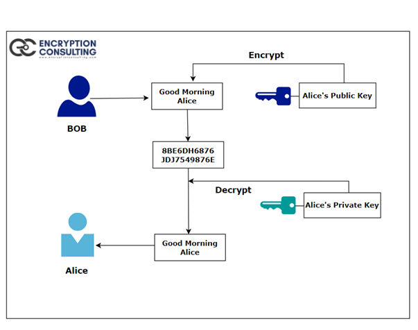

# SEC-E01 Safe Symmetric Key's
For the extra assignment, we are supposed to re-do SEC-04 (Symmetric Encryption) and find a way to sent our keys in a safe way.  
  
My initial solution to SEC-04 was to come up with a key that only me and the teammate I was communication with would have knowledge of. Other people might be able to discover that key based on the information/hint I had to give him in the public chat, but atleast it is a little bit safer than sending the actual key directly.  

Then I heard that this was not allowed and I'm supposed to sent the actual key and we received a tip to do SEC-05 (Asymmetric Encryption) first. I interpreted this as sending our key for SEC-04 as our encryption message in SEC-05. One of my classmates said this also wasn't allowed and our scrum master said he recieved the Diffie-Hellman method as a hint.  
  
So in order to solve the mystery, I'll dive deeper into both RSA and Diffie-Hellman methods and their differences.
  
**Diffie-Hellmann-Merkle Key Exchange**  
These two mathematicians first identified the problem now commonly referred to as the Diffie Hellman problem. Ralph Merkle enhanced and did most of the work for the key exchange part. It is a relation between two real prime numbers that share a common value (or actually the result of a function between the two). This common value is also known as the `shared secret`. Both parties can let the other know they have knowledge of this secret without sharing their own keys.  

As a typical example with Alice and Bob:  
  
1. Let’s say Alice and Bob agreed on a random color, “yellow,” to start with.
2. Alice and Bob set a private color for themselves, and they do not let the other party know what color they chose. Let’s assume Alice decides “red” and Bob decides “Aqua.”
3. Next, Alice and Bob combine their secret color ( Alice-red; Bob: Aqua) with the “yellow” (“Common color.”)
4. Once they have combined the colors, they send the result to the other party. For example, Alice obtains “Sky Blue,” and Bob receives “orange.”
5. Once they have received the combined results of their partners, they then add their secret colors to it. For example, Alice adds the sky blue with the red, and bob adds the Aqua with the orange.
6. As a result, they both come out with the same color, “Brown.”

     

**RSA**
RSA is based on a similar mathmatical problem, but instead, both users have 2 keys; a public and private one. A uses his own private key in combination with Alice's public key to encrypt the message. Basically the algorithm calculates the shared secret. Alice can the decrypt the message by using her own private and Bob's public key. The relation across these four primes stay constant.
  
  
     

**Prime Factorization**  
Prime factorisation means breaking up a number until all factors are primes. One thing that makes it so useful is that for any number, there is only 1 unique set of prime factors possible!  
  
For example: 330 = 2 × 3 × 5 × 11  
  
This is the only prime factorisation of 330. In fact, this rule is so important, it is called the **Fundamental Theorem of Arithmetic**.  
  
Prime factorization on large numbers is very challenging, even for modern computers. That is why encryption algorithms often use primes with a length of 1024 bits or more! That is 2^1023 aka 8.98E^307 aka 307 0's.  

## Key terminology
- **Prime Number:** A whole number greater than 1 that can not be made by multiplying other whole numbers. 2, 3, 5, 7, 11, 13, 17, 19 and 23 are the first few.
- **Composite Number:** Whole numbers that *can* be generated by multiplying other whole numbers. 4 (2x2), 6 (2x3), 8 (2x2x2) etc
- **Factor:** Factors are the numbers you multiply together to make another number. 
- **Fundamental Theorem of Arithmetic:** All numbers are made of either primes or primes multiplied together.

## Exercise
### Sources
- https://en.wikipedia.org/wiki/Diffie%E2%80%93Hellman_key_exchange
- https://en.wikipedia.org/wiki/Password-authenticated_key_agreement
- https://en.wikipedia.org/wiki/SPEKE
- https://en.wikipedia.org/wiki/Secure_Remote_Password_protocol
- https://en.wikipedia.org/wiki/Key-agreement_protocol
- https://www.encryptionconsulting.com/diffie-hellman-key-exchange-vs-rsa/
- https://www.mathsisfun.com/prime-factorization.html
- https://www.mathsisfun.com/numbers/prime-numbers-to-10k.html
- https://crypto.stackexchange.com/questions/95993/is-diffie-hellman-key-exchange-an-asymmetric-or-symmetric-algorithm
- https://en.wikipedia.org/wiki/Primitive_root_modulo_n

### Overcome challenges
- WORMHOLE 2.0 !! Luckily it's a bonus assignment lol
- Confusion regarding if DHKE is symmetric or asymmetric. Symmetric is when both users share the same secret, which is not the case. Both uses have their own private key, which is used to calculate a shared secret. Because both private keys are unique, it is considered asymmetric. 

### Results
After Casper gave the answer, I found out we did find one of the correct ways. Both methods described above are possible, but I have to look deeper into the math to understand which key is being used when.
