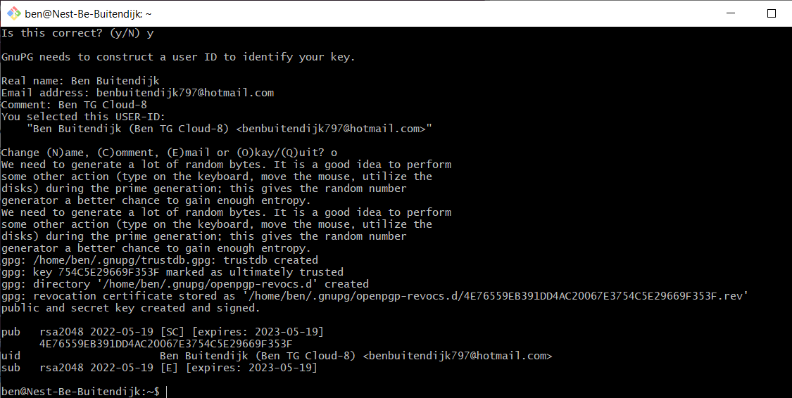
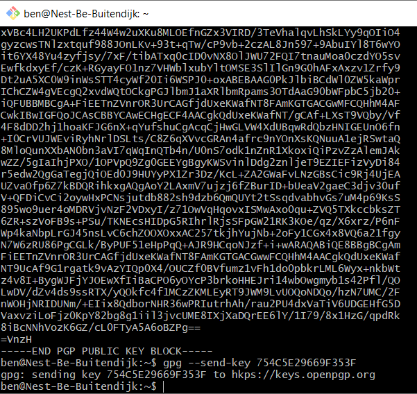

# SEC-E02 Asymmetric Key generation on our VM.
Instead of using an online tool, in this exercise we're going to use the GPG program on our VM to generate a key. 

## Key terminology
- `gpg --expert --pinentry-mode=loopback --full-gen-key` command to start a prompt for creating a new key
- `gpg --armor --export user-id > pubkey.asc` export public key
- `gpg --armor --output key.txt --export user-id` export public key in readable ASCII format
- `gpg --export-secret-keys --armor user-id > privkey.asc` export private key
- `gpg --list-sigs user-id` list all pgp users/keys
- `gpg --fingerprint` display user-id (user-id is usually the registered email)
- `gpg --send-key key-id` upload pgp key on keyserver [Ubuntu Default Server](https://keyserver.ubuntu.com/)
- `gpg --search user-id` find keys/users on the keyserver
- 

## Exercise
### Sources
- https://www.tutorialspoint.com/unix_commands/gpg.htm
- https://www.maketecheasier.com/generate-gpg-keys-linux/
- https://www.linuxbabe.com/security/a-practical-guide-to-gpg-part-1-generate-your-keypair (this is a really good guide!)
- https://rtcamp.com/tutorials/linux/gpg-keys/

### Overcome challenges
I was distracted and not very focussed for this assignment.

### Results
  

