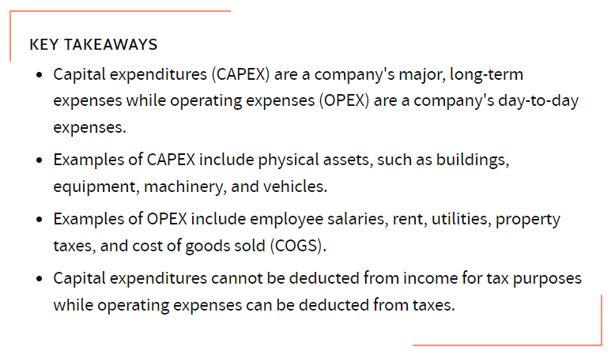

# AWS-02 Pricing
One of the main reasons for moving to the cloud is cost. If done well, public cloud infrastructures can reduce costs significantly compared to traditional data centers. This is done by adopting a pay-as-you-go pricing model and economies of scale.  
  
You pay only for the compute capacity, storage, and outbound data transfer that you use. You never pay for inbound data transfer and data transfer between services within the same region.  
  
AWS lists four advantages of their pricing model:  
- Pay-as-you-go
- Save when you commit
- Pay less by using more
- Benefit from massive economies of scale
  
When creating a new AWS account, you automatically get a free-tier account for the first 12 months. Some services are free up to a certain limit with a free-tier account.  
Other services are always free. However, those services might be integrated with other services for which you have to pay.  
  
The Total Cost of Ownership (TCO) is used to measure how much an infrastructure would cost if it were hosted the traditional way. This is done by measuring capital expenditures (capex). The cloud pricing model allows you to trade capex for variable expenditure. This can reduce cost by not spending money on capacity you don’t need.  
  
## Key terminology
- CAPEX/OPEX: see below

## Exercise
### Sources
- https://calculator.aws/#/
- https://docs.aws.amazon.com/whitepapers/latest/how-aws-pricing-works/how-aws-pricing-works.pdf
- https://aws.amazon.com/pricing/
- https://docs.aws.amazon.com/whitepapers/latest/aws-overview/six-advantages-of-cloud-computing.html
- https://www.investopedia.com/ask/answers/112814/whats-difference-between-capital-expenditures-capex-and-operational-expenditures-opex.asp

### Overcome challenges
N/A

### Results
     
AWS lists four advantages of their pricing model:  
  
**Pay-as-you-go**  
Only pay for what you use. You don't need to invest in servers and maintanance, just for the actual usage of services. If traffic is low, your costs are also low.  
  
**Save when you commit**  
For computing services such as Machine Learning, you commit to a agreed on price ($/hour) for a certain period (1 or 3 years). You can also use these services on-demand, but then the price is higher.  
  
**Pay less by using more**  
With AWS, you can get volume based discounts and realize important savings as your usage increases. For services such as S3, pricing is tiered, meaning the more you use, the less you pay per GB.  
  
**Benefit from massive economies of scale**  
By using cloud computing, you can achieve a lower variable cost than you can get on your own. Because usage from hundreds of thousands of customers is aggregated in the cloud, providers such as AWS can achieve higher economies of scale, which translates into lower pay as-you-go prices.
     
     

**AWS Free-Tier**  
The AWS Free Tier enables you to gain free, hands-on experience with more than 60 products on AWS
platform.  
AWS Free Tier includes the following free offer types:
- 12 Months Free – These tier offers include 12 months free usage following your initial sign-up date
to AWS. When your 12 month free usage term expires, or if your application use exceeds the tiers, you
simply pay standard, pay-as-you-go service rates.
- Always Free – These free tier offers do not expire and are available to all AWS customers.
- Trials – These offers are short term free trials starting from date you activate a particular service. Once
the trial period expires, you simply pay standard, pay-as-you-go service rates.
     

**12 Months Free**  
- **Amazon Elastic Compute Cloud (EC2)**: 750 hours per month of Linux, RHEL, or SLES t2.micro/
t3.micro instance usage or 750 hours per month of Windows t2.micro/t3.micro instance usage
dependent on Region.
- **Amazon Simple Storage Service (Amazon S3)**: 5 GB of Amazon S3 standard storage, 20,000 Get
Requests, and 2,000 Put Requests.
- **Amazon Relational Database Service (Amazon RDS)**: 750 hours of Amazon RDS Single-AZ db.t2.micro
database usage for running MySQL, PostgreSQL, MariaDB, Oracle BYOL, or SQL Server (running SQL
Server Express Edition); 20 GB of general purpose SSD database storage and 20 GB of storage for
database backup and DB snapshots.
- **Amazon CloudFront**: 50 GB Data Transfer Out and 2,000,000 HTTP and HTTPS Requests each month.
     

**Always Free**  
- **Amazon DynamoDB**: Up to 200 million requests per month (25 Write Capacity units and 25 Read
Capacity units); 25 GB of storage.
- **Amazon S3 Glacier**: Retrieve up to 10 GB of your Amazon S3 Glacier data per month for free (applies
to standard retrievals using the Glacier API only).
- **AWS Lambda**: 1 million free requests per month; up to 3.2 million seconds of compute time per
month.
     

**Trails**  
- **Amazon SageMaker**: 250 hours per month of t2.medium notebook,50 hours per month of m4.xlarge
for training, 125 hours per month of m4.xlarge for hosting for the first two months.
- **Amazon Redshift**: 750 hours per month for free, enough hours to continuously run one DC2.Large
node with 160GB of compressed SSD storage. You can also build clusters with multiple nodes to test
larger data sets, which will consume your free hours more quickly. Once your two month free trial expires or your usage exceeds 750 hours per month, you can shut down your cluster to avoid any charges, or keep it running at the standard On-Demand Rate.
     
     

**CAPEX vs OPEX**  
Capital expenditures (CAPEX) are major purchases a company makes that are designed to be used over the long term.  
Operating expenses (OPEX) are the day-to-day expenses a company incurs to keep its business operational.  
  

  
Traditionally, a company would have to invest in hardware (servers, connections, devices) and also have to maintain it. By using the cloud, there is no investment required up-front. So a lot of CAPEX is moved to OPEX (you pay for what you use).  
  
OPEX can be deducted from the profit (and therefore saved on taxes). The goal of any company is to maximize output relative to OPEX. In this way, OPEX represents a core measurement of a company's efficiency over time.  

  

