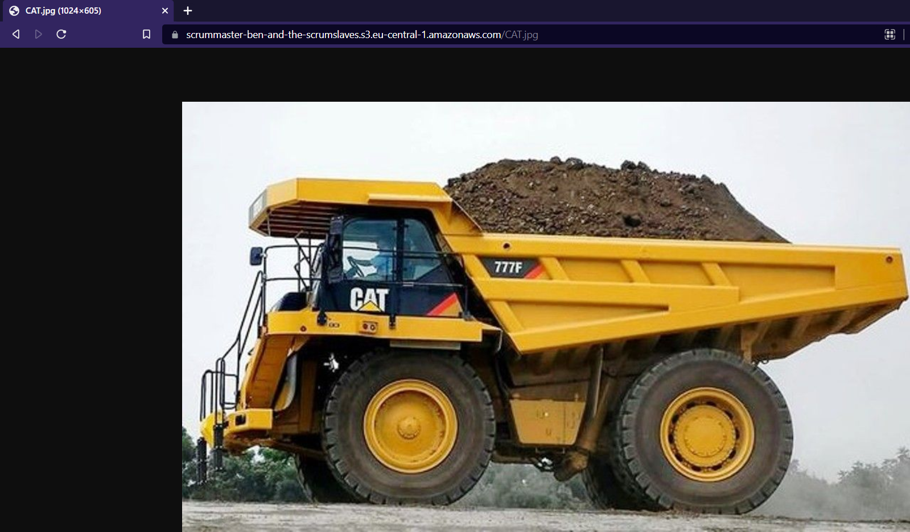
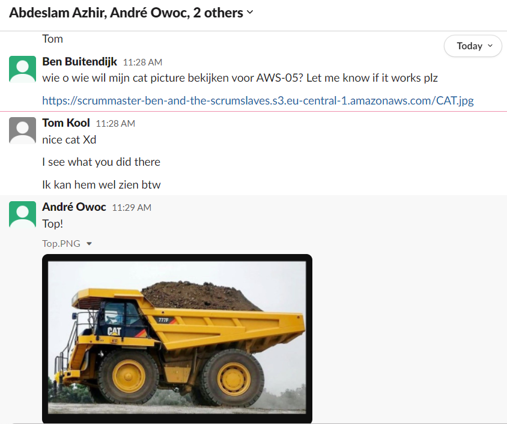
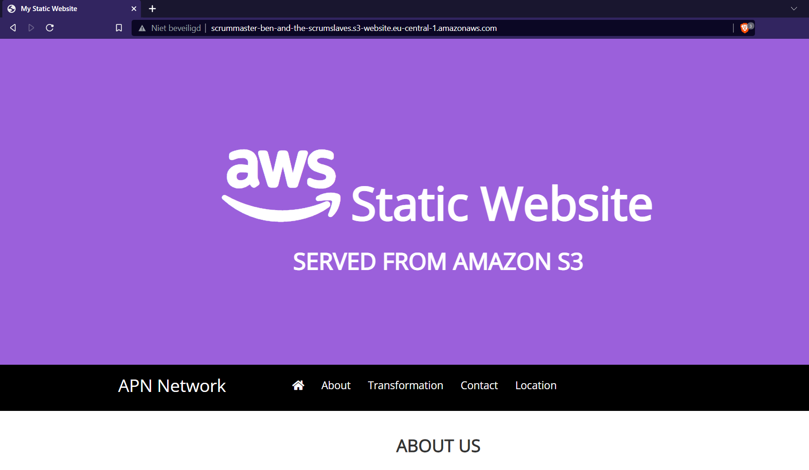

# AWS-05 S3
  
AWS S3 is a storage service. The name stands for "Simple Storage Service". Data that is stored on it is called an object. Objects are stored in buckets. You can store any type of file on it.

There are different storage classes that differ in availability, durability, retrieval time, and cost.  
  
In S3, you pay for:  
- GBs storage per month
- Transfer OUT to out of the region
- PUT, COPY, POST, LIST, and GET requests
  
You don’t pay for:  
- Transfer IN to Amazon S3
- Transfer OUT from S3 to CloudFront or EC2 in the same region

  
## Key terminology
- **Object-Level Storage**: Object-Level Storage contains objects. 
- **Objects**: Objects are made of: Data (any file type), Metadata (information about data) and a Key (unique identifier). They can be 5TB in size.
- **Buckets**: A bucket is a container for objects stored in S3. You can store any number of objects in a bucket and can have up to 100 buckets in your account. Buckets need to have a unique name, which you choose when creating it. It cannot be changed. Think of a bucket as a directory within S3. The bucketname is also added to the URL of your storage.
- **AWS S3 Storage Classes**: Different versions of the S3 service. They differ in data availability, how frequent data is retrieved and cost price.
- **S3 Standard**: S3 Standard is ideal for data that is accessed often. Provides high availability for stored objects (stores data in at least three Availability Zones). It is the most expensive class.
- **S3 Standard-Infrequent Access**: S3 Standard-Infrequent Access is also called S3 Standard-IA. It is almost the same as Standard, except the price. It has a lower storage price but higher data retrieval price.
- **S3 One Zone-IA (S3 One Zone-Infrequent Access)** It stores data in one Availability Zone. It is cheaper than S3 Standard and S3 Standard-IA classes.
- **Amazon S3 Glacier Instant Retrieval** Amazon S3 Glacier Instant Retrieval is an archive storage class that delivers the lowest-cost storage for long-lived data that is rarely accessed and requires retrieval in milliseconds.
- **S3 Glacier Flexible Retrieval** S3 Glacier is recommended for archiving data. It can retrieve objects within a few minutes. S3 Glacier is a cheaper and slower class.
- **S3 Glacier Deep Archive** S3 Glacier Deep Archive has the lowest cost. Compared to S3 Glacier, S3 Glacier Deep Archive can retrieve objects within 12 hours.
- **S3 Intelligent-Tiering** S3 Intelligent-Tiering requires automation and monitoring. It is recommended for data with unknown or frequently changing access. It moves the object to the S3 Standard-IA class if it is not accessed for 30 days. It moves objects to S3 Standard if accessed in S3 Standard-IA or S3 One Zone-IA classes. **not really a class**
- **ARN** Amazon Resource Name. [Check this link for a more detailed syntax guide](https://docs.aws.amazon.com/general/latest/gr/aws-arns-and-namespaces.html)

## Exercise
### Sources
- https://www.w3schools.com/aws/aws_cloudessentials_amazonsimplestorageservice.php
- https://aws.amazon.com/s3/?nc2=h_ql_prod_fs_s3
- https://docs.aws.amazon.com/AmazonS3/latest/userguide/Welcome.html
- https://www.youtube.com/watch?v=_I14_sXHO8U
- https://docs.aws.amazon.com/AmazonS3/latest/userguide/example-bucket-policies.html
- https://docs.aws.amazon.com/general/latest/gr/aws-arns-and-namespaces.html
- https://docs.aws.amazon.com/AmazonS3/latest/userguide/HostingWebsiteOnS3Setup.html

### Overcome challenges
- Understanding AWS terms such as Buckets and Objects.
- Bucket policy's, where to find them, how to read them and the specific syntax.

### Results
  
**Exercise 1:**  
Uploading a Cat picture and making it publicly accessable:  

  
  
**Exercise 2:**  
Hosting a static website on AWS S3:  

