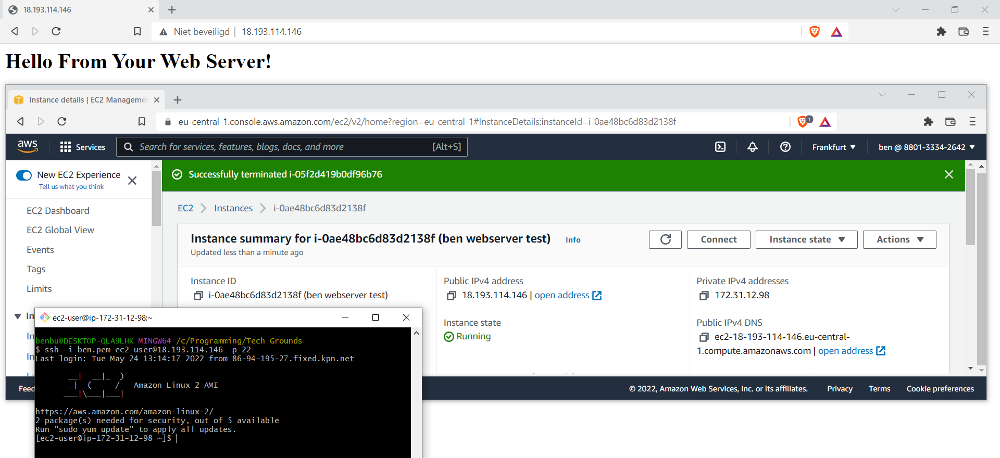

# AWS-06 EC2
EC2 stands for Elastic Cloud Compute. It is an AWS service to create VM's. It makes scaling up and down very easy.  
  
There are 4 different types of instances:
- **General Purpose Instances** An instance with balanced stats between computing, memory and networking resources. It fits different purposes, such as: application server, gaming server, backend server and small/medium database servers.
- **Compute Optimized Instances** These instances when there is a need for high computing power. These are also useful for app-, gaming- and webapp servers, but are ideal for situations that require high-performance and compute-intensive tasks.
- **Memory Optimized Instances** This type can deliver very large dataset workloads fast. Memory is a temporary storage area, data is stored and processes it before the computer can run it. The processing allows for pre-loading which enables the CPU to have direct access. These instances work best when huge amounts of data need to be preloaded before running the app.
- **Accelerated Optimized Instances** This type uses hardware accelerators, which boost the data processing. These instances are best for graphics applications and streaming.
- **Storage Optimized Instances** This type is best when you have a large dataset on local storage (Large file systems, data warehouses or online transaction systems). These instances are designed to deliver many inputs as fast as possible.

There are different pricing options:
- On-demand 
- Spot (cheaper but can be shut down if AWS needs the resources)
- Reserved (savings plan, save $ by commiting for a 1 or 3 year period) 
- Dedicated 

Reserved instance types:
- Standard RI (biggest discount)
- Convertible RI (you can change the instance type if you need to scale vertically, as long as new value is same or greater)
- Scheduled RI (These are only available to launch in a time window that you choose)

## Key terminology
- **AMI** Amazon Machine Image. This functions similar to a blueprint for a VM.

## Exercise
### Sources
- https://docs.aws.amazon.com/AWSEC2/latest/UserGuide/EC2_GetStarted.html
- https://docs.aws.amazon.com/AWSEC2/latest/UserGuide/get-set-up-for-amazon-ec2.html
- https://docs.aws.amazon.com/AWSEC2/latest/UserGuide/TroubleshootingInstancesConnecting.html#TroubleshootingInstancesConnectingPuTTY

### Overcome challenges
- If you stop and restart an instance, the IP is changed.
- The username is not the name associated to the key or IAM, it's a generic user name that is specific for every AMI
- I forgot to add the 'user data' when setting up the instance and by default it only runs that script on initial launch. I did find a guide on how to make it run the script on every reboot, but in the end it was easier to create a new instance with the correct 'user data'
  
### Results
My instance in AWS console, accessed by my browser and also logged into it through an SSH connection:

