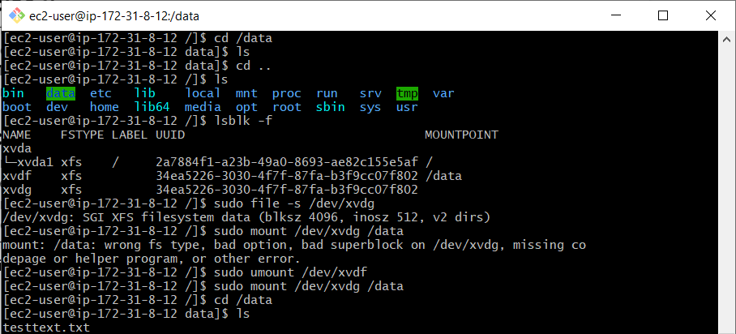

# AWS-07 EBS
AWS EBS stands for Elastic Block Store. It is a storage service, aimed to attach it to an EC2 instance (similarly to attaching a hard-drive).  
An EBS instance is called a volume. A volume can be attach to a single EC2 instance at a time, but for non-root volumes, you can detach and re-attach them to a different EC2 instance (like an external harddrive).  
  
If you stop or terminate an EC2 instance, the EBS instance remains. EBS stores data in blocks. You can create backups of EBS instances (called snapshots). These are stored in S3. A snapshot only adds the block that is changed since the last snapshot (a bit like Git commits), this saves storage space (and therefore costs).  
  
## Key terminology
- `lsblk` lists information about devices and if they are mounted and have a partition.
- `sudo file -s /dev/xvdf` displays information about the device. If it says "data", there is no file-system on the device.
- `sudo mkfs -t xfs /dev/xvdf` install xfs file system on the device (DONT DO IT IF IT ALREADY HAS A FILESYSTEM)
- `sudo mkdir /data` create a dir which will point to the new device (like creating a 'address' to the device in the filesystem)
- `sudo mount /dev/xvdf /data` mount the device to the directory created in the previous step.

## Exercise
### Sources
- https://www.w3schools.com/aws/aws_cloudessentials_awsebs.php
- https://docs.aws.amazon.com/AWSEC2/latest/UserGuide/AmazonEBS.html
- https://docs.aws.amazon.com/AWSEC2/latest/UserGuide/ebs-using-volumes.html
- https://devconnected.com/how-to-mount-and-unmount-drives-on-linux/#Unmounting_drives_on_Linux_using_umount

### Overcome challenges
- Overlooking the difference between 'eu-central-1c' and 'eu-central-1a'
- Creating EBS volume and attaching it was easy, had to look up how to mount it on the EC2 instance.

### Results
Creating new EBS volume:  
  
  
Partitioning the volume and mounting it on the VM:  
  
  
Creating a testtext file on the VM:  
  
  
Unmounting first volume and mounting the new volume with the snapshot: 
  
