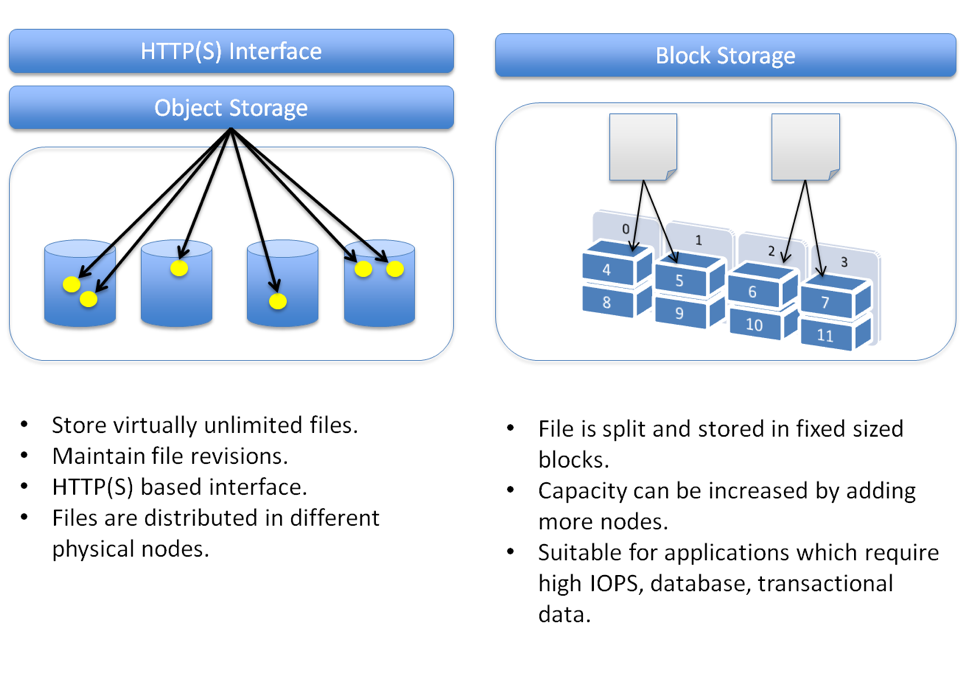

https://cloud.netapp.com/blog/block-storage-vs-object-storage-cloud
  
S3 is object storage. It is typically used as a "write once, read often" type of storage. All objects have no underlying relation, they can be physically stored on different hardware and even locations.  
  
An advantage is that you can read and access data extremely quickly based on the key-value pair. You can locate them on any server in no-time (therefore it's also easy for the cloud provider to store them in multiple AZ's). This is not as simple with block-based storage.  
  
EBS data is stored as blocks. These are fixed-sized chunks that have an individual memory address. They support random write/read access. AWS allows users to create file systems (partitions) on the volume's. Another use is the snapshot feature for backup purposes.  
  
With block-based storage, it is easier to modify files because you have access to the specific required blocks in the volumes. With object-based storage, you need to re-upload the entire object. This has a significant effect on performance if you often require modifications.  
Block scores much quicker on IO speed, as they are mounted as a storage device to the server. Object-storage usually relies on the HTTP-protocol. 
Block stores is therefore commonly used for databases, where S3 is useful for storing files (images for a website), data lakes (unstructured/raw data) or archives (backups).
  
