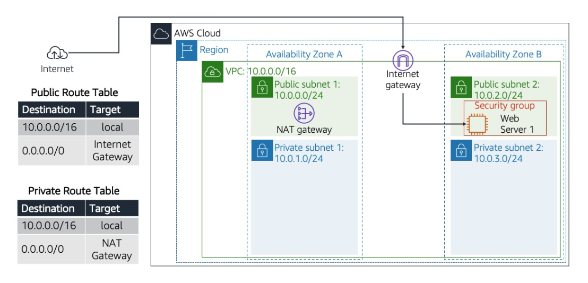
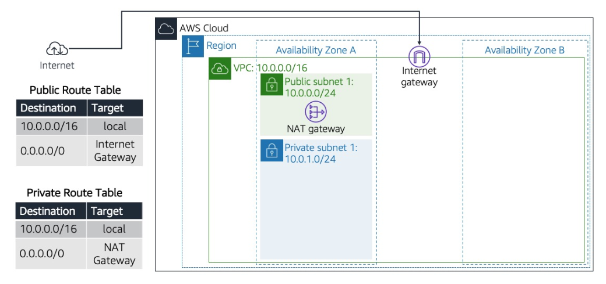
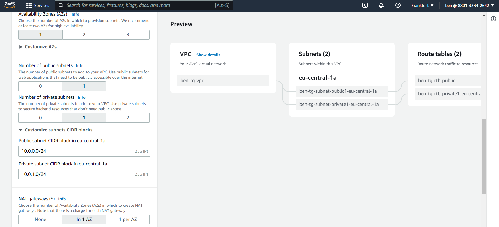
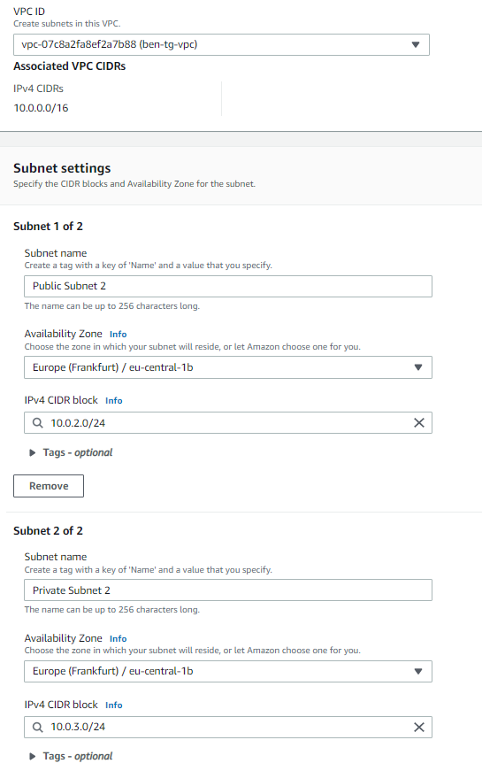
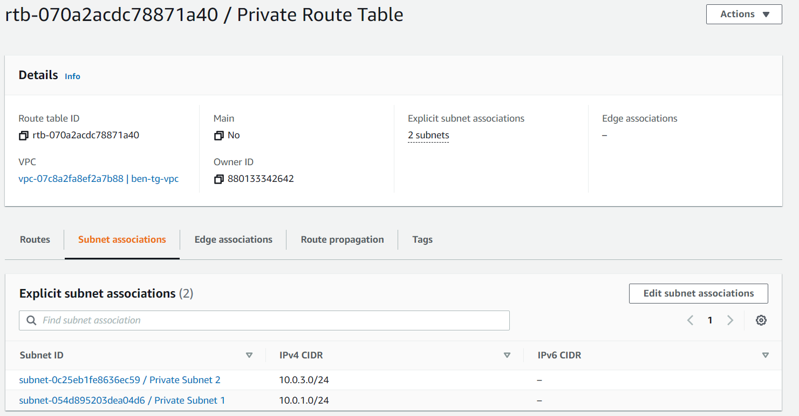
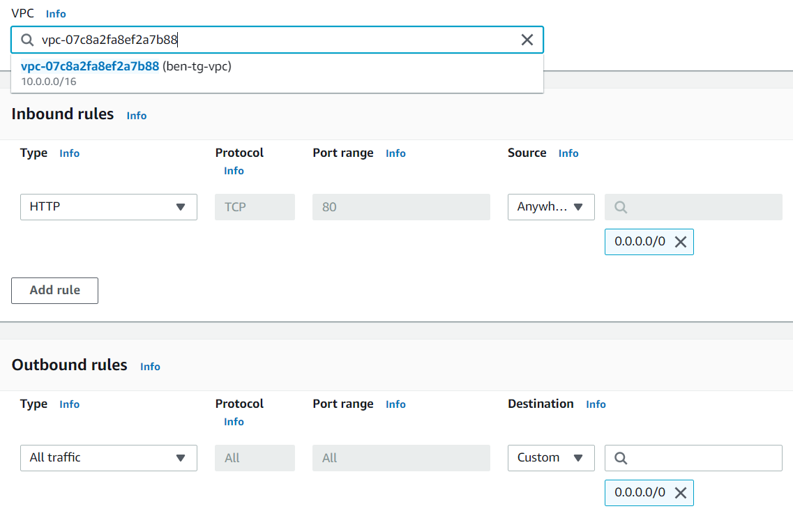
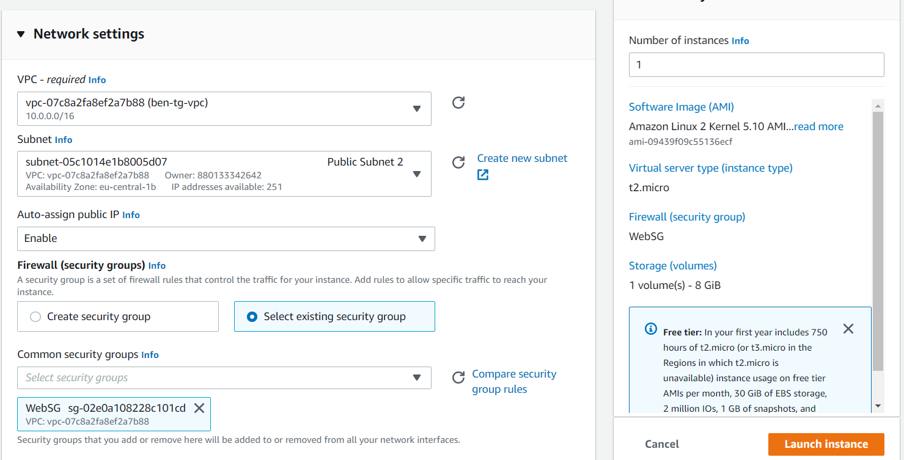
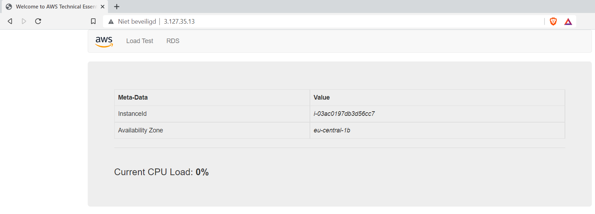

# AWS-10 VPC
Amazon VPC is typically described as a virtual private data center in the cloud. It is a virtual network that is logically isolated from other VPCs. With a VPC you have full control over the design of the network. You can create subnets, internet gateways (igw), NAT gateways, VPN connections, and more.  
  
There is always a default VPC when you create a new AWS account, but you can add up to 5 non-default VPCs per region per account. This is a soft limit. That is, you can request the limit to be raised. Many services, like EC2, RDS and ECS require a VPC to be placed into.  
  
When you create a VPC, you must assign a CIDR block. Choose your CIDR block and subnet mask carefully, as they have to allow for enough subnets and hosts and cannot be changed after creation.  
  
Subnets can be either public or private. The only difference is that private subnets do not have an entry for the internet gateway (igw) in their route table, where public subnets do. In other words, private subnets cannot access the internet without a NAT gateway or a NAT instance.  
  
VPCs operate at the regional level, while subnets can only be placed into a single Availability Zone.  
  
Elastic IPs are also available from the VPC menu. EIPs are public IP addresses that can be dynamically allocated to resources like EC2 instances or NAT gateways.  
  
## Key terminology
- **Tenancy** By default, the setting is "Shared Tenancy", which means you share AWS's hardware resources with other clients. Your network is only virtually/logically seperated. If, for example for compliance reasons, you need to be completely seperate from other clients, you can also choose "Dedicated Tenancy". Your instances will run on isolated hardware. This is not cost effective, so AWS will charge you much more for it. 
- **VPC endpoints** These endpoints can be used to route traffic inside the VPC. You can use AWS PrivateLink to connect the resources in your VPC to services using private IP addresses, as if those services were hosted directly in your VPC.
- **VPC Peering** Used to route traffic between two seperate VPCs using private IP addresses.
- **AWS VPN** Used to create an (encrypted) connection between on-premises sites and AWS via the public internet. The public internet can have fluctuations in speed, so it may not always be optimal.
- **AWS Direct Connect** Connect your on-premises sites to AWS via Direct Connect locations, avoiding the public internet. This is expensive, but in some situations where reliability and consistency is required, this may be the best option.

## Exercise
### Sources
- https://docs.aws.amazon.com/vpc/latest/userguide/what-is-amazon-vpc.html
- https://theithollow.com/2017/10/16/understanding-aws-tenancy/
- https://docs.aws.amazon.com/vpc/latest/privatelink/concepts.html#concepts-service-providers

### Overcome challenges
- Confusion because EIP service brings me to EC2 service. But once you have allocated an Elastic IP, you can then connect it to any instance or any vpc igw in your account. Also if you use the VPC Wizard, an EIP is automatically allocated.
- Understanding what the Tenancy option means.
  
### Results
In this exercise we'll re-create the following network:  
  
  
  
**Exercise 1**  
  
  
  
In the first exercise we can use the VPC Wizard to create the network pictured above.
  
   
  
**Exercise 2**  
In the second exercise, we have to add two additional subnets, 1 private and 1 public, without the wizard. After they have been created, we have to adjust the Route Tables and add the corresponding subnets.  
  
  
  
  
  
**Exercise 3**  
For exercise 3, we have to create a new Security Group that allows inbound HTTP traffic (and all outbound traffic).  
  
  
  
**Exercise 4**  
Launching an EC2 instance in our newly created VPC with the new SG rules.  
  
  
  
  
  
