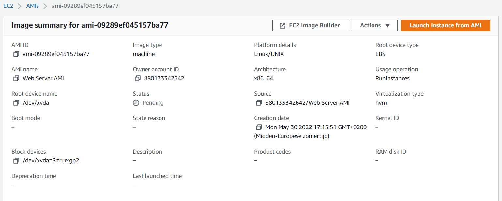
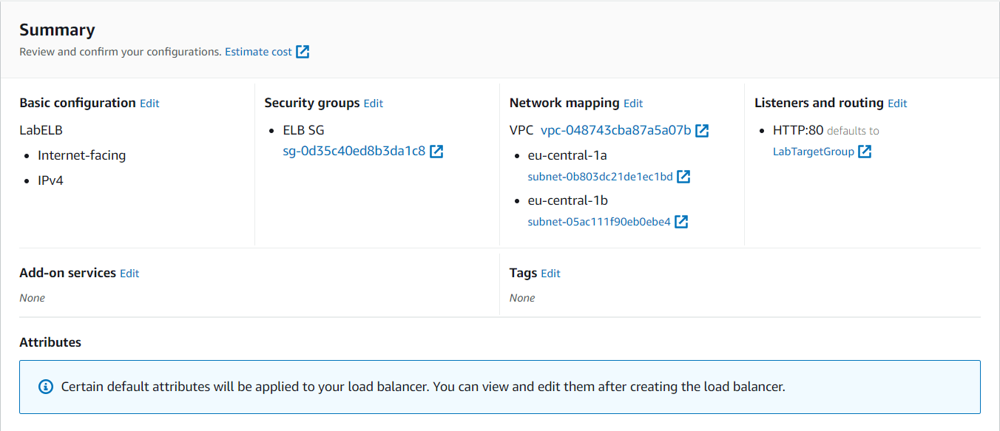
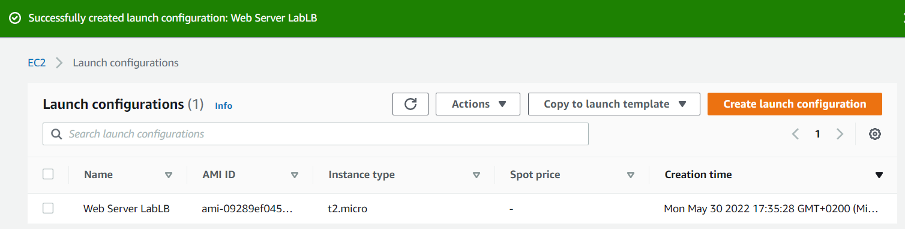
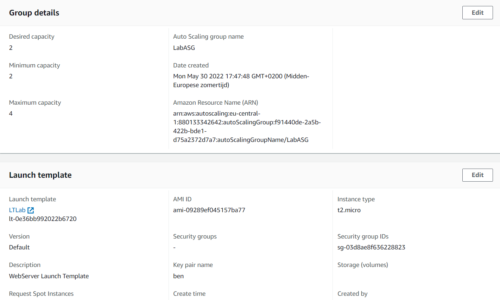
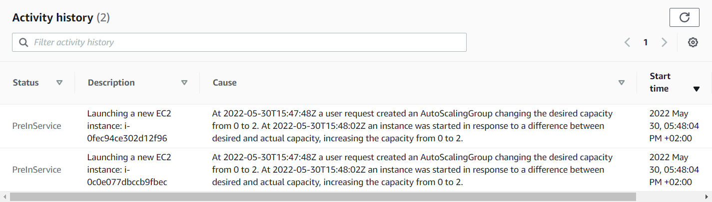
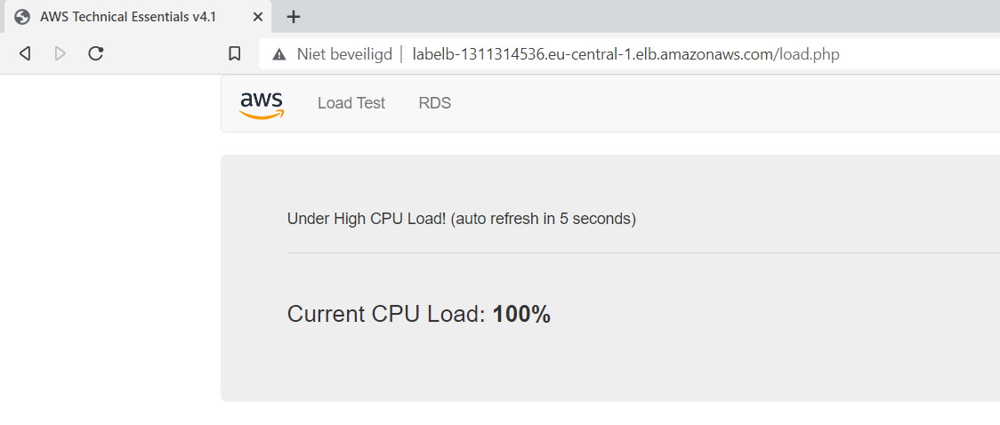
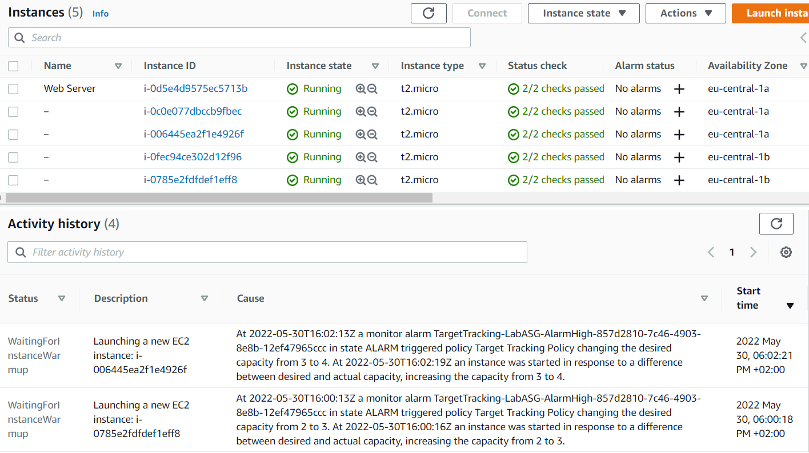

# AWS-11 Elastic Load Balancing (ELB) and Auto Scaling
One of the main advantages of the cloud is that your compute power can scale automatically according to your capacity requirement. Auto-Scaling is an AWS service that enables this.  
  
Instead of running your app on a single server, you can run your app on a fleet of instances. The Auto-Scaler automatically adds or removes instances from your fleet according to the traffic.  
  
Auto-Scaling uses a custom AMI (to ensure all servers are the same) and makes use of the CloudWatch metrics to decide whether to add or remove instances.
  
If you host your site or app on multiple servers, you need to use a Load Balancer. This forwards the request to different servers based on their current workload (spreading the load over all available servers) and relays the response back to the client.  
I imagine this a bit like an inverted NAT gateway (instead of routing outbound traffic to a single public IP, it routes inbound traffic to different private IPs (all instances in the fleet)).  
  
For Load-Balancing, AWS provides the Elastic Load Balancing (ELB) service. There are four types of Elastic Load Balancer (ELB) on AWS:  
- **Classic Load Balancer (CLB)** – this is the oldest of the three and provides basic load balancing at both layer 4 and layer 7. It is outdated and not recommended for use. The reason it still exists, is that is may break existing applications if it is removed.
- **Application Load Balancer (ALB)** – layer 7 load balancer that routes connections based on the content of the request. This ELB works using the HTTP and HTTPS protocols.
- **Network Load Balancer (NLB)** – layer 4 load balancer that routes connections based on IP protocol data. It uses the TCP/UDP protocols.
- **Gateway Load Balancer (GWLB)** – layer 3/4 load balancer used in front of virtual appliances such as firewalls and IDS/IPS systems. This ELB acts as a gateway into your network, as well as a load balancer. It will first route traffic to a (3rd party) application that checks the traffic, like an IDS/IPS or Firewall. After the packet has been inspected, the GWLB acts like a NLB routing to your application. GWLB act on layers 3 and 4 of the OSI stack.
  
Traffic can be routed across a single or multiple AZ's within a region. If you want to route traffic across multiple regions, you can use multple ELB's (1 for every region) along with Route53.  
  
ELB's can be **Internet** facing or **Internal Only**. Internet ELB's have an public IP address. Internal Only ELB's have private IP addresses. Both can route traffic to the private IP addresses of instances. Internal ELB's do not need an internet gateway.  

## Key terminology
[Write a list of key terminology with a short description. To prevent duplication you can reference to previous excersizes.]

## Exercise
### Sources
- https://aws.amazon.com/elasticloadbalancing/
- https://digitalcloud.training/aws-elastic-load-balancing-aws-elb/

### Overcome challenges
[Give a short description of your challanges you encountered, and how you solved them.]

### Results
**Exercise 1:**
Create an EC2 instance with some requirements and create an AMI based on that instance:  
  
  
**Exercise 2:**  
Create an ELB instance following the given specifications:  
  
  
**Exercise 3:**  
Create a Launch Configuration and create a Auto-Scaling group:  
  
  
  
  
**Exercise 4:**  
The auto-scaling group launched two instances:
  
  
Accessing the site through the DNS address of our ELB and enabling the loadtest:  
  
  
Activity Log of the Auto-Scaling Group and all 4 instances online:  
    
