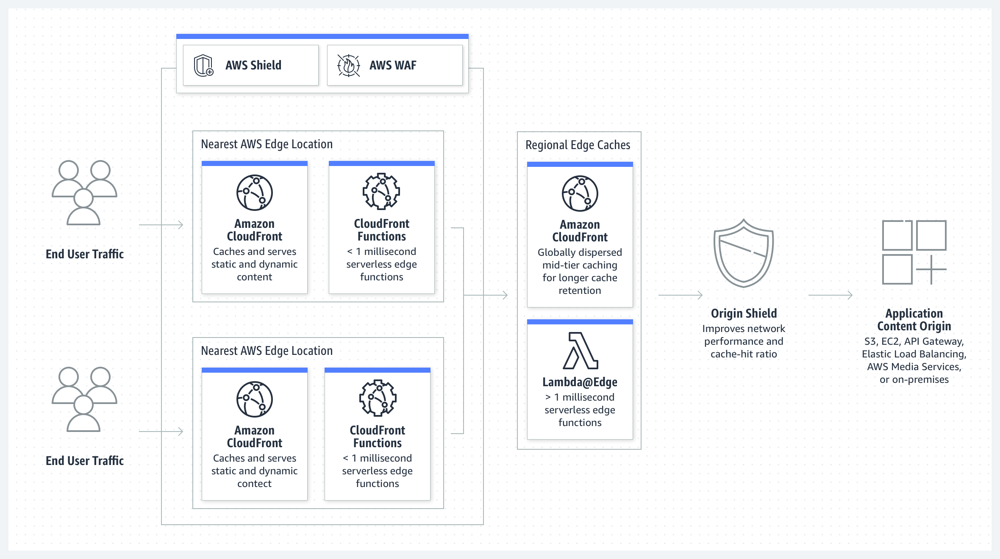

# AWS-13-2 CloudFront
AWS CloudFront is service that speeds up the distribution of your web content, such as .html, .css, .js and image files, to your users. It delivers the content through a global network of data centers also known as Edge Locations. When a client requests content that you are serving with CloudFront, the request is routed to the Edge Location that provides the lowest latency time, so that content is delivered with the best possible performance.

If the content of the request is already in that Edge Location, CloudFront delivers it immediately. If it is not, CloudFront retrieves it from an origin that has been defined in the configuration (i.e. an S3 bucket, MediaPackage Channel or HTTP server) as the source of all content.
  
Normally when a client visits a website, the request is routed over the internet over many different networks. Using CloudFront, it is routed over the private AWS backbone network that is connected all over the world. This greatly reduces the amount of networks the request has to transverse. This improves performance for the enduser.  

It also improves reliability and availability, because the objects are now stored (cached) in multiple Edge Locations around the world.
    
  
  
In general, it is not possible to run your applications on Edge Servers, but CloudFront does support CloudFront Functions and Lambda@Edge functionality.  
  
## Key terminology
- **Origin Server** The actual server where the content that is distributed by CloudFront originates from.
- **AWS Shield** AWS Shield is a managed Distributed Denial of Service (DDoS) protection service that safeguards applications running on AWS. When you use AWS Shield Standard with CloudFront or Route53, you receive protection against all known infrastructure (layer 3 and 4) attacks. For more advanced protection, there is also the Advanced tier, but this one comes at an additional fee.
- **AWS WAF - Web Application Firewall** AWS WAF is a web application firewall that helps protect your web applications or APIs against common web exploits and bots that may affect availability, compromise security, or consume excessive resources. AWS WAF gives you control over how traffic reaches your applications by enabling you to create security rules that control bot traffic and block common attack patterns, such as SQL injection or cross-site scripting.
- **OWASP - Open Web Application Security Project** is an online community that produces freely-available articles, methodologies, documentation, tools, and technologies in the field of web application security.
- **Amazon CloudFront Origin Shield** CloudFront Origin Shield is an additional layer in the CloudFront caching infrastructure that helps to minimize your origin’s load, improve its availability, and reduce its operating costs. It can help generate a *better cache hit ratio*.
- **Cache Hit Ratio** The ratio between requests that get send to the Origin Server or a Cache.
- **AWS Origin Shield** This is an additional layer in the caching infrastructure that helps minimize the Origin's load. CloudFront can retrieve each object using a single origin request from Origin Shield, and all other layers of the CloudFront cache (edge locations and regional edge caches) can retrieve the object from Origin Shield.

## Exercise
### Sources
- https://aws.amazon.com/cloudfront/
- https://aws.amazon.com/shield/?whats-new-cards.sort-by=item.additionalFields.postDateTime&whats-new-cards.sort-order=desc
- https://aws.amazon.com/waf/

### Overcome challenges
N/A

### Results
N/A
