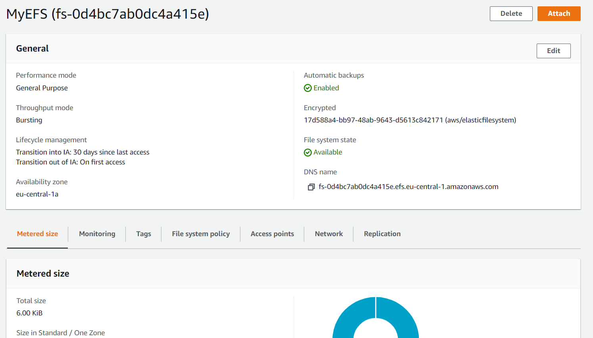

# AWS-13-4 Elastic File System (EFS)
In most of my previous jobs, the company made use of a Shared Disk. Every computer on the network had access to this disk. From a user point-of-view, you access it the same way as a physical harddrive that is connected to the computer, but instead, the data travels over the network to a central file system. 

AWS Elastic File System is the cloud service that enables you to set up a system like this. One of the main advantages is that this system is Elastic, meaning it can up- and downscale based on the requirements after files are added of deleted (it does so automatically). All the other cloud advantages are also here: high-availability, durability and pay-for-what-you-use cost model.

You can use it in combination with AWS services or as a shared-disk for your on-premise resources. It supports Network File System version 4 (NFSv4.1 and NFSv4.0) protocol), so you can integrate with current tools seamlessly.

These are the storage classes of EFS:
- **Standard storage classes** – EFS Standard and EFS Standard–Infrequent Access (Standard–IA), which offer multi-AZ resilience and the highest levels of durability and availability.
- **One Zone storage classes** – EFS One Zone and EFS One Zone–Infrequent Access (EFS One Zone–IA), which offer customers the choice of additional savings by choosing to save their data in a single Availability Zone.
  
You can enable Lifecycle Management to move infrequently accessed files automatically to IA storage. There is also Intelligent Tiering.

EFS is designed to provide the throughput, IOPS, and low latency needed for a broad range of workloads. There are two performance modes and two throughput modes:

- The default General Purpose performance mode is ideal for latency-sensitive use cases, like web serving environments, content management systems, home directories, and general file serving.
- File systems in the Max I/O mode can scale to higher levels of aggregate throughput and operations per second with a tradeoff of higher latencies for file system operations. For more information, see Performance modes.
- Using the default Bursting Throughput mode, throughput scales as your file system grows.
- Using Provisioned Throughput mode, you can specify the throughput of your file system independent of the amount of data stored. For more information, see Throughput modes.

## Key terminology
- **AWS FSx** EFS does not work with all file systems. If you want to run an EC2 instance as a WindowsServer, you would need to use FSx. FSx supports NetApp ONTAP, OpenZFS, Windows File Server, and Lustre file systems.
- **AWS DataSync** This is a service that simplifies, automates and accelerates moving data between storage systems and services. It can copy data to and from: NFS servers, SMB servers, HDFS, Object storage systems, S3, EFS, FSx and Snowcone devices.
- **NFS** Network File System
- **SMB** Server Message Block
- **HDFS** Hadoop Distributed File System.
- **AWS Snowcone** A physical device to transfer data to the cloud. It seems to be designed to be used in harsh environments with bad connectivity.

## Exercise
### Sources
- https://en.wikipedia.org/wiki/Clustered_file_system
- https://docs.aws.amazon.com/efs/latest/ug/whatisefs.html

### Overcome challenges
- echo > txt didn't work on the EFS, but doing that in my home folder and then moving it to the disk worked. Probably something with the directory permissions? Even though I did try to do it as Sudo as well...

### Results
To practise the usage of this service, my goal is to create an EFS, create 2 EC2 instances and see if we can share the disk + files on the disk.  
  
Creation of the EFS (I just used the recommended settings from the documentation):
  
  
I created two instances, both with the EFS mounted. On the screenshot you can see I create a file on the left side (Instance 1) and move it onto the EFS. On the right side is the second Instance and you can see the files that have been created on Instance 1, as well as opening them.  
  

