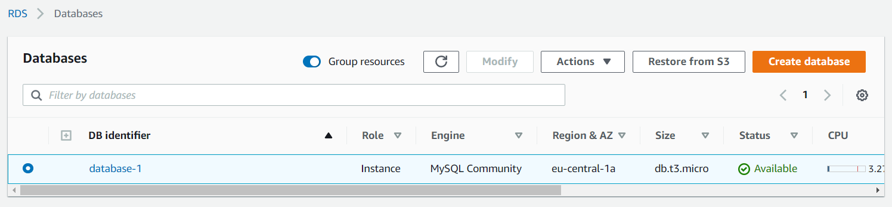
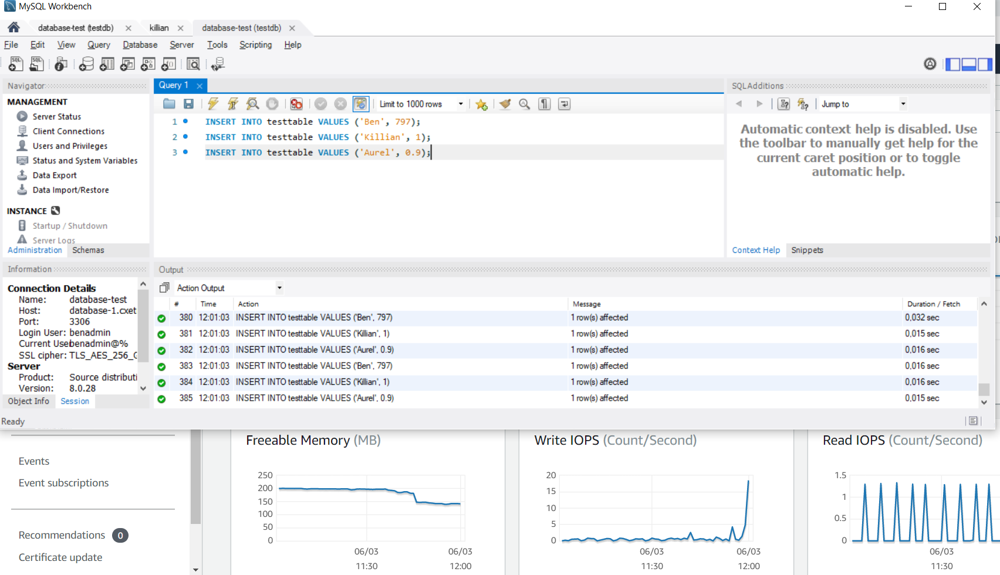

# AWS-13-5 Relational Database System (RDS) and Aurora
To understand AWS RDS, you first need to understand what Relational Databases are. In (very) short: Relational Databases store data in tables. Usually the columns are the "types" of data (name, age, email, country, occupation) and each row is an entry of that data (Ben, 30, bb@bb.bb, NL, Clown Engineer). You can access the data based on the row# (usually called an ID) or actual data itself. You can also filter data (i.e. Age > 25) and perform other functions.  
In order to store data more efficiently, you can split the data up in categories and reference one table from another. So you might have a table "customer data", another with "product data" and another with "orders". The order data also contains customer and product data, but instead of adding it to that table, you reference to the other tables.  
SQL is a very popular language for Relational Databases.  
  
AWS RDS is a collection of managed services that make it simple to setup, operate and scale databases in the cloud. By selecting a DB Engine, RDS launches the instance pre-configured with parameters and settings appropriate for the engine you selected. Similarly to EC2 instances, you can have your database up and running within minutes.  
  
Also similarly to EC2, there are a range of instance types (classes) you can choose from.

There are two storage options:
- **General Purpose (SSD) Storage** Amazon RDS General Purpose Storage is an SSD-backed storage option delivers a consistent baseline of 3 IOPS per provisioned GB and provides the ability to burst up to 3,000 IOPS above the baseline. This storage type is suitable for a broad range of database workloads.
- **Provisioned IOPS (SSD) Storage** Amazon RDS Provisioned IOPS Storage is an SSD-backed storage option designed to deliver fast, predictable, and consistent I/O performance. You specify an IOPS rate when creating a database instance, and Amazon RDS provisions that IOPS rate for the lifetime of the database instance. This storage type is optimized for I/O-intensive transactional (OLTP) database workloads. You can provision up to 40,000 IOPS per database instance, although your actual realized IOPS may vary based on your database workload, instance type, and database engine choice.
- There is also magnetic storage capabilities for compatibility reasons, but it's discouraged to use it for new instances.

## Aurora
Amazon Aurora is part of the managed database service Amazon Relational Database Service (Amazon RDS). It is a relational database management system (RDBMS) built for the cloud with full MySQL and PostgreSQL compatibility. Aurora gives you the performance and availability of commercial-grade databases at one-tenth the cost. Furthermore Aurora can deliver up to 5x the throughput of MySQL and 3x that of PostGreSQL without requiring any chances.  
Aurora also automates and standardizes database clustering and replication, which are typically among the most challenging aspects of database configuration and administration.

## Key terminology
- **SQL** Structured Query Language
- **AWS DMS** Database Migration Service
- **DB Instance** A DB instance is an isolated database environment in the AWS Cloud. The basic building block of Amazon RDS is the DB instance.
- **DB engines** A DB engine is the specific relational database software that runs on your DB instance. Amazon RDS currently supports the following engines: MySQL, MariaDB, PostgreSQL, Oracle and Microsoft SQL Server.
- **Aurora DB cluster** An Amazon Aurora DB cluster consists of one or more DB instances and a cluster volume that manages the data for those DB instances. An Aurora cluster volume is a virtual database storage volume that spans multiple Availability Zones, with each Availability Zone having a copy of the DB cluster data.
- **Burstable Performance** Instances with burstable performance have a baseline level, from this you can calculate your CPU Credits per hour. If an instance does not use its CPU Credits, it can use these at a later time when more processing power is required. This was you can have performance available when you need it, without selecting an overly large instance type.
  

## Exercise
### Sources
- https://aws.amazon.com/rds/?nc=sn&loc=3&dn=1
- https://docs.aws.amazon.com/AmazonRDS/latest/UserGuide/Welcome.html
- https://aws.amazon.com/rds/aurora/
- https://docs.aws.amazon.com/AmazonRDS/latest/AuroraUserGuide/CHAP_AuroraOverview.html
- https://aws.amazon.com/rds/instance-types/

### Overcome challenges
- Aurora's exact definition is a bit unclear. As of now, it seems its a DB Engine that is designed by AWS, but is fully compatible with the existing solutions.
- My patience. Creating a DB instance takes a loooooong time.

### Results
For the practical exercise, I wanted to create a DB instance and be able to log into it from my own laptop. In order to do this has to be public and with the right ports opened.  
I also gave the DNS address to Killian, who was also able to log into my instance (as well as me being able to log into his).
  
In the second screenshot you can see me spamming database entries and the IOPS monitor rising on the AWS console.  
  
  
  
  