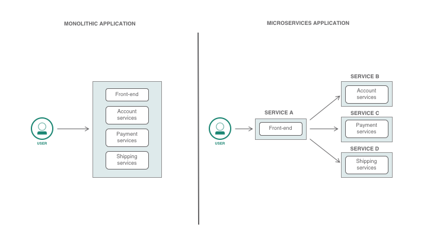

# AWS-14 Elastic Container Service (ECS)
This is the AWS service that enables us to run highly secure, reliable and scalable containers in the cloud.  
  
**Containers**  
We have already used Virtual Machines (EC2 instances), where there is a hypervisor installed that controls the hardware resources. On top of the hypervisor, you can install multiple VM's that all have their own OS. Every OS also requires computing power to run, so there is a limit to the amount of VM's you can run on a single server. If you add too many, there won't be any resources left to do any other tasks than to keep all the OS's running.  
  
That is a problem that containers solve. Instead of every VM having it's own OS, there is one Host Operating System installed and on top of that, the containers run. They don't have their own OS, but all share the same Host OS. This makes them very efficient, very quick to boot up (instead of installing a full OS, it's comparable to opening another instance of a program) and portable. The downsides are some security concerns (if one container is compromised, the host may also be compromised) and that all containers run on the same OS as the host (so they will need to be fully compatible with that OS).  
      
  
        

**Microservices**  
Traditionally, applications where build as one big stack of services (also known as monolithic applications). All services and components run on a single VM. If this VM fails, your whole app is at risk. Microservice Architectures aim to solve this by splitting applications into smaller parts (each with it own seperate function).  
  
The services are described as tightly scoped (only cover the neccesary functions, usually closely related to a business function), strongly encapsulated (all the requirements for this service to run are included in this service), loosely coupled (see below), independently deployable and independently scalable.  
Other advantages are that each service can be managed by a small team, it allows for the use of multiple languages in your app and it allows for quicker testing and development.  
  

     

**Elastic Container Service**  
Amazon ECS is a highly scalable and fast container management service. You can control and manage containers on a cluster. On ECS, your containers are defined in a task definition. You use those to run individual tasks, or multiple tasks within a service. You can run your tasks on a serverless infrastructure controlled by AWS Fargate. Alternatively you can run your tasks and services on a cluster of EC2 instances, over which you have more control, but you'll also have to manage them fully.  
  
The Fargate launch type is suitable for the following workloads:  
- Large workloads that need to be optimized for low overhead
- Small workloads that have occasional burst
- Tiny workloads
- Batch workloads
  
The EC2 launch type is suitable for the following workloads:
- Workloads that require consistently high CPU core and memory usage
- Large workloads that need to be optimized for price
- Your applications need to access persistent storage
- You must directly manage your infrastructure
  
## Key terminology
- **Loose Coupling** Components are weakly associated (have breakable relationship) with each other, and so, changes in one component least affect existence or performance of another component.
- **Cluster** A locigal grouping of tasks/services that are being run in ECS.
- **Container** A container is a standardized unit of software development that holds everything that your software application requires to run. This includes relevant code, runtime, system tools, and system libraries. Containers are created from a read-only template that's called an image.
- **Task Definition** A task definition describes one or more containers that form your application, it functions as a blueprint for your application. It specifies the various parameters for your application. For example, you can use it to specify parameters for the operating system, which containers to use, which ports to open for your application, and what data volumes to use with the containers in the task.
- **Task** A task is the instantiation of a task definition within a cluster. After you create a task definition for your application within Amazon ECS, you can specify the number of tasks to run on your cluster.
- **Services** Services are used to maintain a desired amount of tasks.
- **AWS Fargate** Services that manages the infrastructure for ECS (serverless).
- **AWS ECR** Elastic Container Registry, kind of like GitHub, but then for container images. You can push/pull images to your repository. For CI/CD pipelines, you would want to integrate this with ECS (so new pushes automatically get deployed as well).

## Exercise
### Sources
- https://aws.amazon.com/ecs/
- https://docs.aws.amazon.com/AmazonECS/latest/developerguide/Welcome.html
- https://www.slant.co/versus/8614/8615/~container_vs_type-2-hypervisor
- https://developer.ibm.com/articles/why-should-we-use-microservices-and-containers/
- https://azure.microsoft.com/en-us/topic/kubernetes-vs-docker/

### Overcome challenges
N/A
