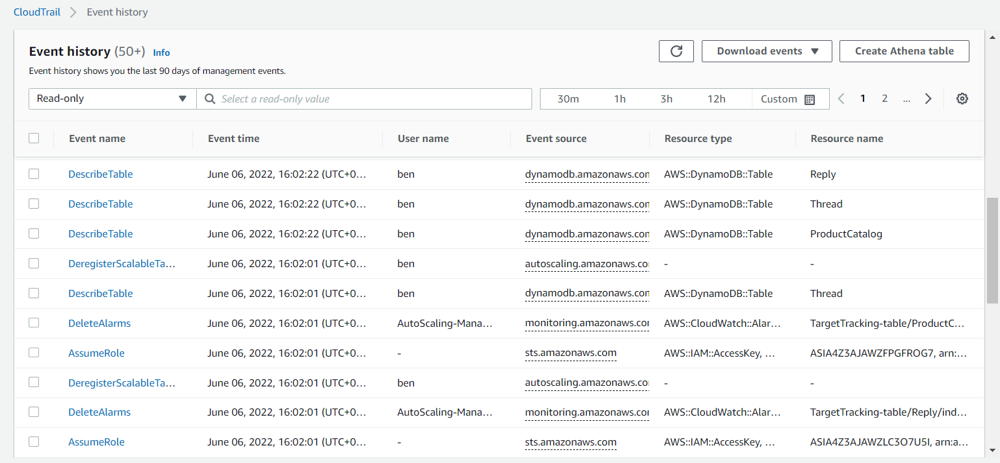

# AWS-18 CloudTrail
AWS CloudTrail is an AWS service that helps you enable governance, compliance, and operational and risk auditing of your AWS account. Actions taken by a user, role, or an AWS service are recorded as events in CloudTrail. Events include actions taken in the AWS Management Console, AWS Command Line Interface, and AWS SDKs and APIs.  
  
Basically CloudTrail is a logging function based on all actions user accounts within your AWS account take. All actions are automatically stored within the "Event History" for 90 days. Below is a screenshot of the events in my account yesterday when I was setting up the DynamoDB table:  
  
 
  
In addition to the Event History, you can create a Trail. A trail is a configuration that enables delivery of CloudTrail events to an Amazon S3 bucket, CloudWatch Logs, and CloudWatch Events. You can use a trail to filter the CloudTrail events you want delivered, encrypt your CloudTrail event log files with an AWS KMS key, and set up Amazon SNS notifications for log file delivery. Using Trails, you create a event log that extends past 90 days.  
  
For easier overview and extra security (permissions), you can create an Organisation Trail. Here all Trails for all accounts under an organisation are delivered to the same S3, CloudWatch Logs and CloudWatch Events. You can disable deleting Logs for your member accounts.

**CloudTrail Lake**  
This is a relatively new functionality that lets you run SQL-based queries on your events. CloudTrail Lakes store the events in a event data store, where you can keep it stored for up to 2555 days (7 years). CloudTrail Lake is an auditing solution that can complement your compliance stack, and assist you with real-time troubleshooting.
