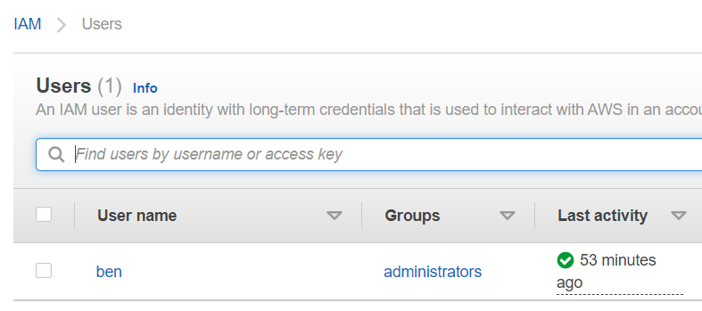

# AWS-19 IAM
IAM stands for Identity and Access Management. Here you can find all settings related to users, groups and roles that belong to your acccount. You can specify who has permission to access to which services and resources and under which conditions. This is where you implement the least privilege policy.  

Users are actual users, Groups are a way to apply permissions to a group of users and roles are used by resources to get access to other resources. For example, you don't want to store an key on an EC2 instance, instead, you would assign this instance an role with the corresponding permissions. If this instance tries to connect to another service, it assumes this role and is able to make a connection.  
  
In IAM you can also define other requirements that you make to your users, such as password policy (password length and maximum age), requiring MFA.
  
IAM features:  
- **Shared access to your AWS account** You can grant other people permission to administer and use resources in your AWS account without having to share your password or access key.
- **Granular permissions** You can grant different permissions to different people for different resources. For example, you might allow some users complete access to Amazon Elastic Compute Cloud (Amazon EC2), Amazon Simple Storage Service (Amazon S3), Amazon DynamoDB, Amazon Redshift, and other AWS services. For other users, you can allow read-only access to just some S3 buckets, or permission to administer just some EC2 instances, or to access your billing information but nothing else.
- **Secure access to AWS resources for applications that run on Amazon EC2** You can use IAM features to securely provide credentials for applications that run on EC2 instances. These credentials provide permissions for your application to access other AWS resources. Examples include S3 buckets and DynamoDB tables.
- **Multi-factor authentication (MFA)** You can add two-factor authentication to your account and to individual users for extra security. With MFA you or your users must provide not only a password or access key to work with your account, but also a code from a specially configured device.
- **Identity federation** You can allow users who already have passwords elsewhere—for example, in your corporate network or with an internet identity provider—to get temporary access to your AWS account.
- **Identity information for assurance** If you use AWS CloudTrail, you receive log records that include information about those who made requests for resources in your account. That information is based on IAM identities.
- **PCI DSS Compliance**
IAM supports the processing, storage, and transmission of credit card data by a merchant or service provider, and has been validated as being compliant with Payment Card Industry (PCI) Data Security Standard (DSS). For more information about PCI DSS, including how to request a copy of the AWS PCI Compliance Package, see PCI DSS Level 1.
- **Integrated with many AWS services** For a list of AWS services that work with IAM, see AWS services that work with IAM.
- **Eventually Consistent** IAM, like many other AWS services, is eventually consistent. IAM achieves high availability by replicating data across multiple servers within Amazon's data centers around the world. If a request to change some data is successful, the change is committed and safely stored. However, the change must be replicated across IAM, which can take some time. Such changes include creating or updating users, groups, roles, or policies. We recommend that you do not include such IAM changes in the critical, high-availability code paths of your application. Instead, make IAM changes in a separate initialization or setup routine that you run less frequently. Also, be sure to verify that the changes have been propagated before production workflows depend on them. For more information, see Changes that I make are not always immediately visible.

## Key terminology
- **AWS Organisations** This is the management account. You can create or invite other accounts to operate under the organisation. You can organize different groups in Operational Units (OUs), to which you can assign SCPs. You can set it up so that your bills are split up for different divisions, but pay from a single account and can have a general overview of costs. You can programatically create new accounts.
- **SCP** Service Control Policy
- **IAM Resources** The user, group, role, policy, and identity provider objects that are stored in IAM. As with other AWS services, you can add, edit, and remove resources from IAM.
- **IAM Identities** The IAM resource objects that are used to identify and group. You can attach a policy to an IAM identity. These include users, groups, and roles.
- **IAM Entities** The IAM resource objects that AWS uses for authentication. These include IAM users and roles.
- **Principals** A person or application that uses the AWS account root user, an IAM user, or an IAM role to sign in and make requests to AWS. Principals include federated users and assumed roles.
- **Attribute-based access control (ABAC)** is an authorization strategy that defines permissions based on attributes (tags). For example, for a new project, you just create a tag with the right permissions and assign it to the team, no mather what role they currently have. If the project requires a new resource, you just add it to that tag, instead of having to ammend all team members their permissions.
- **Role-based access control (RBAC)** an authorisation strategy based on roles. 

## Exercise
### Sources
- https://aws.amazon.com/iam/
- https://aws.amazon.com/organizations/
- https://docs.aws.amazon.com/IAM/latest/UserGuide/introduction.html

### Overcome challenges
- I already made an IAM user for myself on the first day, so most of it was familiar... Just learned some additional terminology such as principals.
- ABAC vs RBAC was new

### Results
Created an Adminstrator group and added my IAM user to the group:  
  
  
  
Applied Adminstrator permissions to the group (access to all services with full permissions):  
  
  
  
My Root account has MFA and I am using my IAM account for actually using the account:  
  
  
  
