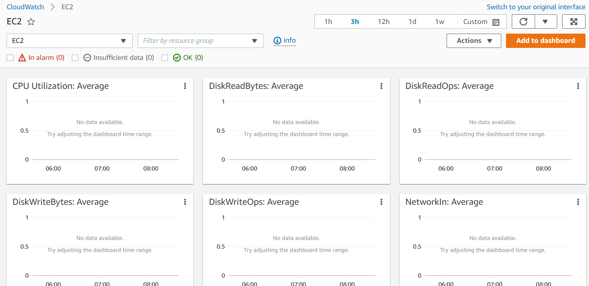
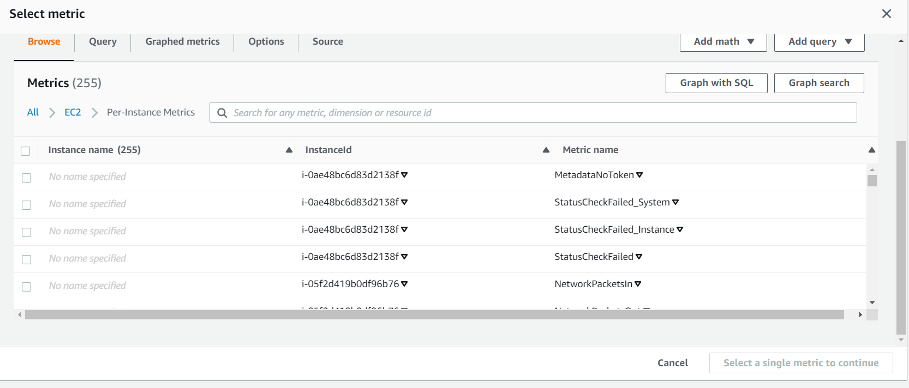

# AWS-20 CloudWatch
CloudWatch collects monitoring and operational data in the form of logs, metrics, and events, and visualizes it using automated dashboards so you can get a unified view of your AWS resources, applications, and services that run in AWS and on-premises. You can correlate your metrics and logs to better understand the health and performance of your resources. You can also create alarms based on metric value thresholds you specify, or that can watch for anomalous metric behavior based on machine learning algorithms. To take action quickly, you can set up automated actions to notify you if an alarm is triggered and automatically start auto scaling, for example, to help reduce mean-time-to-resolution. You can also dive deep and analyze your metrics, logs, and traces, to better understand how to improve application performance.
  
  
  
It is integrated to a lot of services within AWS, for examply, during the assignment where we set up a Load Balancer with Auto-Scaling, it received the CPU metric from CloudWatch. This is an automated response to an *Event*.  
  
You can also set up an alarm that will notify you via SNS (Simple Notification Service).

## Features
- **CloudWatch Metrics** - services send time-ordered data points to CloudWatch
  - Metrics are send to CloudWatchs for many AWS services
  - EC2 Metrics are send every 5 minutes by default (free)
  - EC2 Detailed monitoring sends every 1 minute (chargeable)
  - Unified CloudWatch Agent send sytem-level metrics for EC2 and on-premises servers
  - System-level metrics include memory and disk usage (You need the Unified CloudWatch Agent to receive this data!)
  - Metrics that get sent by default: CPUUtilization, DiskReadOps, NetworkIn, StatusCheckFailed
  - Public custom metric via CLI or API: standard resolution (1 minute granularity) (AWS metrics are standard by default); high resolution (1 second granularity)

- **CloudWatch Alarms** - monitor metrics and initiate actions
  - **Metric Alarm** performs one or more actions based on a single metric
  - **Composite Alarm** uses a rule expression and takes into account multiple alarms
  - Metric Alarm States: 
     - OK (metric within treshold)
     - ALARM (metric outside treshold)
     - INSUFFICIENT_DATA (not enough data)
- **CloudWatch Logs** - centralized collection of system and application logs
  - Gather application and system logs in CloudWatch
  - Defined expiration policies and KMS encryption
  - Send to: 
    - S3 (export)
    - Kinesis Data Streams
    - Kinesis Data Firehose
  - Unified CloudWatch Agent can send Application Logs and System Logs 
  - Lambda Functions require permissions to CloudWatch Logs (role)
- **CloudWatch Events** - stream of system events describing changes to AWS resources and can trigger actions (similar to EventBridge)

## Unified CloudWatch Agent
https://docs.aws.amazon.com/AmazonCloudWatch/latest/monitoring/metrics-collected-by-CloudWatch-agent.html  
  
- Collect internal system-level metrics from EC2 instances across operating systems
- Collect system-level metrics from on-premises servers
- Retrieve custom metrics from your applications or services using the StatsD or collectd protocols
- Collect logs from EC2 instances and on-premises servers (Windows/Linux)
- Agent must be installed on the server:
  - Amazon EC2 instances
  - on-premises servers
  - Linux, Windows Server or MacOS
  
Logging via the CloudWatch agent is almost realtime, so it's very useful to store logs from instances that get terminated by an ASG, as you won't lose that data.  
  
**You can add a "subscriber filter" to a Log Group to connect another service such as Lambda to process the logs.**

## Key terminology
- **AWS-X-Ray** Another logging service, but this time specifically about the requests your applications receive and also the requests they send out to other resources. It can be useful to identify bottlenecks that cause performance issues.  

## Exercise
### Sources
- https://aws.amazon.com/cloudwatch/
- https://docs.aws.amazon.com/AmazonCloudWatch/latest/monitoring/WhatIsCloudWatch.html
- https://docs.aws.amazon.com/xray/latest/devguide/aws-xray.html

### Overcome challenges
- N/A

### Results
Here is an example of a dashboard for EC2 instances in CloudWatch. Currently I don't have any instances running, so you don't see any metrics, but we have already shown this in a couple of previous exercises.   
  
  
In the alarm screen there is an huge amount of options. You can select metrics from the menu (for EC2 instances there are already 255 options!). On top of that you can add functions (sum, average etc) and other queries. 
  
  
In the next screen you can select a treshhold value or a band (so there is a greater acceptable area). You can also create different alarms for different conditional options (<, <=, >=, >). And you can add a required amount of metric breaches before your alarm actually activates.  
  
Then you can add Alarm actions, for example, reboot an instance or use an SNS topic, or create a new topic.