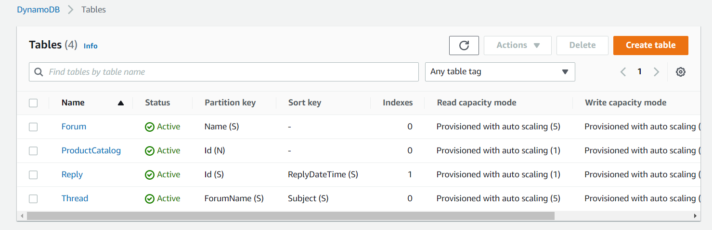
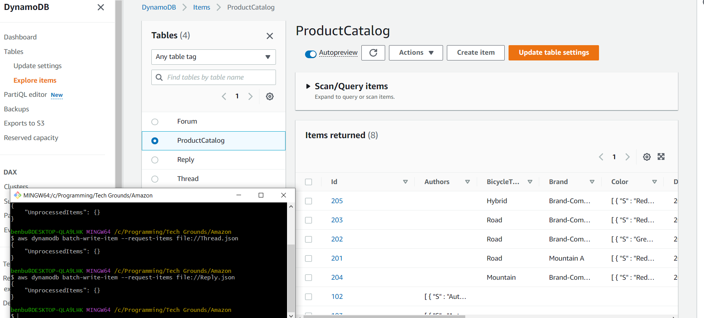
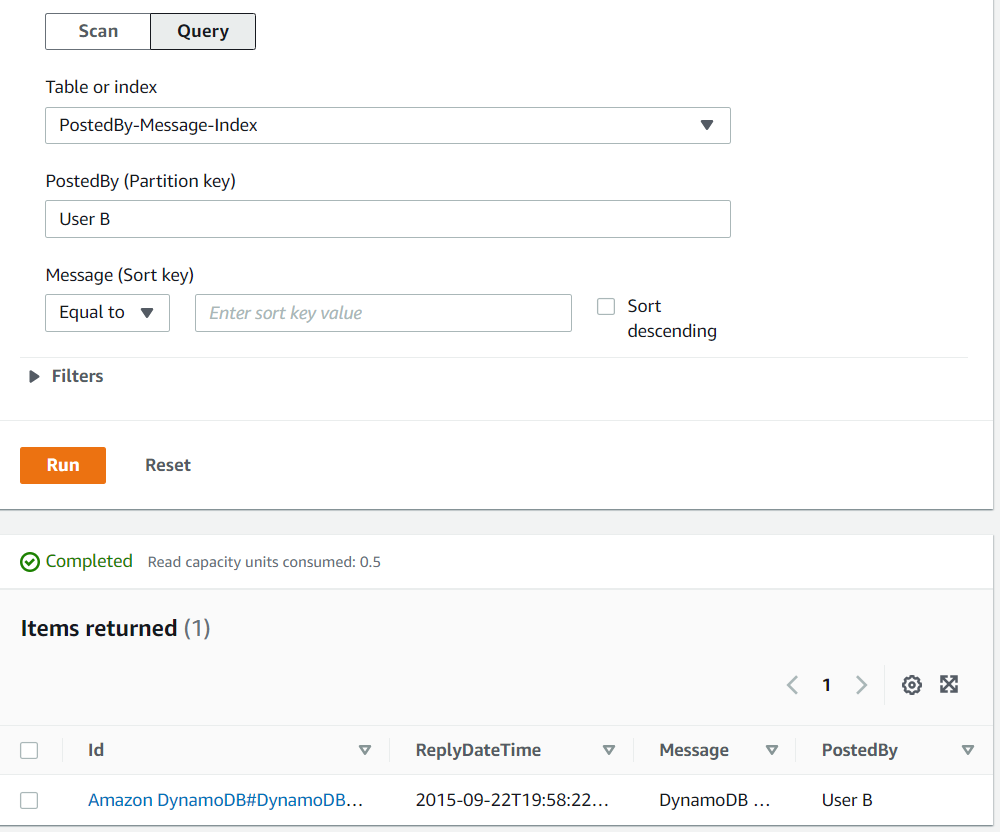
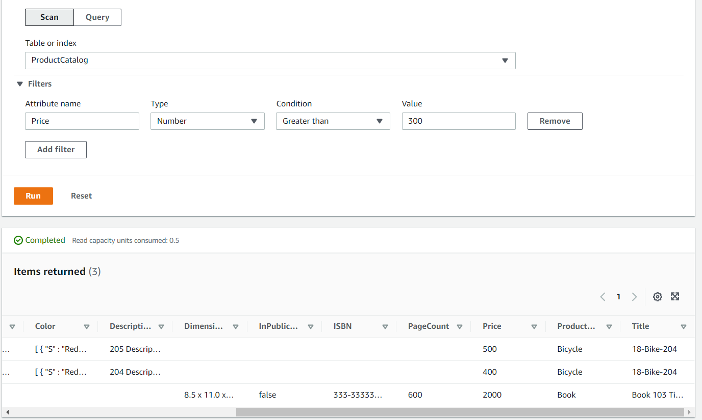

# AWS-21 DynamoDB
**NoSQL**
  
NoSQL databases (also known as non-relational) don't store data as tables, but in different formats. All entry's must have a unique identifier (primary key), based on which an entry is looked up. DynamoDB stores data as **items** and the content of an item is called **attributes**. NoSQL is easy to use, because you don't need to design your database beforehand. Back in the day, the cost for storage was very high, thus the need for a memory efficient system was high and SQL/relational-databases was the norm (because it avoids storing duplicated data).
  
There are a couple of advantages to using a NoSQL database:
- Flexibility: NoSQL databases allow flexible schemas, meaning you don't need to define your exact schema beforehand. 
- Scalability: NoSQL databases make horizontal scaling very easy. The difficulty of this is generally one of the disadvantages of relational databases.
- High-Performance: For certain data models and access patterns, NoSQL is much better suited and therefore allows for much higher performance than trying the same thing with a relational database (joining multiple huge tables is slow).
- Highly functional: NoSQL databases provide highly functional APIs and data types that are purpose built for each of their respective data models.
  
Different types of NoSQL database models:  
- Key-value pairs - *DynamoDB*
- Document (JSON format) - *DocumentDB*
- Graph - *AWS Neptune*
- In-memory - *AWS MemoryDB*
- Search - *AWS Elastic Search*

**DynamoDB**    
DynamoDB is a key-value database with single digit millisecond performance. Data is stored in a table, but you cannot index the data on rows other than the primary key. Optionally, you can also enter a sort key (based on which your data gets sorted).  
It is a fully managed service, meaning you don't have to worry about hardware provisioning, setup and configuration, replication, software patching, or cluster scaling.  
  
There are a couple of options for how you can use DynamoDB:
- Continuous Backup (makes backups for the preceding 35 days)
- On-Demand Backup (takes snapshot backups at specified points in time)
- Global Tables (Replicates data to create multi-region table)
- DynamoDB Accelerator (DAX) (Reduces latency by using in-memory cache - Fully Managed - from millisecond to **microsecond** latency!)

All those options add to the price in addition to the (provisioned) write capacity (WCU) and (provisioned) read capacity (RCU) and storage per GB of data. If you select provisioned mode, you have to select in advance the maximum amount of read/write requests you can do per second.  
There is also in IA (infrequent access) class for tables.
  
You can add a secondary index to a table, but this is more like creating a second table and linking it to the first. It is stored and scales independently.
  
You can either scan or query the data in a DynamoDB table. Querying requires you to supply a key, so the returned result will only ever be 1 item. This is efficient and cheap, but you can't run a query like (age > 20). To run a search like that, you need to use scan. To return a scan result, DynamoDB needs to iterate over every item in your table, so if you need to run a lot of scan operations, you might want to use a relational database (because you pay for every iteration).  
The maximum size both operations can return is 1MB and you have to keep in mind filters are applied AFTER the data has been extracted from the table.
  
To integrate DynamoDB with your applications, you need to use the API. You pay for the API calls (WCU/RCU) and don't have an instance up and running (DynamoDB is serverless).

### DynamoDB Streams
Every time an item is written/update or deleted in a table, a record is written to the DynamoDB Stream. The stream can then trigger a lambda function (which could then process that data or write a log to CloudWatch Logs).  
  
- Captures a *time-ordered* sequence of *item-level* modifications in any DynamoDB table and stores this information in a log for up to 24 hours.
- You can configure the information that is written to the stream:
  - **KEYS_ONLY** Only the key attributes of the modified item
  - **NEW_IMAGE** The entire item, as it appears after it was modified
  - **OLD_IMAGE** The entire item, as it appeared before it was modified
  - **NEW_AND_OLD_IMAGES** Both the new and old images of the item
  
## Key terminology
- **Transaction options** Strongly consistent or eventually consistent reads, support for ACID transactions
- **Backup** Point-in-time recovery down to the second in the last 35 days; on-demand backup and restore
- **Time To Live (TTL)** - expiry date for an item in a table. No extra cost and does not consume WCU/WCU. Helps reduce storage and manage the table size over time.
- **Global Tables** is a multi-region, multi-active (or multi-master) database. You can read/write to replica tables at the same time, which are then asynchronously synchronized.

## Exercise
### Sources
- https://aws.amazon.com/nosql/
- https://www.mongodb.com/nosql-explained
- https://www.ibm.com/cloud/blog/sql-vs-nosql
- https://docs.aws.amazon.com/amazondynamodb/latest/developerguide/Introduction.html
- https://beabetterdev.com/2021/05/12/dynamodb-scan-vs-query/

### Overcome challenges
- Getting confused about NoSQL vs DynamoDB, because NoSQL can mean a range of different types of non-relational databases.

### Results
As a practical assignment, I followed the guide in the documentation. Initially I'll create 4 tables, then I'll populate them with some sample data and finally I'll query them.
  
Here you can see the tables have been created:  
  
  
On the following screenshot, I have loaded the provided data into DynamoDB using CLI and confirm it has been loaded correctly by viewing it in the console:  
  
  
Here I queried the data in the Reply table based on a secondary index (PostedBy). Instead of showing all replies, it only shows the results that correspond to the query.
  
  
To display the difference between scan and index; using the following filter based on price does not work with query. Scan goes through all items and only returns the ones that conform to the filter. If you use query, it is required to supply a key. Based on that key, you would only get the product that corresponds to that key returned. If the price doesn't correspond to the filter, you don't get any result returned.  
  
