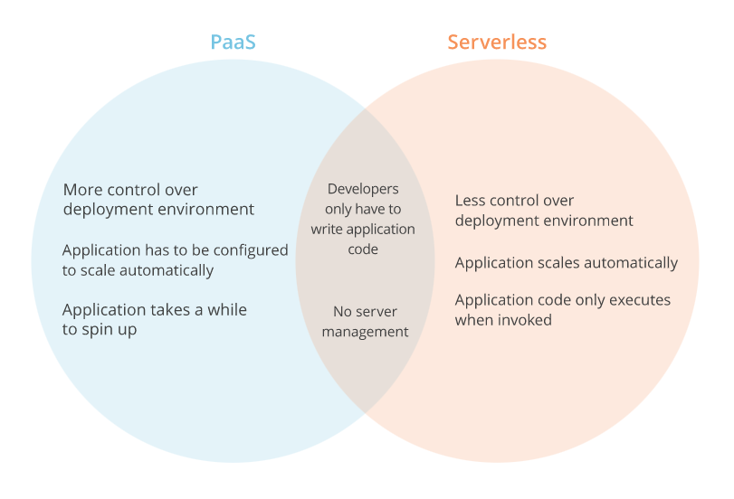
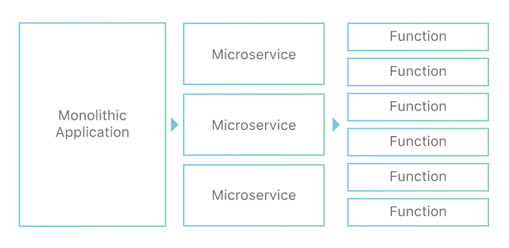
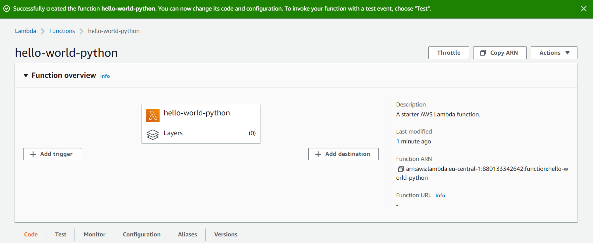
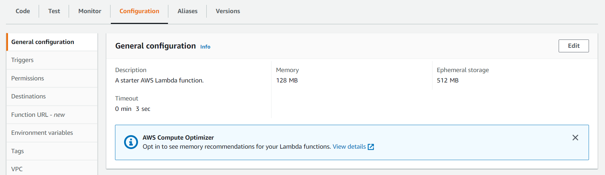
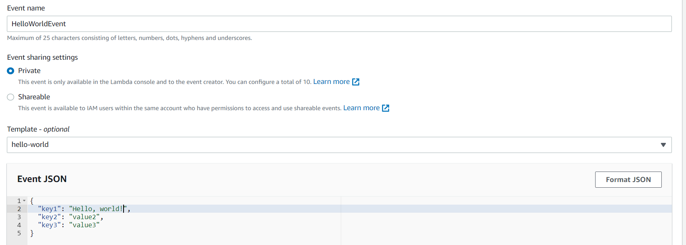
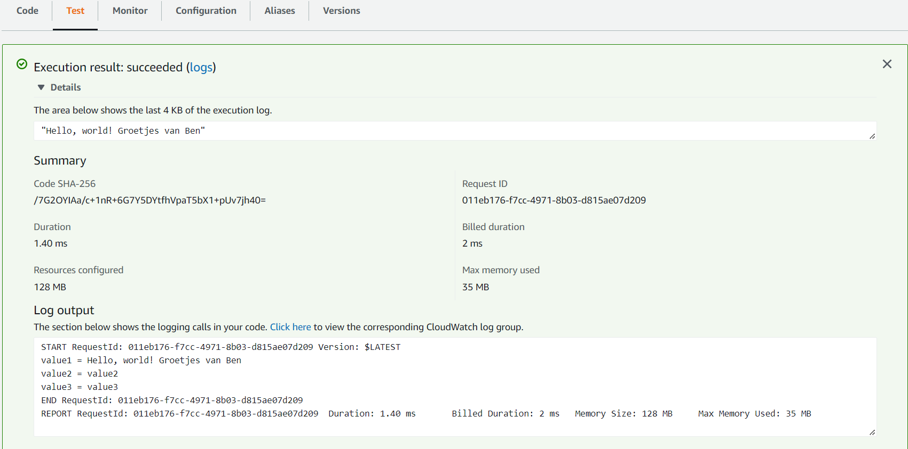

# AWS-22 Lambda
I am familiar with Lambda functions from Python, where they are also referred to as Anonymous functions. It is a quick way to run a function without having to do the complete definition.  
  
In the cloud it is a similar concept, you supply a function (code) to the cloud through a request and Lambda makes sure it gets executed. It takes care of provisioning the required resources and infrastructure, so you do not have to manage any servers. That is why it is called Serverless computing.

**What is serverless computing?**  
Serverless computing allows you to build and run applications and services without thinking about servers. With serverless computing, your application still runs on servers, but all the server management is done by AWS. At the core of serverless computing is AWS Lambda, which lets you run your code without provisioning or managing servers.  
  
It is different from Beanstalk or other PaaS services. Using PaaS services, the infrastructure is configured by the vendor, but with serverless, it is just the code that is executed. Even the vendor doesn't configure a server for you, it just reserves some computing power for you on the spot. This is done within (milli) seconds, even launching a container can not be done that quick. It means if your code doesn't run, you have literally 0 usage. 

I really like this quote:  
`Serverless computing can be compared to drawing water from a tap, with water representing computing power. A tap in a modern home can be switched on at any time and can produce as much water as is necessary. PaaS is more like using a water dispenser and a water bottle delivery service. It is still possible to obtain as much drinking water as is needed, but it is not as simple as turning on the tap; the consumer has to ask the vendor to deliver more if demand increases. In both scenarios, someone else is handling the 'backend' – purifying the water, bringing it to the building, etc. – but only tap water can be scaled precisely, on demand, and in real time.`

  
  
AWS Lambda executes in response to events. Events can be changes to an S3 bucket (process a new object), updates to a DynamoDB table or other custom events that are generated by applications or devices.  
  
AWS Lambda natively supports Java, Go, PowerShell, Node.js, C#, Python, and Ruby code, and provides a Runtime API which allows you to use any additional programming languages to author your functions. 
  
In AWS-14 (Elastic Container Service) we briefly spoke about Monolithic and Microservices architectures, serverless is the latest type of architecture. Here you divide your complete application in specific functions instead of services.  
Developers can focus on writing code and have to worry about the infrastructure even less, which greatly improves development time.
  
  
  
The code you run on AWS Lambda is uploaded as a “Lambda function”. Each function has associated configuration information, such as its name, description, entry point, and resource requirements. The code must be written in a “stateless” style i.e. it should assume there is no affinity to the underlying compute infrastructure. Local file system access, child processes, and similar artifacts may not extend beyond the lifetime of the request, and any persistent state should be stored in Amazon S3, Amazon DynamoDB, Amazon EFS, or another Internet-available storage service. Lambda functions can include libraries, even native ones.  
  
Here is a diagram showing how a simple To-Do app might use Lambda functions. Traditionally, you would have the webserver running back-end code that makes calls to the database server for adding, updating and deleting tasks. If you split every "task" your backend performs into seperate functions, you can then proceed to define them as Lambda Functions.  
These can be called through an API, will then connect to the database and return/ammend the requested data.  
You don't need to have a server running that is waiting for these requests/function calls to come in, so when there aren't any request, you have literally 0 usage.

  
  
With Lambda, you pay for what you use. You need to allocate memory for your function (between 128MB and 10240MB). You pay for the memory you allocate plus the runtime of your function (the duration that it takes for your function from start to finish).  
There is also a small charge per every million request. The thing about GB per second I don't understand.

## Key terminology
- **Execution environment** An execution environment provides a secure and isolated runtime environment for your Lambda function. An execution environment manages the processes and resources that are required to run the function. The execution environment provides lifecycle support for the function and for any extensions associated with your function.
- **Instruction set architecture** The instruction set architecture determines the type of computer processor that Lambda uses to run the function. Lambda provides a choice of instruction set architectures: Arm64 (AWS Graviton2) or x86_64
- **Deployment package** You deploy your Lambda function code using a deployment package. *Option 1:* A .zip file archive that contains your function code and its dependencies. Lambda provides the operating system and runtime for your function. *Option 2:* A container image that is compatible with the Open Container Initiative (OCI) specification. You add your function code and dependencies to the image. You must also include the operating system and a Lambda runtime.
- **Runtime** The runtime provides a language-specific environment that runs in an execution environment. The runtime relays invocation events, context information, and responses between Lambda and the function. You can use runtimes that Lambda provides, or build your own. (This includes things like OS, CPU Architecture and Python version)
- **Lambda layer** is a .zip file archive that can contain additional code or other content. A layer can contain libraries, a custom runtime, data, or configuration files.

## Exercise
### Sources
- https://aws.amazon.com/serverless/
- https://www.cloudflare.com/learning/serverless/glossary/serverless-vs-paas/
- https://www.cloudflare.com/learning/serverless/glossary/function-as-a-service-faas/
- https://docs.aws.amazon.com/lambda/latest/dg/welcome.html
- https://aws.amazon.com/getting-started/hands-on/run-serverless-code/

### Overcome challenges
- Where does Serverless belong in the as-a-service model? Especially vs PaaS.
- WORMHOLE!!!!!!!!!!!

### Results
I found a simple hello-world-python function as a tutorial/guide and decided to follow that.  
  
On this screenshot I have created the function:  
  
  
Here is the basic configuration of the fucntion:  
  
  
Creating a test event:
  
  
Executing the test:
  

