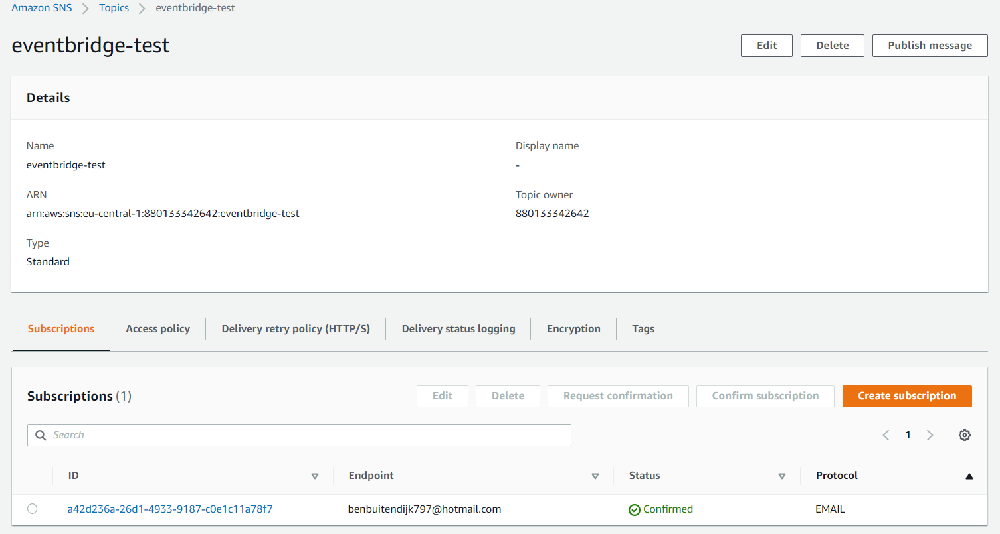

# AWS-23 SNS, SQS and EventBridge

## AWS SNS
SNS stands for Simple Notification Service. It is a managed pub/sub message system.  
  
**What is Pub/Sub Messaging?** 
Publish/subscribe messaging, or pub/sub messaging, is a form of asynchronous service-to-service communication used in serverless and microservices architectures. In a pub/sub model, any message published to a topic is immediately received by all of the subscribers to the topic. Pub/sub messaging can be used to enable event-driven architectures, or to decouple applications in order to increase performance, reliability and scalability.  
  
Publisher/Subscribers are also known as Producers and Consumers. The Publisher communicates by sending out a *topic*, which is a logical access point and communication channel. Clients can subscribe to the topic and receive the messages using a supported endpoint type.  
  
There can be A2A communication (Application to application, EC2 or Lambda to CloudWatch for example) or A2P (Application to person; email, sms, mobile push message).
  
SNS pushes the message to all subscribers, so in some situations, it is desirable to use it in conjuction with SQS. Using SQS you can configure the messages to be send  FIFO (first in first out) and guarantee that they will be received. 

## AWS SQS
SQS stands for Simple Queue Service. Imagine you have a App running with an Auto-Scaling Group that receives requests from the web and another one that will receive the requests from the first ASG and processes them. If the web tier suddenly receive a spike, the processing tier might not be able to handle them all at once. This can cause failures and loss of data.  
To solve this problem you can use SQS. The requests from the web tier are send to the Queue, where they are stored. The Processing Tier takes the data from the Queue (this is called Polling), so both can work at their own capacity without the need for exact synchronisation. This is also known as decoupling. 

Short summary:
- SQS offers a reliable, highly-scalable, hosted queue for storing messages in transit between computers
- SQS is used for distributed/decoupled applications
- SQS uses a message-oriented API
- SQS uses pull based polling, not push (meaning: the receiving host asks SQS for the next message, it doesn't get transmitted automatically)

Another similar service is AWS MQ, which is a managed message broker service for Apache ActiveMQ and RabbitMQ. It provides similar functionality, but SQS is based on AWS their own system.
  
## AWS EventBridge
Amazon EventBridge is a serverless event bus service that you can use to connect your applications with data from a variety of sources. EventBridge delivers a stream of real-time data from your applications, software as a service (SaaS) applications, and AWS services to targets such as AWS Lambda functions, HTTP invocation endpoints using API destinations, or event buses in other AWS accounts. It was formerly called CloudWatch Events.  
  
EventBridge receives an event, an indicator of a change in environment, and applies a rule to route the event to a target. Rules match events to targets based on either the structure of the event, called an event pattern, or on a schedule. For example, when an Amazon EC2 instance changes from pending to running, you can have a rule that sends the event to a Lambda function.  
  
All events that come to EventBridge are associated with an event bus. Rules are tied to a single event bus, so they can only be applied to events on that event bus. Your account has a default event bus which receives events from AWS services, and you can create custom event buses to send or receive events from a different account or Region.  
  

## Exercise
### Sources
- https://aws.amazon.com/pub-sub-messaging/
- https://docs.aws.amazon.com/sns/latest/dg/welcome.html
- https://docs.aws.amazon.com/eventbridge/latest/userguide/eb-what-is.html

### Overcome challenges
N/A

### Results
Because these 3 services are somewhat linked, I would like to use all 3 of them in one go.  
  
Creation of an SNS topic that has my email address as a subscriber:
  
  
The creation of an EventBridge Rule that responds to an S3 bucket. It will target my SNS topic every time an S3 object gets created or deleted in my bucket.  
  
  
Receiving an email notification after uploading the CAT picture to my bucket again. Unfortunately, Outlook doesn't format JSON very nicely. We also have the option to attach the data as a JSON object instead of text.
  
