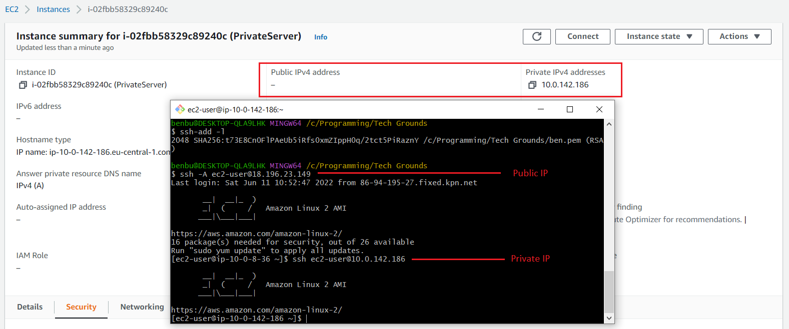

# EC2

## Bastion Host
 - `ssh -A` Enable forwarding of the authentication agent connection.
 - `ssh -i` identity file
 - `ssh-agent bash` start ssh agent and add path to ENV
 - `ssh-add <full-path-to-key>` add .pem file to active agent. ADD ABSOLUTE PATH! RELATIVE DOESN'T WORK!!

### Sources
- https://digitalcloud.training/ssh-into-ec2-in-private-subnet/
- https://www.ssh.com/academy/ssh/command
- https://unix.stackexchange.com/questions/48863/ssh-add-complains-could-not-open-a-connection-to-your-authentication-agent

### Result

# To-Do
- check out roles / trustpolicies / AWS STS