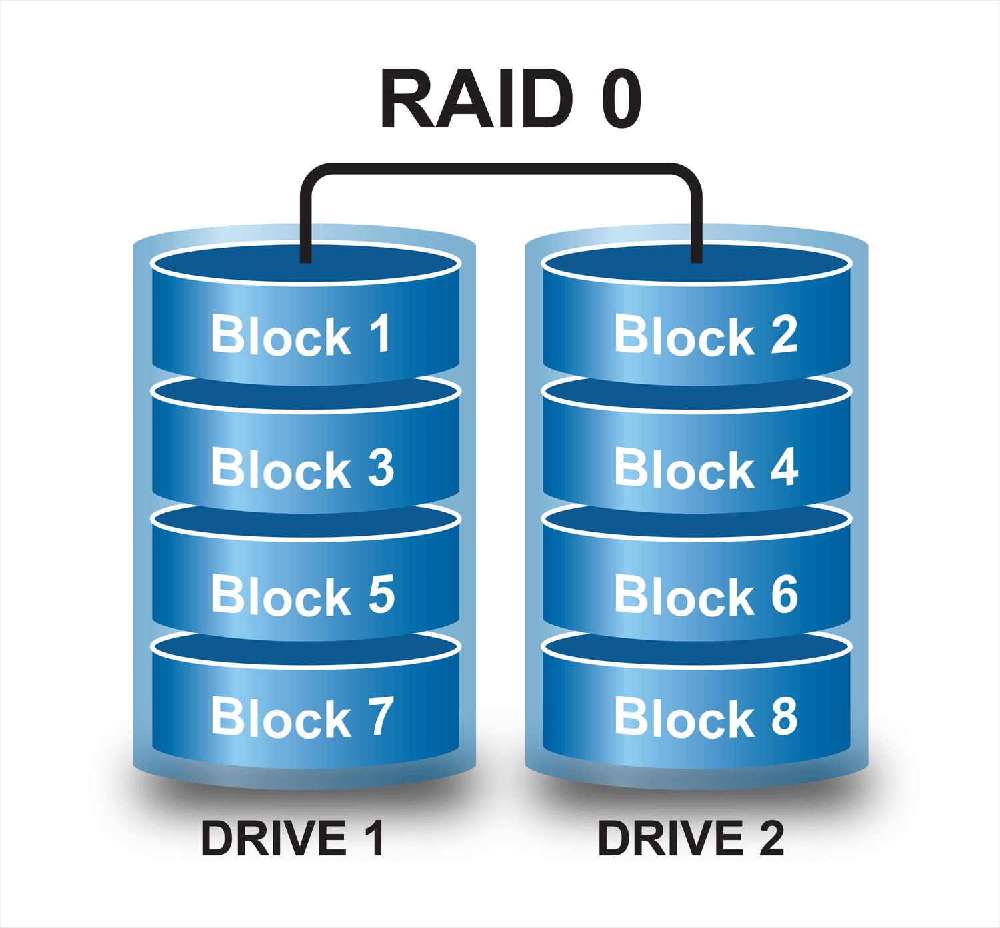
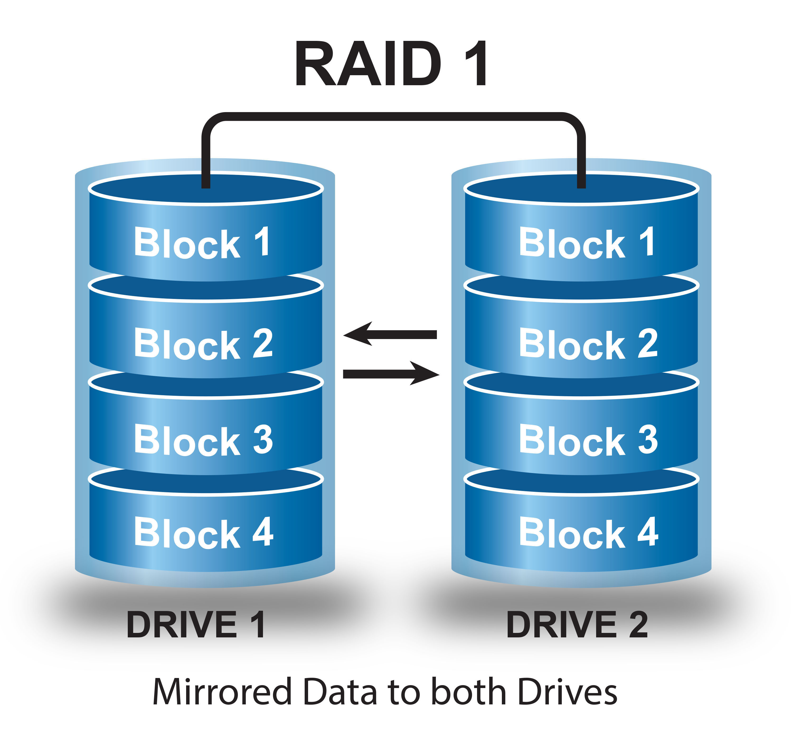

# EBS

## EBS Multi-Attach
- Must be within a single AZ
- Only available for Nito system-based EC2 instances
- Must be a Provisioned IOPS SSD volume
- Max. 16 instances can be attached to a single volume

## EBS SSD Volumes
Provisioned IOPS are the fastest volume types and always run on SSD.  

https://aws.amazon.com/ebs/provisioned-iops/
 ## EBS HDD Volumes
 **You cannot have HDD Volumes as your boot volume!!**
   
- Throughput Optimized HDD - Big Data, Data warehouses and log processing
- Cold HDD - throughput-oriented storage for data that is infrequently accessed | scenarios where the lowest storage cost is important

Throughput of HDD volumes is okay, but IOPS is extremely low!

## Instance Store
This is a volume that is physically attached to the host on which your instance is running. This is very good for quick IOPS (like caching or buffering), but it's not very reliable.  
If the hardware disk fails or your instance stops/hibernates/reboots, your data is lost. You can reboot your instance.  
An Instance Store is attached to an instance for the lifetime of an instance and can only be attached during the launch.

## RAID with EBS
- Using RAID with EBS volumes is possible by configuring it through your operating system, it is not provided by AWS.  
- You can use RAID 0 and RAID 1 with EBS
- RAID 5 and RAID 6 are common outside of AWS, but not recommended by AWS
  
**RAID 0**  
- RAID 0 is used for striping data across disks (to gain better performance)
- You have to use 2 or more disks
- If one disk fails, the entire RAID set fails
  
Every block that is written is spread over every volume, so when you read it, you can read it from multiple volumes at the same time.  
  
  
  
**RAID 1**  
aka mirroring!  
  
- RAID 1 is used for mirroring data across disks (improve redundancy/fault tolerance)
- If one disks fails, the other disk is still working
- When data gets written, it gets send to two volumes at the same time
  
  

## Key Terminology
- **SAN** Storage Area Network - A network that allows devices (such as storage) to communicate over a network as if they had a physical connection.
- **NAS** Network-Attached Storage - Typically a server that has many storage disks attached to it that can be accessed by other computers over a network. 
- **RAID** Redundant array of independent disks - Different methods of spreading blocks of data over multiple storage volumes 

## Sources
- https://www.ibm.com/topics/storage-area-network
- https://stackoverflow.com/questions/15759571/iops-versus-throughput
- https://cloudacademy.com/blog/amazon-aws-raid-0-configuration-on-ebs-volumes/