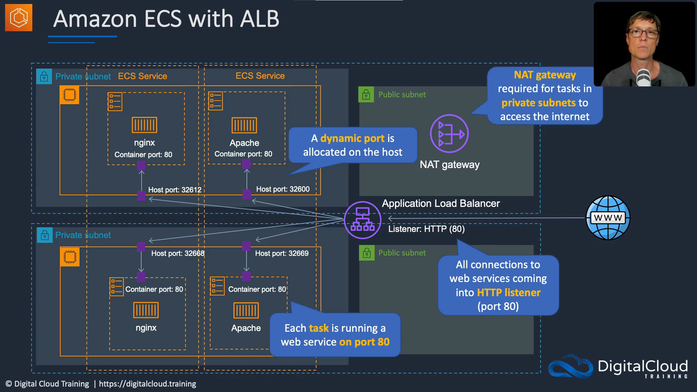
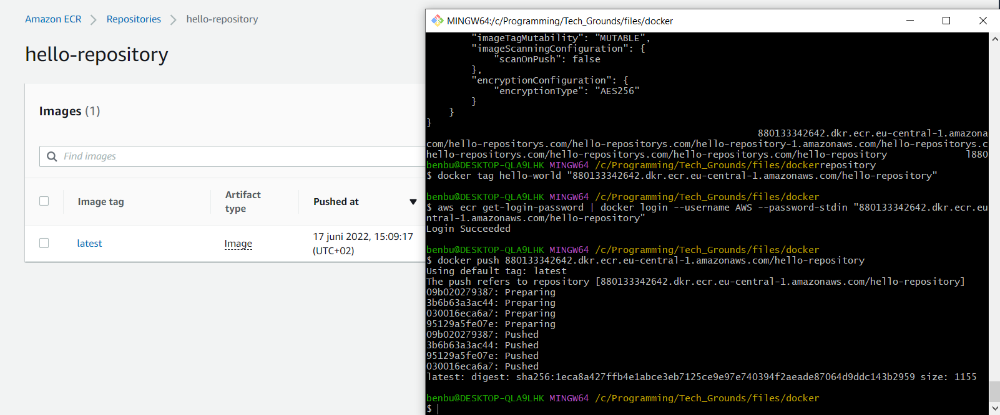

# Docker Containers - ECS and EKS
  

## ECS and IAM roles
- **IAM Instance Role** provides permissions to the container instance / host (EC2)
- **IAM Task Role** provides permissions to the containers (tasks)
  
Permissions included in the *Instance Role* (host) are supplied to the containers via instance meta data! So least-privilege principle is important to think about for the Instance Role.  
  
On Fargate, you don't control any instances so you only use Task Roles. You can specify roles in the task definition, so here you also need to think about least-privilege.

## ECS Scaling
**Service auto scaling**  
- Automatically adjust the desired task count up or down using the Application Auto Scaling service
- Supports target tracking, step and scheduled scaling policies
- Three scaling options:
  - *Target Tracking Scaling Policies* scale based on a CloudWatch metric
  - *Step Scaling Policies* scale based on a breach of CloudWatch alarm, in incremented steps based on the size of the alarm breach. 
  - *Scheduled Scaling* Scale the amount of tasks based on the date and time
  
**Cluster auto scaling**  
- Uses a Capacity Provider to scale the number of EC2 cluster instances using EC2 Auto Scaling
- It's using an ECS resource type: **Capacity Provider**
- A Capacity Provider can be associated with an EC2 Auto-Scaling Group (ASG)
- Two scaling options:
  - *Managed Scaling* with an automatically created scaling policy on your ASG
  - *Managed Instance Termination Protection* which enables container-aware termination of instances in the ASG when scale-in happens
  
- https://docs.aws.amazon.com/autoscaling/application/userguide/what-is-application-auto-scaling.html
  
## ECS and ALB
You can use a ALB in conjunction with Containers. If you run multiple webservers (port 80), you have to configure *host ports* on which to forward the requests.
  
- **Port Mapping** this is defined in the Task Definition. It allows containers access to that port on the host instance to send and receive traffic.
- **containerPort** is the port in the container, one which your containerized app should listen on,
- **hostPort** is the port which will be visible on the Mesos Agent where container is running,
- **servicePort** is abstract port for internal use of framework, e.g. it can be used in loadbalancer as port mapped to host on which your run your container and its hostPort. Should be unique across your cluster.
  
  

- https://aws.amazon.com/premiumsupport/knowledge-center/dynamic-port-mapping-ecs/
- https://stackoverflow.com/questions/48163354/difference-between-container-port-host-port-and-service-port-in-dcos-json-in-por

# Practical Practise
I've created a Dockerfile & created the image it using docker build. Then I made a repo on ECR and pushed the image to the repo.  
  
  
The new console doesn't have all functionalities, so I need to try again with the old console.

# Todo
- Lize Rice builds a container from scratch in Go: https://www.youtube.com/watch?v=8fi7uSYlOdc 
- https://medium.com/@saschagrunert/demystifying-containers-part-i-kernel-space-2c53d6979504
- https://linuxcontainers.org/lxd/introduction/  

