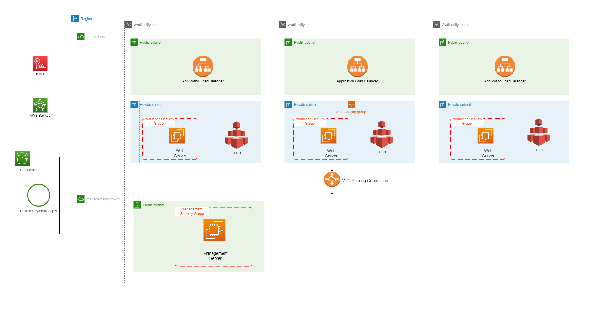

# Tech Grounds Final Project V1.1
This is version 1.1 of the final project for the Tech Grounds Cloud Engineer cohort.  

For V1.0, we received a document in which the specifications, requirements and a sketch were supplied. Our task was to implement it using AWS CDK (Infrastructure as Code), make suggestions/improvements along the way and work with the Scrum methodology.

In the second half of the project, we only received a list of requirements for the new version. The design and implementation was completely up to us. Most of the requirements resolved around enabling Auto-Scaling and adding a Load Balancer, as well as some security improvements.
  
# Content

- [Quick Start Guide](#quick-start-guide)
  - [Requirements](#requirements)
  - [Preparations](#preparations)
  - [Configuration File](#configuration-file)
  - [Parameter Store variables](#parameter-store-variables)
  - [EC2 Key Pair](#creating-ec2-key-pair)
  - [Deploying](#deploying)
  - [SSH Connection](#connecting-through-ssh)
  - [Cleaning Up](#cleaning-up)
- [Updating Web Content](#updating-web-content)
- [Design](#design)
- [Changelog](#changelog)
  - [Region](#region)
  - [AZ](#availability-zones)
  - [Instance Type](#instance-types)
  - [Backup](#backup-schedule)
  - [Additional EBS](#additional-ebs-volume)
  - [Trusted IPs](#trusted-ips)
  - [Encryption Keys](#encryption-keys)
 
# Quick Start Guide

## Requirements
- [Python 3 installed (make sure it's added to the PATH)](https://www.python.org/)
- [AWS CLI installed](https://docs.aws.amazon.com/cli/latest/userguide/cli-chap-getting-started.html)
- [Configure your Access key + region for your AWS account](https://docs.aws.amazon.com/cli/latest/userguide/cli-configure-quickstart.html)
- [NodeJS installed (npm)](https://nodejs.org/)
- AWS CDK installed (run: `npm install -g aws-cdk`)
- [Create a certificate and import it in Amazon Certificate Manager](https://docs.aws.amazon.com/acm/latest/userguide/import-certificate.html)
- Add your account-id and the region to deploy in the [app.py](app.py) file.

## Preparations
Create a virtualenv:
```
$ python -m venv .venv
```

Activate your virtualenv.

```
$ source .venv/bin/activate

or

$ . .venv/bin/activate
```

Once the virtualenv is activated, you can install the required dependencies.

```
$ pip install -r requirements.txt
```
## Configuration File
There are a couple configurable settings:
- **TRUSTED_IP** - Allow SSH access from these IP addresses. By default, your current public IP will be added. Any additional IP addresses need to be added to the list as strings: `[my_ip, "35.68.133.14", "56.175.25.219"]`. For better security, you can add the office IP in SSM Parameter Store ()
- **TEST_ENV** - When set to true, certain resources such as S3 bucket, Backup Plans & Vaults will be deleted along with the stack. If you run a **production environment**, you want to keep these resources available, so it's **highly recommended** to set this setting to False. The default setting is True, so all resources get deleted.
- **AMI_SERVER** - When this is set to True, a Web Server is launched that can be used to configure and then create an AMI from. This can then be used for the Auto-Scaling Group's Launch Template.
- **CAPACITY** - For the Auto-Scaling Group, you can specify the Minimum and Maximum amount of servers.

You can find the configuration file in the code directory, the file is named `_config.py`.  
  
[Click here for a shortcut](./code/_config.py)

Alternatively, you can run the following command to open it in VSC:
```
$ code ./code/_config.py
```

## Parameter Store Variables
There are a couple of variables that will be retrieved from the Parameter Store (which you can find in the console). You have to name the parameters with these exact names:
- `tgfp-office-ip` - Add the Office IP to allow connection in the firewalls
- `tgfp-myami` - After creating an AMI, add the AMI-id here so it will be used for the ASG Launch Template.
- `tgfp-certificate-arn` Add ARN to the Certificate that has been imported in ACM.

## Creating EC2 key pair
In the console, create an EC2 key pair (.pem file) in the same region you want to deploy in with the name `ec2-key-pair`
  

  
## Deploying
Now you can bootstrap your environment to your stack (this adds your account settings such as the region to the Stack)

```
$ cdk bootstrap
```

By default, the configuration has been set to TEST_MODE and your current public IP address will be used for the firewalls.  
If that is alright and you want to continue to deploy:

```
$ cdk deploy
```
## Connecting with RDP
The Admin Server is now a Windows instance, so you can use RDP to connect. To do so, you must go to the console, click 'connect' and follow the steps on the screen. A default password has been generated based on the key-pair that was made earlier. 

## Connecting through SSH
Start the SSH agent
```
$ ssh-agent bash
```
Add the ec2 key pair to the SSH agent
```
$ ssh-add ec2-key-pair.pem
```
Now we are going to proxy jump from the Admin Server to the instances in the private subnet.
SSH to your Admin server's *public IP* and the Web servers' *private IP*. Add the -J flag to enable jumping and add the -A flag to enable forwarding of the public key.
You will be used to fill in the password, this is the same password you have received in the previous step, unless you have changed it.

It may take a little time for the Windows server to be fully booted and it may be neccesary to RDP into that first.

```
$ ssh -J -A Administrator@<admin.server.public.ip> ec2-user@<web.server.private.ip>
```

## Cleaning Up

After testing the infrastructure, you can destroy the whole stack with the following command:
```
$ cdk destroy
```

If the TEST_ENV setting in the configuration file was set to True, all resources will be deleted. Else you may need to manually delete an S3 bucket, Backup Plan & Vault and the additional EBS Volume.

# Updating Web Content
Save a zip file called `website_content.zip` in the `assets` folder. This will automatically be downloaded and unpacked in the corresponding folder. The data will now be stored on EFS, so you can update it there too.

# Design



# Changelog

## Environment
[It's recommended for production stacks to explicitly specify the environment for the stack in the .app file.](https://docs.aws.amazon.com/cdk/v2/guide/environments.html)

## CIDR blocks
In V1.0 the request was to use /24 for the VPC's, but why not use /16? There are no disadvantages, but it makes management far easier and allows for a lot of room for growth!

name= app-prd-vpc
cidr= 10.10.0.0/16

name= management-prd-vpc
cidr= 10.20.0.0/16

The subnets will use /24.

## Private Subnets
The max amount of servers the ASG can scale to is 3, but in order to design for high availability, we'll create 3 private subnets so every server will be launched in a different AZ. This only applies to the "app-prd-vpc". The management vpc doesn't require private subnets, so will remain unchanged.

## S3 Endpoint in the VPC
An S3 Endpoint has been created in the VPC so traffic to S3 doesn't have to traverse the internet.

## EFS file system
It is a best practise to seperate the root disk and data disk, but when we use auto-scaling, EFS is easier to accomplish this than EBS. 

## Windows Admin server
The Admin server now runs Windows OS.

## SSL offloading
Encryption and decryption require a bit of computing power, so in order to speed up traffic over the internal network, we allow for SSL offloading at the ALB.

## Backups
The web servers get the website data from EFS, so the backup plan now makes backups of EFS instead of EC2.
