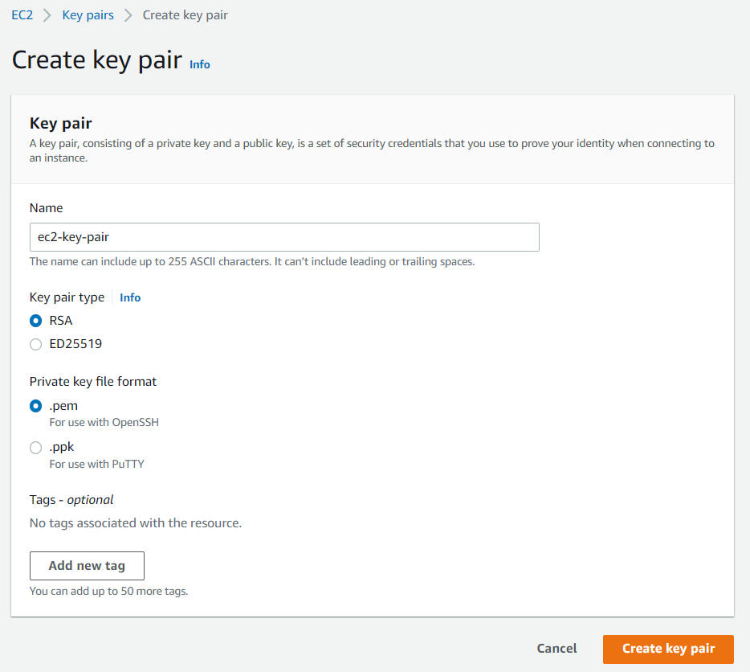

# Tech Grounds Final Project V1.0
This is version 1.0 of the final project for the Tech Grounds Cloud Engineer cohort.  

We received a document in which the specifications, requirements and a sketch were supplied. Our task was to implement it using AWS CDK (Infrastructure as Code), make suggestions/improvements along the way and work with the Scrum methodology.
  
# Content

- [Quick Start Guide](#quick-start-guide)
  - [Requirements](#requirements)
  - [Preparations](#preparations)
  - [Configuration File](#configuration-file)
  - [EC2 Key Pair](#creating-ec2-key-pair)
  - [Deploying](#deploying)
  - [SSH Connection](#connecting-through-ssh)
  - [Cleaning Up](#cleaning-up)
- [Design](#design)
- [Changelog](#changelog)
  - [Region](#region)
  - [AZ](#availability-zones)
  - [Instance Type](#instance-types)
  - [Backup](#backup-schedule)
  - [Additional EBS](#additional-ebs-volume)
  - [Trusted IPs](#trusted-ips)
  - [Encryption Keys](#encryption-keys)
 
# Quick Start Guide

## Requirements
- [Python 3 installed (make sure it's added to the PATH)](https://www.python.org/)
- [AWS CLI installed](https://docs.aws.amazon.com/cli/latest/userguide/cli-chap-getting-started.html)
- [Configure your Access key + region for your AWS account](https://docs.aws.amazon.com/cli/latest/userguide/cli-configure-quickstart.html)
- [NodeJS installed (npm)](https://nodejs.org/)
- AWS CDK installed (run: `npm install -g aws-cdk`)

## Preparations
Create a virtualenv:
```
$ python -m venv .venv
```

Activate your virtualenv.

```
$ source .venv/bin/activate

or

$ . .venv/bin/activate
```

Once the virtualenv is activated, you can install the required dependencies.

```
$ pip install -r requirements.txt
```
## Configuration File
There are two configurable settings:
- **TRUSTED_IP** - Allow SSH access from these IP addresses. By default, your current public IP will be added. Any additional IP addresses need to be added to the list as strings: `[my_ip, "35.68.133.14", "56.175.25.219"]`
- **TEST_ENV** - When set to true, certain resources such as S3 bucket, Backup Plans & Vaults will be deleted along with the stack. If you run a **production environment**, you want to keep these resources available, so it's **highly recommended** to set this setting to False. The default setting is True, so all resources get deleted.

You can find the configuration file in the code directory, the file is named `_config.py`.  
  
[Click here for a shortcut](./code/_config.py)

Alternatively, you can run the following command to open it in VSC:
```
$ code ./code/_config.py
```

## Creating EC2 key pair
In the console, create an EC2 key pair (.pem file) in the same region you want to deploy in with the name `ec2-key-pair`
  

  
## Deploying

Now you can bootstrap your environment to your stack (this adds your account settings such as the region to the Stack)

```
$ cdk bootstrap
```

By default, the configuration has been set to TEST_MODE and your current public IP address will be used for the firewalls.  
If that is alright and you want to continue to deploy:

```
$ cdk deploy
```

## Connecting through SSH
Start the SSH agent
```
$ ssh-agent bash
```
Add the ec2 key pair to the SSH agent
```
$ ssh-add ec2-key-pair.pem
```
SSH to your Admin server's *public IP*. Add the -A flag to enable forwarding of the connection.
```
$ ssh -A ec2-user@<admin.server.public.ip>
```
In order to connect to the web server, make an SSH connection from the admin server's terminal. You have to use the web server's *private ip*.
```
$ ssh ec2-user@<web.server.private.ip>
```
## Cleaning Up

After testing the infrastructure, you can destroy the whole stack with the following command:
```
$ cdk destroy
```

If the TEST_ENV setting in the configuration file was set to True, all resources will be deleted. Else you may need to manually delete an S3 bucket, Backup Plan & Vault and the additional EBS Volume.

# Using the Web Server
In the folder `assets` you can add more files for the website. These will

# Design


# Changelog

## Region
The stack will deploy in the region that has been set up for your account in your AWS CLI profile.  
  
In the initial diagram, the VPC's were split over two regions, but this doesn't add any benefit (it doesn't increase the availability in the current setup), so the stack will deploy in a single region. There are two VPCs in order to comply with the security protocol for the management server.

## Availability Zones
The provided diagram asked for two public subnets per VPC, but there is no use-case for that. Also having the webserver and the management server doesn't add any value or benefit. If the web server AZ is down, you could still access the management server, but not the web server. By having both of them in the AZ, you can't reach either of them, but the result is the same. 
  
For a future version, it is highly recommended to use Auto-Scaling with a load balancer and opt for a multi-AZ deployment! This greatly increases availability and resiliency!

## Instance Types
There weren't any specifications supplied for the performance requirements of the servers, therefore the instance types with the lowest costs have been chosen.

## Backup Schedule
The backups are done daily at 5am UTC (the recommended time by AWS).

## Additional EBS volume
It is a best practise to have seperate root and data volumes for your servers, this has been added for the webserver. Incase the instance terminates, the data volume should persist.

## Trusted IPs
These haven't been provided, the script retrieves the public IP address of the host that runs it and adds it to the firewalls as a trusted IP. Additional or custom IP's can be added in the configuration file.

## Encryption Keys
Data in transit and at rest has been encrypted. For most services, this has been done with the default key. A custom key can be used via KMS.